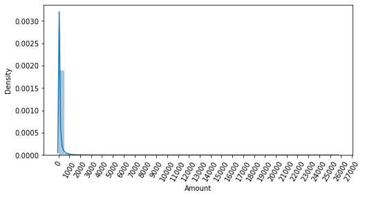
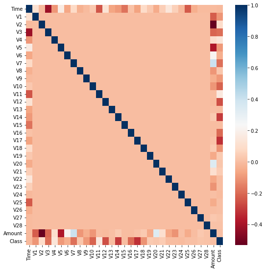
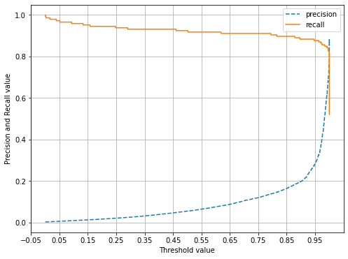

* * *

## 분류 실습 - 캐글 신용카드 사기 검출

해당 데이터셋의 레이블인 Class 속성은 매우 불균형한 분포를 가짐

Class는 0과 1로 분류되는데 0이 사기가 아닌 정상적인 신용카드 트랜잭션 데이터, 1은 신용카드 사기 트랜잭션

전체 데이터의 약 0.172%만이 레이블 값이 1, 즉 사기 트랜잭션(사기 검출, 이상 검출과 같은 데이터셋은 레이블 값이 극도로 분균형한 값을 가지기 쉬움)

### 언더 샘플링과 오버 샘플링의 이해

이상 레이블을 가지는 데이터 건수가 정상 레이블을 가진 데이터 건수에 비해 너무 적음

-> 이상 레이블 데이터는 다양한 유형을 학습하지 못하고 일방적으로 정상 레이블로 치우친 학습을 수행해 제대로 된 이상 데이터 검출이 어려워지기 쉬움

-> 언더 샘플링/오버 샘플링 이용, 적절한 학습 데이터를 확보하여 문제 해결

> 오버 샘플링 
> * 이상 데이터와 같이 적은 데이터셋을 증식하여 학습을 위한 충분한 데이터를 확보하는 방법
> * 동일한 데이터를 단순히 증식하는 방법은 과적함이 되기 때문에 원본 데이터의 피처 값들을 아주 약간만 변경하여 증식
> * 대표적으로 SMOTE(Synthetic Minority Over_sampling Technique) 방법이 있음
> * SMOTE: 적은 데이터셋에 있는 개별 데이터들의 최근접 아웃을 찾아 이 데이터와 k개 이웃들의 차이를 일정 값으로 만들어 기존 데이터와 약간 차이가 나는 새로운 데이터들을 생성

* imbalanced_learn : SMOTE를 구현한 대표적인 파이썬 패키지

### 데이터 일차 가공 및 모델 학습/예측/평가


```python
import pandas as pd
import numpy as np
import matplotlib.pyplot as plt
import warnings
warnings.filterwarnings("ignore")
%matplotlib inline

card_df = pd.read_csv('./creditcard.csv')
card_df.head(3)
```


<div>
<style scoped>
    .dataframe tbody tr th:only-of-type {
        vertical-align: middle;
    }

    .dataframe tbody tr th {
        vertical-align: top;
    }

    .dataframe thead th {
        text-align: right;
    }
</style>
<table border="1" class="dataframe">
  <thead>
    <tr style="text-align: right;">
      <th></th>
      <th>Time</th>
      <th>V1</th>
      <th>V2</th>
      <th>V3</th>
      <th>V4</th>
      <th>V5</th>
      <th>V6</th>
      <th>V7</th>
      <th>V8</th>
      <th>V9</th>
      <th>...</th>
      <th>V21</th>
      <th>V22</th>
      <th>V23</th>
      <th>V24</th>
      <th>V25</th>
      <th>V26</th>
      <th>V27</th>
      <th>V28</th>
      <th>Amount</th>
      <th>Class</th>
    </tr>
  </thead>
  <tbody>
    <tr>
      <th>0</th>
      <td>0.0</td>
      <td>-1.359807</td>
      <td>-0.072781</td>
      <td>2.536347</td>
      <td>1.378155</td>
      <td>-0.338321</td>
      <td>0.462388</td>
      <td>0.239599</td>
      <td>0.098698</td>
      <td>0.363787</td>
      <td>...</td>
      <td>-0.018307</td>
      <td>0.277838</td>
      <td>-0.110474</td>
      <td>0.066928</td>
      <td>0.128539</td>
      <td>-0.189115</td>
      <td>0.133558</td>
      <td>-0.021053</td>
      <td>149.62</td>
      <td>0</td>
    </tr>
    <tr>
      <th>1</th>
      <td>0.0</td>
      <td>1.191857</td>
      <td>0.266151</td>
      <td>0.166480</td>
      <td>0.448154</td>
      <td>0.060018</td>
      <td>-0.082361</td>
      <td>-0.078803</td>
      <td>0.085102</td>
      <td>-0.255425</td>
      <td>...</td>
      <td>-0.225775</td>
      <td>-0.638672</td>
      <td>0.101288</td>
      <td>-0.339846</td>
      <td>0.167170</td>
      <td>0.125895</td>
      <td>-0.008983</td>
      <td>0.014724</td>
      <td>2.69</td>
      <td>0</td>
    </tr>
    <tr>
      <th>2</th>
      <td>1.0</td>
      <td>-1.358354</td>
      <td>-1.340163</td>
      <td>1.773209</td>
      <td>0.379780</td>
      <td>-0.503198</td>
      <td>1.800499</td>
      <td>0.791461</td>
      <td>0.247676</td>
      <td>-1.514654</td>
      <td>...</td>
      <td>0.247998</td>
      <td>0.771679</td>
      <td>0.909412</td>
      <td>-0.689281</td>
      <td>-0.327642</td>
      <td>-0.139097</td>
      <td>-0.055353</td>
      <td>-0.059752</td>
      <td>378.66</td>
      <td>0</td>
    </tr>
  </tbody>
</table>
<p>3 rows × 31 columns</p>
</div>


> 위의 결과 해석
> * V로 시작하는 피처들의 의미는 알 수 없음
> * Time 피처는 데이터 생성 관련한 작업용 속성으로, 큰 의미가 없음
> * Amount 피처는 신용카드 트랜잭션 금액을 의미
> * 레이블인 Class는 0이면 정상, 1이면 사기 트랜잭션
> * card_df.info()로 확인한 결과 결측치 값 없음
> * Class 레이블만 int형이고 나머지 피처들은 모두 float형


```python
from sklearn.model_selection import train_test_split

# 인자로 입력받은 DataFrame을 복사한 뒤 Time 칼럼만 삭제하고 복사된 DataFrame 반환
def get_preprocessed_df(df=None):
    df_copy = df.copy()
    df_copy.drop('Time', axis=1, inplace=True)
    return df_copy
```


```python
# 사전 데이터 가공 후 학습과 데이터 세트를 반환하는 함수
def get_train_test_dataset(df=None):
    # 인자로 입력된 DataFrame의 사전 데이터 가공이 완료된 복사 DataFrame 반환
    df_copy = get_preprocessed_df(df)
    # DataFrame의 맨 마지막 칼럼이 레이블, 나머지는 피처들
    X_features = df_copy.iloc[:, :-1]
    y_target = df_copy.iloc[:, -1]
    #train_test_split()으로 학습과 데이터 세트 분할, stratify=y_target으로 Stratified 기반 분할
    X_train, X_test, y_train, y_test = \
    train_test_split(X_features, y_target, test_size=0.3, random_state=0, stratify=y_target)
    # 학습과 데이터 세트 반환
    return X_train, X_test, y_train, y_test

X_train, X_test, y_train, y_test = get_train_test_dataset(card_df)
```


```python
# 생성된 학습 데이터셋과 테스트 데이터셋의 레이블 값 비율을 백분율로 환산하여 서로 비슷하게 분할됐는지 확인
print('학습 데이터 레이블 값 비율')
print(y_train.value_counts()/y_train.shape[0]*100)
print('테스트 데이터 레이블 값 비율')
print(y_test.value_counts()/y_test.shape[0]*100)
```

    학습 데이터 레이블 값 비율
    0    99.827451
    1     0.172549
    Name: Class, dtype: float64
    테스트 데이터 레이블 값 비율
    0    99.826785
    1     0.173215
    Name: Class, dtype: float64
    

* 로지스틱 회귀를 이용하여 신용카드 사기 여부를 예측


```python
from sklearn.metrics import confusion_matrix, accuracy_score, precision_score, recall_score, f1_score
from sklearn.metrics import roc_auc_score

def get_clf_eval(y_test, pred):
    confusion = confusion_matrix( y_test, pred)
    accuracy = accuracy_score(y_test , pred)
    precision = precision_score(y_test , pred)
    recall = recall_score(y_test , pred)
    f1 = f1_score(y_test,pred)
    # ROC-AUC 추가 
    roc_auc = roc_auc_score(y_test, pred)
    print('오차 행렬')
    print(confusion)
    # ROC-AUC print 추가
    print('정확도: {0:.4f}, 정밀도: {1:.4f}, 재현율: {2:.4f},\
    F1: {3:.4f}, AUC:{4:.4f}'.format(accuracy, precision, recall, f1, roc_auc))
```


```python
from sklearn.linear_model import LogisticRegression

lr_clf = LogisticRegression()
lr_clf.fit(X_train, y_train)
lr_pred = lr_clf.predict(X_test)
lr_pred_proba = lr_clf.predict_proba(X_test)[:, 1]

# 3장에서 사용된 get_clf_eval() 함수를 이용해 평가 수행
get_clf_eval(y_test, lr_pred)
```

    오차 행렬
    [[85283    12]
     [   59    89]]
    정확도: 0.9992, 정밀도: 0.8812, 재현율: 0.6014,    F1: 0.7149, AUC:0.8006
    

재현율(Recall)이 0.6014, ROC_AUC가 0.8006

* LightGBM 이용하여 신용카드 사기 여부를 예측

그에 앞서, 앞으로 수행할 예제 코드에서 반복적으로 모델을 변경해 학습/예측 평가할 것이므로 이를 위한 별도의 함수 생성


```python
# 인자로 사이킷런의 Estimator 객체와 학습/테스트 데이터 세트를 입력 받아서 학습/예측/평가 수행
def get_model_train_eval(model, ftr_train=None, ftr_test=None, tgt_train=None, tgt_test=None):
    model.fit(ftr_train, tgt_train)
    pred = model.predict(ftr_test)
    pred_proba = model.predict_proba(ftr_test)[:, 1]
    get_clf_eval(tgt_test, pred)
```

데이터 세트가 극도로 불균형한 레이블 값 분포도를 가지고 있으므로 LGBMCLassifier객체 생성 시 boost-from_average=False로 파라미터 설정

(boost-from_average의 디폴트 값이 True로 설정되어있음, 레이블 값이 극도로 불균형한 분포를 이루는 경우 True 설정은 재현률 및 ROC_AUC 성능을 매우 크게 저하시키므로 False로 파라미터를 변경해야 함.


```python
from lightgbm import LGBMClassifier

lgbm_clf = LGBMClassifier(n_estimators=1000, num_leaves=64, n_jobs=-1, boost_from_average=False)
get_model_train_eval(lgbm_clf, ftr_train=X_train, ftr_test=X_test, tgt_train=y_train, tgt_test=y_test)
```

    오차 행렬
    [[85290     5]
     [   36   112]]
    정확도: 0.9995, 정밀도: 0.9573, 재현율: 0.7568,    F1: 0.8453, AUC:0.8783
    

재현율 0.7568, ROC_AUC 0.8783

### 데이터 분포도 변환 후 모델 학습/예측/평가

왜곡된 분포도를 가지는 데이터를 재가공한 뒤 모델을 다시 테스트

로지스틱 회귀 : 선형 모델

대부분의 선형 모델은 중요 피처들의 값이 정규 뷴포 형태를 유지하는 것을 선호

Amount 피처는 신용 카드 사용 금액으로 정상/사기 속성을 결정하는 매우 중요한 속성일 가능성이 높음


```python
import seaborn as sns
plt.figure(figsize=(8, 4))
plt.xticks(range(0, 30000, 1000), rotation=60)
sns.distplot(card_df['Amount'])
```


    <AxesSubplot:xlabel='Amount', ylabel='Density'>


    

    


> 위의 결과 해석
> * Amount, 즉 사용 금액이 1000불 이하인 데이터가 대부분, 27000불까지 드물지만 많은 금액을 사용한 경우가 발생하면서 꼬리가 긴 형태

Amount를 표준 정규 분포 형태로 변환한 뒤 로지스틱 회귀 예측 성능 측정


```python
from sklearn.preprocessing import StandardScaler
# 사이킷런의 StandardScaler를 이용해 정규 분포 형태로 Amount 피처값 변환하는 로직으로 수정
def get_preprocessed_df(df=None):
    df_copy = df.copy()
    scaler = StandardScaler()
    amount_n = scaler.fit_transform(df_copy['Amount'].values.reshape(-1 ,1))
    # 변환된 Amount를 Amount_Scaled로 피처명 변경 후 DataFrame 맨 앞 칼럼으로 입력
    df_copy.insert(0, 'Amount_Scaled', amount_n)
    # 기존 Time, Amount 피처 삭제
    df_copy.drop(['Time', 'Amount'], axis=1, inplace=True)
    return df_copy
```


```python
# Amount를 정규 분포 형태로 변환 후 로지스틱 회귀 및 LightGBM 수행
X_train, X_test, y_train, y_test=get_train_test_dataset(card_df)

print('### 로지스틱 회귀 예측 성능 ###')
lr_clf = LogisticRegression()
get_model_train_eval(lr_clf, ftr_train=X_train, ftr_test=X_test, tgt_train=y_train, tgt_test=y_test)
print('### LightGBM 예측 성능 ###')
lgbm_clf = LGBMClassifier(n_estimators=1000, num_leaves=64, n_jobs=-1)
get_model_train_eval(lgbm_clf, ftr_train=X_train, ftr_test=X_test, tgt_train=y_train, tgt_test=y_test)
```

    ### 로지스틱 회귀 예측 성능 ###
    오차 행렬
    [[85281    14]
     [   58    90]]
    정확도: 0.9992, 정밀도: 0.8654, 재현율: 0.6081,    F1: 0.7143, AUC:0.8040
    ### LightGBM 예측 성능 ###
    오차 행렬
    [[85146   149]
     [   81    67]]
    정확도: 0.9973, 정밀도: 0.3102, 재현율: 0.4527,    F1: 0.3681, AUC:0.7255
    

* 로그 변환 : 데이터 분포도가 심하게 왜곡되어 있을 경우 적용하는 중요 기법 중의 하나로, 원래 값을 log값으로 변환해 원래 큰 값을 상대적으로 작은 값으로 변환하기 때문에 데이터 분포도의 왜곡을 상당 수준 개선해 줌

로그 변환은 넘파이의 log1p()함수를 이용해 간단히 변환 가능함


```python
# 데이터 가공 함수인 get_preprocessed_df()를 로그 변환 로직으로 변경
def get_preprocessed_df(df=None):
    df_copy = df.copy()
    # 넘파이의 log1p()를 이용해 Amount를 로그 변환
    amount_n = np.log1p(df_copy['Amount'])
    df_copy.insert(0, 'Amount_Scaled', amount_n)
    df_copy.drop(['Time', 'Amount'], axis=1, inplace=True)
    return df_copy
```


```python
# Amount 피처를 로그 변환한 후 다시 로지스틱 회귀와 LightGBM 모델을 적용 후 예측 성능 확인
X_train, X_test, y_train, y_teat = get_train_test_dataset(card_df)

print('### 로지스틱 회귀 예측 성능 ###')
get_model_train_eval(lr_clf, ftr_train=X_train, ftr_test=X_test, tgt_train=y_train, tgt_test=y_test)

print('### LightGBM 예측 성능 ###')
get_model_train_eval(lgbm_clf, ftr_train=X_train, ftr_test=X_test, tgt_train=y_train, tgt_test=y_test)
```

    ### 로지스틱 회귀 예측 성능 ###
    오차 행렬
    [[85283    12]
     [   59    89]]
    정확도: 0.9992, 정밀도: 0.8812, 재현율: 0.6014,    F1: 0.7149, AUC:0.8006
    ### LightGBM 예측 성능 ###
    오차 행렬
    [[85238    57]
     [   77    71]]
    정확도: 0.9984, 정밀도: 0.5547, 재현율: 0.4797,    F1: 0.5145, AUC:0.7395
    

### 이상치 데이터 제거 후 모델 학습/예측/평가

이상치 데이터(Outlier) : 전체 데이터의 패턴에서 벗어난 이상 값을 가진 데이터

IQR(Inter Quantile Range) : 이상치 데이터를 찾아내는 방법 중 하나, 사분위 값의 편차를 이용하는 기법으로 박스 플롯 방식으로 시각화할 수 있다.

전체 데이터를 값이 높은 순으로 정렬하고, 이를 1/4씩으로 구간을 분할하여 Q1, Q2, Q3, Q4라고 명명한다면 Q1~Q3 범위를 IQR이라고 한다.

IQR에 1.5를 곱해서 생성된 범위를 이용해 최댓값과 최솟값을 결정한 뒤 최댓값을 초과하거나 최솟값에 미달하는 데이터를 이상치로 간주

IQR 방식을 시각화한 도표가 박스 플롯


```python
# 이상치 데이터를 IQR을 이용해 제거
# 어떤 피처의 이상치 데이터를 검출할 것인지 선택 
# -> 매우 많은 피처가 있을 경우 이들 중 결정값(즉 레이블)과 가장 상관성이 높은 피처들을 위주로 이상치를 검출
# DataFrame의 corr()를 이용해 각 피처별로 상관도를 구한 뒤 seaborn의 heatmap을 통해 시각화
import seaborn as sns

plt.figure(figsize=(9, 9))
corr = card_df.corr()
sns.heatmap(corr, cmap="RdBu")
```


    <AxesSubplot:>


    

    


* cmap을 RdBu로 설정해 양의 상관관계가 높을수록 진한 파란색, 은의 상관관계가 높을수록 진한 빨간색에 가깝게 표현
* 상관관계 히트맵에서 맨 아래 위치한 결정 레이블인 Class 피처와 음의 상관관계가 가장 높은 피처는 v14와 v17


```python
# v14에 대해서 이상치를 찾아 제거
# IQR을 이용해 이상치를 검출하는 함수를 생성한 뒤 이를 이용해 검출된 이상치 삭제
# get_outlier() 함수는 인자로 DataFrame과 이상치를 검출한 함수 입력받음
# 함수 내에서 넘파이의 percentile()함수를 이용해 1/4분위와 3/4분위를 구하고 이에 기반해 IQR 계산
# 계산된 IQR에 1.5를 곱해 최댓값/최솟값 지점을 구한 뒤 이상치를 찾아 해당 이상치가 있는 DataFrame Index 반환
import numpy as np

def get_outlier(df=None, column=None, weight=1.5):
    # fraud에 해당하는 column 데이터만 추출, 1/4분위와 3/4분위 지점을 np.percentile로 구함
    fraud = df[df['Class']==1][column]
    quantile_25 = np.percentile(fraud.values, 25)
    quantile_75 = np.percentile(fraud.values, 75)
    # IQR을 구하고, IQR에 1.5를 곱해 최댓값과 최솟값 지점을 구함
    iqr = quantile_75 - quantile_25
    iqr_weight = iqr * weight
    lowest_val = quantile_25 - iqr_weight
    highest_val = quantile_75 + iqr_weight
    # 최댓값보다 크거나 최솟값보다 작은 값을 이상치 데이터로 설정하고 DataFrame Index 반환
    outlier_index = fraud[(fraud < lowest_val) | (fraud > highest_val)].index
    return outlier_index
```


```python
# outlier()함수를 이용해 V14칼럼에서 이상치 데이터 찾기
outlier_index = get_outlier(df=card_df, column='V14', weight=1.5)
print("이상치 데이터 인덱스: ", outlier_index)
```

    이상치 데이터 인덱스:  Int64Index([8296, 8615, 9035, 9252], dtype='int64')
    

* 총 4개의 데이터인 8296, 8615, 9035, 9252번 Index가 이상치로 추출


```python
# get_outlier()를 이용해 이상치를 추출하고 이를 삭제하는 로직을 get_proceed_df()함수에 추가해 데이터를 가공 후 모델 적용
# get_processed_df( )를 로그 변환 후 V14 피처의 이상치 데이터를 삭제하는 로직으로 변경. 
def get_preprocessed_df(df=None):
    df_copy = df.copy()
    amount_n = np.log1p(df_copy['Amount'])
    df_copy.insert(0, 'Amount_Scaled', amount_n)
    df_copy.drop(['Time','Amount'], axis=1, inplace=True)
    # 이상치 데이터 삭제하는 로직 추가
    outlier_index = get_outlier(df=df_copy, column='V14', weight=1.5)
    df_copy.drop(outlier_index, axis=0, inplace=True)
    return df_copy

X_train, X_test, y_train, y_test = get_train_test_dataset(card_df)
print('### 로지스틱 회귀 예측 성능 ###')
get_model_train_eval(lr_clf, ftr_train=X_train, ftr_test=X_test, tgt_train=y_train, tgt_test=y_test)
print('### LightGBM 예측 성능 ###')
get_model_train_eval(lgbm_clf, ftr_train=X_train, ftr_test=X_test, tgt_train=y_train, tgt_test=y_test)
```

    ### 로지스틱 회귀 예측 성능 ###
    오차 행렬
    [[85281    14]
     [   48    98]]
    정확도: 0.9993, 정밀도: 0.8750, 재현율: 0.6712,    F1: 0.7597, AUC:0.8355
    ### LightGBM 예측 성능 ###
    오차 행렬
    [[85268    27]
     [   36   110]]
    정확도: 0.9993, 정밀도: 0.8029, 재현율: 0.7534,    F1: 0.7774, AUC:0.8766
    

* 이상치 데이터 제거한 후 예측 성능 크게 향상됨

* * * 

### SMOTE 오버 샘플링 적용 후 모델 학습/예측/평가

* SMOTE는 imbalanced-learn 패키지의 SMOTE 클래스를 이용해 간단하게 구현 가능

SMOTE 적용할 때는 반드시 학습 데이터 세트만 오버샘플링

검증 데이터 세트나 테스트 데이터 세트를 오버 샘플링할 경우 결국은 원본 데이터 세트가 아닌 데이터 세트에서 검증 또는 테스트를 수행하기 때문에 올바른 검증/테스트가 될 수 없음


```python
from imblearn.over_sampling import SMOTE

smote = SMOTE(random_state=0)
X_train_over, y_train_over = smote.fit_sample(X_train, y_train)
print("SMOTE 적용 전 학습용 피처/레이블 데이터 세트: ", X_train.shape, y_train.shape)
print("SMOTE 적용 후 학습용 피처/레이블 데이터 세트: ", X_train_over.shape, y_train_over.shape)
print("SMOTE 적용 후 레이블 값 분포: \n", pd.Series(y_train_over).value_counts())
```

    SMOTE 적용 전 학습용 피처/레이블 데이터 세트:  (199362, 29) (199362,)
    SMOTE 적용 후 학습용 피처/레이블 데이터 세트:  (398040, 29) (398040,)
    SMOTE 적용 후 레이블 값 분포: 
     0    199020
    1    199020
    Name: Class, dtype: int64
    

SMOTE 적용 전 학습용 데이터 세트는 199.362 건이었지만 적용 후 398.040 건으로 두 배 가까이 불어남

또 적용 후 레이블 값이 0과 1의 분초가 동일하게 생성


```python
lr_clf = LogisticRegression()
# ftr_train과 tgt_train 인자값이 SMOTE 증식된 X_train_over와 y_train_over로 변경됨에 유의
get_model_train_eval(lr_clf, ftr_train=X_train_over, ftr_test=X_test, tgt_train=y_train_over, tgt_test=y_test)
```

    오차 행렬
    [[82937  2358]
     [   11   135]]
    정확도: 0.9723, 정밀도: 0.0542, 재현율: 0.9247,    F1: 0.1023, AUC:0.9485
    

로지스틱 회귀 모델의 경우 오버샘플링된 데이터로 학습한 경우 재현율이 92.47%로 크게 증가함

반대로 정밀도가 5.42%로 급갹하게 저하됨

로지스틱 회귀 모델이 오버 샘플링으로 인해 실제 원본 데이터의 유형보다 훨씬 많은 Class=1데이터를 학습하면서 실제 데이터 세트에서 예측을 지나치게 Class=1로 적용해 정밀도가 급격히 떨어짐


```python
# 분류 결정 임곗값에 따른 정밀도와 재현율 곡선을 통해 SMOTE로 학습된 로지스틱 회귀 모델에 어떤 문제가 발생하고 있는지 시각적으로 확인
# 3장에서 사용한 precision_recall_curve_plot() 함수 이용
import matplotlib.pyplot as plt
import matplotlib.ticker as ticker
from sklearn.metrics import precision_recall_curve
%matplotlib inline

def precision_recall_curve_plot(y_test , pred_proba_c1):
    # threshold ndarray와 이 threshold에 따른 정밀도, 재현율 ndarray 추출. 
    precisions, recalls, thresholds = precision_recall_curve( y_test, pred_proba_c1)
    
    # X축을 threshold값으로, Y축은 정밀도, 재현율 값으로 각각 Plot 수행. 정밀도는 점선으로 표시
    plt.figure(figsize=(8,6))
    threshold_boundary = thresholds.shape[0]
    plt.plot(thresholds, precisions[0:threshold_boundary], linestyle='--', label='precision')
    plt.plot(thresholds, recalls[0:threshold_boundary],label='recall')
    
    # threshold 값 X 축의 Scale을 0.1 단위로 변경
    start, end = plt.xlim()
    plt.xticks(np.round(np.arange(start, end, 0.1),2))
    
    # x축, y축 label과 legend, 그리고 grid 설정
    plt.xlabel('Threshold value'); plt.ylabel('Precision and Recall value')
    plt.legend(); plt.grid()
    plt.show()
```


```python
precision_recall_curve_plot(y_test, lr_clf.predict_proba(X_test)[:, 1])
```


    

    


* 임계값이 0.99 이하에서는 재현율이 매우 좋고 정밀도가 극단적으로 낮다가 0.99이상에서는 반대로 재현율이 대폭 떨어지고 정말도가 높아짐
* 분류 결정 임곗값을 조정하더라도 임계값의 민감도가 너무 심해 올바른 재현율/정밀도 성능을 얻을 수 없음
* 로지스틱 회귀 모델의 경우 SMOTE 적용 후 올바른 예측 모델이 생성되지 못함


```python
# LightGBM 모델을 SMOTE로 오버 샘플링된 데이터 세트로 학습/예측/평가 수행
lgbm_clf = LGBMClassifier(n_estimators=1000, num_leaves=64, n_jobs=-1, boost_from_average=False)
get_model_train_eval(lgbm_clf, ftr_train=X_train_over, ftr_test=X_test,
                  tgt_train=y_train_over, tgt_test=y_test)
```

    오차 행렬
    [[85283    12]
     [   22   124]]
    정확도: 0.9996, 정밀도: 0.9118, 재현율: 0.8493,    F1: 0.8794, AUC:0.9246
    

* SMOTE를 적용하면 일반적으로 재현율은 높아지나 정밀도는 낮아짐


```python

```
