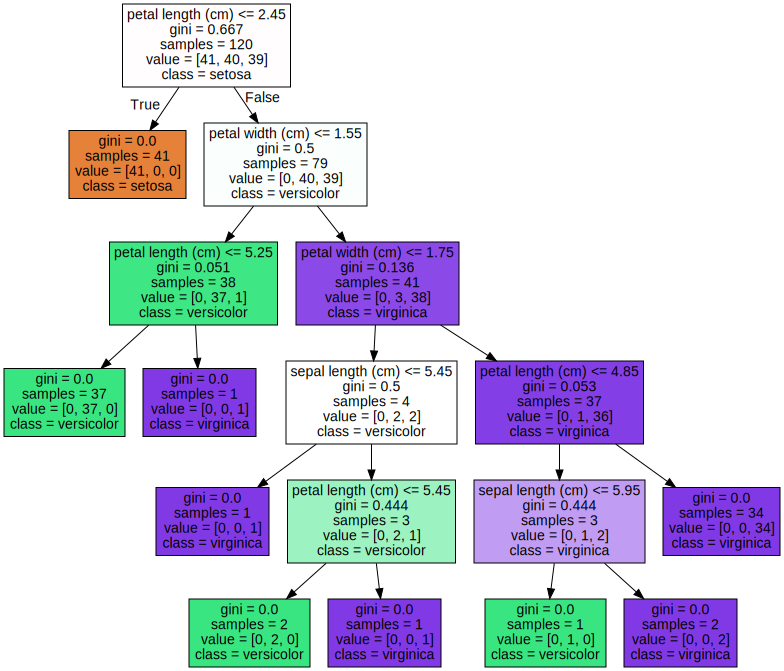
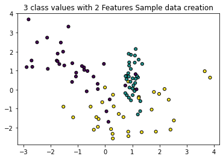
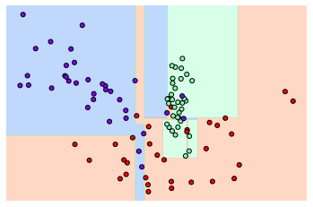
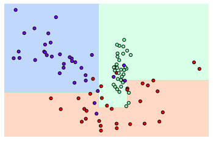
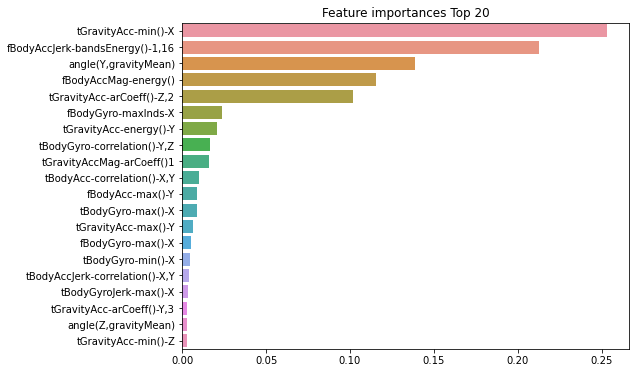

# 분류

* * *


## 02. 결정 트리

> Keyword : 균일도, 트리, 데이터셋 분할, 과적합


 : 데이터에 있는 규칙을 학습을 통해 자동으로 찾아내 트리 기반의 분류 규칙을 만드는 것

* 구조
    * 규칙 노드(Decision Node) : 규칙 조건, 데이터셋의 피퍼가 결합해 규칙 조건을 만들 때마다 생성
    * 리프 노드(Leaf Node) : 결정된 클래스 값

트리의 깊이(Depth)가 깊어질수록 과적합의 가능성 높아짐

트리의 분할(split)의 균일함이 중요 

    -> 결정 노드는 정보 균일도가 높은 데이터셋을 먼저 선택하도록 규칙 조건 생성

    -> 정보 균일도 측정

* 정보의 균일도 측정 방법
    * 정보 이득 : 엔트로피, 정보 이득 지수 = 1-엔트로피 지수
    * 지니 계수 : 0이 가장 평등 1로 갈수록 불평등, 지니 계수가 낮은 속성을 기준으로 분할
    
    sklrearn에서는 DecisionTreeClassifier 이라는 결정 트리 알고리즘을 사용(지니 계수 사용하여 데이터셋 분할)
    데이터가 모두 특정 분류에 속하게 될 때까지 Recursive하게 분할 수행
    
### 결정 트리 모델의 특징

* 장점 : '균일도'라는 룰 명확, 전처리 작업(스케일링, 정규화 등)의 불필요
* 단점 : 과적합(피처가 많고 균일도가 다양하게 존재할수록) -> 트리의 크기 사전에 제한

### 결정 트리 파라미터

sklearn의 결정 트리 알고리즘(CART 알고리즘 기반)

* DecisionTreeClassifier : 분류
* DecisionTreeRegressor : 회귀

> 파라미터
> * min_samples_split
> > 노드를 분할하기 위한 최소한의 샘플 데이터 수(과적합 제어)
> > 디폴트=2, 작을수록 과적합의 위험성 증가
> * min_samples_leaf
> > 말단 노드가 되기 위한 최소한의 샘플 데이터 수(과적합 제어)
> > 비대칭적 데이터의 경우 작게 설정 필요(특정 클래스의 데이터가 극도로 작을 수 잇음)
> * max_features
> > 최적의 분할을 위해 고려할 최대 피처 개수
> > 디폴트는 None
> > int형으로 지정 : 대상 피처의 개수 / float형으로 지정 : 전체 피처 중 대상 피처의 퍼센트
> > 'sqrt' : 전체 피처 중 sqrt(전체 피처 개수)
> > 'auto'로 지정하면 sqrt와 동일
> > 'log' : 전체 피처 중 log2(전체 피처 개수)
> > 'None' : 전체 피처 선정
> * max_depth
> > 트리 최대 깊이
> > 디폴트는 None
> > 최대 분할 시 과적합의 우려가 있으므로 적절한 값으로 제어 필요
> * max_leaf_nodes
> > 말단 노드의 최대 개수

### 결정 트리 모델의 시각화

Graphiz 패키지 사용하여 시각화 가능


```python
from sklearn.tree import DecisionTreeClassifier
from sklearn.datasets import load_iris
from sklearn.model_selection import train_test_split
import warnings
warnings.filterwarnings('ignore')

# DecisionTreeClassifier 생성
dt_clf = DecisionTreeClassifier(random_state=156)

# 붓꽃 데이터 로딩 후 학습 데이터셋과 테스트 데이터셋으로 분리
iris_data = load_iris()
X_train, X_test, y_train, y_test = train_test_split(iris_data.data, iris_data.target, test_size=0.2, random_state=11)

# DecisionTreeClassifier 학습
dt_clf.fit(X_train, y_train)
```


    DecisionTreeClassifier(random_state=156)


```python
from sklearn.tree import export_graphviz

# export_graphviz의 호출 결과로 out_file로 지정된 tree.dot 파일 생성
export_graphviz(dt_clf, out_file="tree.dot", class_names=iris_data.target_names, \
               feature_names=iris_data.feature_names, impurity=True, filled=True)
```


```python
import graphviz
# 위에서 생성된 tree.dot파일을 Graphviz가 읽어서 주피터노트북상에서 시각화
with open("tree.dot") as f:
    dot_graph = f.read()
graphviz.Source(dot_graph)
```


    

    


* petal length(cm) <= 2.45 : 자식 노드를 만들기 위한 규칙 조건(이 조건이 없으면 리프 노드)
* gini : 주어진 데이터 분포에서의 지니 계수
* samples : 현 규칙에 해당하는 데이터 건수
* value = [] : 클래스 값 기반의 데이터 건수

### 결정 트리 과적합

* make_classification() : 사이킷런에서 제공, 분류를 위한 테스트 데이터를 쉽게 만들 수 있게 해줌

    반환되는 객체 : 피처 데이터 세트, 클레스 레이블 데이터 세트


```python
from sklearn.datasets import make_classification
import matplotlib.pyplot as plt
%matplotlib inline

plt.title("3 class values with 2 Features Sample data creation")

# 2차원 시각화를 위해 피처는 2개, 클래스는 3가지 유형의 분류 샘플 데이터 생성
X_features, y_labels = make_classification(n_features=2,n_redundant=0, n_informative=2,
                                          n_classes=3, n_clusters_per_class=1, random_state=0)

# 그래프 형태로 2개의 피처로 2차원 좌표 시각화, 각 클래스 값은 다른 색깔로 표시
plt.scatter(X_features[:,0], X_features[:,1], marker='o', c=y_labels, s=25, edgecolor='k')
```


    <matplotlib.collections.PathCollection at 0x1cf79d2ec10>


    

    


위의 그래프 : 각 피처가 X,Y축으로 나열된 2차원 그래프, 3개의 색깔로 구분되는 클래스

X_features와 y_labels 데이터셋을 기반으로 결정트리 학습

* 첫 번째 학습 : 결정 트리 하이퍼 파라미터: 디폴트 로 하고 결정 트리 모델이 어떤 결정 기준을 가지고 분할하면서 데이터를 분류하는지 확인


```python
import numpy as np

# Classifier의 Decision Boundary를 시각화 하는 함수
def visualize_boundary(model, X, y):
    fig,ax = plt.subplots()
    
    # 학습 데이타 scatter plot으로 나타내기
    ax.scatter(X[:, 0], X[:, 1], c=y, s=25, cmap='rainbow', edgecolor='k',
               clim=(y.min(), y.max()), zorder=3)
    ax.axis('tight')
    ax.axis('off')
    xlim_start , xlim_end = ax.get_xlim()
    ylim_start , ylim_end = ax.get_ylim()
    
    # 호출 파라미터로 들어온 training 데이타로 model 학습 . 
    model.fit(X, y)
    # meshgrid 형태인 모든 좌표값으로 예측 수행. 
    xx, yy = np.meshgrid(np.linspace(xlim_start,xlim_end, num=200),np.linspace(ylim_start,ylim_end, num=200))
    Z = model.predict(np.c_[xx.ravel(), yy.ravel()]).reshape(xx.shape)
    
    # contourf() 를 이용하여 class boundary 를 visualization 수행. 
    n_classes = len(np.unique(y))
    contours = ax.contourf(xx, yy, Z, alpha=0.3,
                           levels=np.arange(n_classes + 1) - 0.5,
                           cmap='rainbow', clim=(y.min(), y.max()),
                           zorder=1)
```


```python
from sklearn.tree import DecisionTreeClassifier

# 특정한 트리 생성 제약 없는 결정 트리의 학습과 결정 경계 시각화
dt_clf = DecisionTreeClassifier().fit(X_features, y_labels)
visualize_boundary(dt_clf, X_features, y_labels)
```


    

    


```python
# 이상치에 크게 반응하지 않으면서 좀더 일반화된 분류 규칙에 따라 분류하도록 변경

# min_samples_leaf=6으로 트리 생성 조건을 제약한 결정 경계 시각화
dt_clf = DecisionTreeClassifier(min_samples_leaf=6).fit(X_features, y_labels)
visualize_boundary(dt_clf, X_features, y_labels)
```


    

    


### 결정 트리 실습 - 사용자 행동 인식 데이터 세트

30명에게 스마트폰 센서를 장착한 뒤 사람의 동작과 관련된 여러 가지 피처를 수집한 데이터

수집된 피처 세트를 기반으로 결정 트리를 이용해 어떤 동작인지 예측


```python
import pandas as pd
import matplotlib.pyplot as plt
%matplotlib inline

# features.txt 파일에는 피처 이름 index와 피처명이 공백으로 분리되어 있음. 이를 DataFrame으로 로드.
feature_name_df = pd.read_csv('C:/Users/gram/human_activity/human_activity/features.txt',sep='\s+',
                        header=None,names=['column_index','column_name'])

# 피처명 index를 제거하고, 피처명만 리스트 객체로 생성한 뒤 샘플로 10개만 추출
feature_name = feature_name_df.iloc[:, 1].values.tolist()
print('전체 피처명에서 10개만 추출:', feature_name[:10])
```

    전체 피처명에서 10개만 추출: ['tBodyAcc-mean()-X', 'tBodyAcc-mean()-Y', 'tBodyAcc-mean()-Z', 'tBodyAcc-std()-X', 'tBodyAcc-std()-Y', 'tBodyAcc-std()-Z', 'tBodyAcc-mad()-X', 'tBodyAcc-mad()-Y', 'tBodyAcc-mad()-Z', 'tBodyAcc-max()-X']
    

피처명 관찰 -> 인체의 움직입과 관련된 속성의 평균/표준편차가 X,Y,Z축 값으로 돼 있음을 유추

주의 : 피처명을 가진 features_info.txt파일이 중복된 피처명을 가짐 -> 중복된 피처명에 대해서 원본 피처명에 _1 혹은 _2를 추가로 부여한 후에 DataFrame에 로드


```python
# 중복된 피처명이 얼마나 있는지 확인
feature_dup_df = feature_name_df.groupby('column_name').count()
print(feature_dup_df[feature_dup_df['column_index'] > 1].count())
feature_dup_df[feature_dup_df['column_index'] > 1].head(10)
```

    column_index    42
    dtype: int64
    


<div>
<style scoped>
    .dataframe tbody tr th:only-of-type {
        vertical-align: middle;
    }

    .dataframe tbody tr th {
        vertical-align: top;
    }

    .dataframe thead th {
        text-align: right;
    }
</style>
<table border="1" class="dataframe">
  <thead>
    <tr style="text-align: right;">
      <th></th>
      <th>column_index</th>
    </tr>
    <tr>
      <th>column_name</th>
      <th></th>
    </tr>
  </thead>
  <tbody>
    <tr>
      <th>fBodyAcc-bandsEnergy()-1,16</th>
      <td>3</td>
    </tr>
    <tr>
      <th>fBodyAcc-bandsEnergy()-1,24</th>
      <td>3</td>
    </tr>
    <tr>
      <th>fBodyAcc-bandsEnergy()-1,8</th>
      <td>3</td>
    </tr>
    <tr>
      <th>fBodyAcc-bandsEnergy()-17,24</th>
      <td>3</td>
    </tr>
    <tr>
      <th>fBodyAcc-bandsEnergy()-17,32</th>
      <td>3</td>
    </tr>
    <tr>
      <th>fBodyAcc-bandsEnergy()-25,32</th>
      <td>3</td>
    </tr>
    <tr>
      <th>fBodyAcc-bandsEnergy()-25,48</th>
      <td>3</td>
    </tr>
    <tr>
      <th>fBodyAcc-bandsEnergy()-33,40</th>
      <td>3</td>
    </tr>
    <tr>
      <th>fBodyAcc-bandsEnergy()-33,48</th>
      <td>3</td>
    </tr>
    <tr>
      <th>fBodyAcc-bandsEnergy()-41,48</th>
      <td>3</td>
    </tr>
  </tbody>
</table>
</div>


총 42개의 피처명 중복


```python
# 원본 피처명에 _1또는 _2를 추가 후 새로운 피처명을 가지는 DataFrame 반환하는 함수

def get_new_feature_name_df(old_feature_name_df):
    feature_dup_df = pd.DataFrame(data=old_feature_name_df.groupby('column_name').cumcount(),
                                  columns=['dup_cnt'])
    feature_dup_df = feature_dup_df.reset_index()
    new_feature_name_df = pd.merge(old_feature_name_df.reset_index(), feature_dup_df, how='outer')
    new_feature_name_df['column_name'] = new_feature_name_df[['column_name', 'dup_cnt']].apply(lambda x : x[0]+'_'+str(x[1]) 
                                                                                         if x[1] >0 else x[0],  axis=1)
    new_feature_name_df = new_feature_name_df.drop(['index'], axis=1)
    return new_feature_name_df
```


```python
df = pd.DataFrame([['a'], ['a'], ['a'], ['b'], ['b'], ['a']], columns=['A'])
display(df)
df.groupby('A').cumcount()
```


<div>
<style scoped>
    .dataframe tbody tr th:only-of-type {
        vertical-align: middle;
    }

    .dataframe tbody tr th {
        vertical-align: top;
    }

    .dataframe thead th {
        text-align: right;
    }
</style>
<table border="1" class="dataframe">
  <thead>
    <tr style="text-align: right;">
      <th></th>
      <th>A</th>
    </tr>
  </thead>
  <tbody>
    <tr>
      <th>0</th>
      <td>a</td>
    </tr>
    <tr>
      <th>1</th>
      <td>a</td>
    </tr>
    <tr>
      <th>2</th>
      <td>a</td>
    </tr>
    <tr>
      <th>3</th>
      <td>b</td>
    </tr>
    <tr>
      <th>4</th>
      <td>b</td>
    </tr>
    <tr>
      <th>5</th>
      <td>a</td>
    </tr>
  </tbody>
</table>
</div>


    0    0
    1    1
    2    2
    3    0
    4    1
    5    3
    dtype: int64


```python
import pandas as pd

def get_human_dataset( ):
    
    # 각 데이터 파일들은 공백으로 분리되어 있으므로 read_csv에서 공백 문자를 sep으로 할당.
    feature_name_df = pd.read_csv('C:/Users/gram/human_activity/human_activity/features.txt',sep='\s+',
                        header=None,names=['column_index','column_name'])
    
    # 중복된 피처명을 수정하는 get_new_feature_name_df()를 이용, 신규 피처명 DataFrame생성. 
    new_feature_name_df = get_new_feature_name_df(feature_name_df)
    
    # DataFrame에 피처명을 컬럼으로 부여하기 위해 리스트 객체로 다시 변환
    feature_name = new_feature_name_df.iloc[:, 1].values.tolist()
    
    # 학습 피처 데이터 셋과 테스트 피처 데이터을 DataFrame으로 로딩. 컬럼명은 feature_name 적용
    X_train = pd.read_csv('C:/Users/gram/human_activity/human_activity/train/X_train.txt',sep='\s+', names=feature_name )
    X_test = pd.read_csv('C:/Users/gram/human_activity/human_activity/test/X_test.txt',sep='\s+', names=feature_name)
    
    # 학습 레이블과 테스트 레이블 데이터을 DataFrame으로 로딩하고 컬럼명은 action으로 부여
    y_train = pd.read_csv('C:/Users/gram/human_activity/human_activity/train/y_train.txt',sep='\s+',header=None,names=['action'])
    y_test = pd.read_csv('C:/Users/gram/human_activity/human_activity/test/y_test.txt',sep='\s+',header=None,names=['action'])
    
    # 로드된 학습/테스트용 DataFrame을 모두 반환 
    return X_train, X_test, y_train, y_test


X_train, X_test, y_train, y_test = get_human_dataset()
```


```python
print('## 학습 피처 데이터셋 info()')
print(X_train.info())
```

    ## 학습 피처 데이터셋 info()
    <class 'pandas.core.frame.DataFrame'>
    RangeIndex: 7352 entries, 0 to 7351
    Columns: 561 entries, tBodyAcc-mean()-X to angle(Z,gravityMean)
    dtypes: float64(561)
    memory usage: 31.5 MB
    None
    


```python
print(y_train['action'].value_counts())
```

    6    1407
    5    1374
    4    1286
    1    1226
    2    1073
    3     986
    Name: action, dtype: int64
    

사이킷런의 DecisionTreeClassifier 이용, 동작 예측 분류 수행

하이퍼 파라미터 : 모두 디폴트 값으로 설정 수행 후 하이퍼 파라미터 값 모두 추출


```python
from sklearn.tree import DecisionTreeClassifier
from sklearn.metrics import accuracy_score

# 예제 반복 시 마다 동일한 예측 결과 도출을 위해 random_state 설정
dt_clf = DecisionTreeClassifier(random_state=156)
dt_clf.fit(X_train , y_train)
pred = dt_clf.predict(X_test)
accuracy = accuracy_score(y_test , pred)
print('결정 트리 예측 정확도: {0:.4f}'.format(accuracy))

# DecisionTreeClassifier의 하이퍼 파라미터 추출
print('DecisionTreeClassifier 기본 하이퍼 파라미터:\n', dt_clf.get_params())
```

    결정 트리 예측 정확도: 0.8548
    DecisionTreeClassifier 기본 하이퍼 파라미터:
     {'ccp_alpha': 0.0, 'class_weight': None, 'criterion': 'gini', 'max_depth': None, 'max_features': None, 'max_leaf_nodes': None, 'min_impurity_decrease': 0.0, 'min_samples_leaf': 1, 'min_samples_split': 2, 'min_weight_fraction_leaf': 0.0, 'random_state': 156, 'splitter': 'best'}
    

결정 트리의 깊이(Tree Depth)가 예측 정확도에 주는 영향

GridSearchCV 이용, max_depth값을 변화시키면서 예측 성능 확인


```python
from sklearn.model_selection import GridSearchCV

params = {
    'max_depth' : [ 6, 8 ,10, 12, 16 ,20, 24], 
    'min_samples_split': [16]
}

grid_cv = GridSearchCV(dt_clf, param_grid=params, scoring='accuracy', cv=5, verbose=1)
grid_cv.fit(X_train , y_train)
print('GridSearchCV 최고 평균 정확도 수치:{0:.4f}'.format(grid_cv.best_score_))
print('GridSearchCV 최적 하이퍼 파라미터:', grid_cv.best_params_)
```

    Fitting 5 folds for each of 7 candidates, totalling 35 fits
    GridSearchCV 최고 평균 정확도 수치:0.8549
    GridSearchCV 최적 하이퍼 파라미터: {'max_depth': 8, 'min_samples_split': 16}
    

위의 결과 분석 : max_depth가 8일 때 5개의 폴드 세트 최고 평균 정확도 결과가 85.49%로 도출
    
5개의 CV세트에서 max_depth값에 따른 예측 성능 변화를 보기 위해
    
GridSearchCV 객체의 cv_results속성을 통해 살펴봄


```python
# GridSearchCV객체의 cv_results_ 속성을 DataFrame으로 생성
cv_results_df = pd.DataFrame(grid_cv.cv_results_)

# max_depth 파라미터 값과 그때의 테스트(Evaluation)셋, 학습 데이터 셋의 정확도 수치 추출
cv_results_df[['param_max_depth', 'mean_test_score']]
```


<div>
<style scoped>
    .dataframe tbody tr th:only-of-type {
        vertical-align: middle;
    }

    .dataframe tbody tr th {
        vertical-align: top;
    }

    .dataframe thead th {
        text-align: right;
    }
</style>
<table border="1" class="dataframe">
  <thead>
    <tr style="text-align: right;">
      <th></th>
      <th>param_max_depth</th>
      <th>mean_test_score</th>
    </tr>
  </thead>
  <tbody>
    <tr>
      <th>0</th>
      <td>6</td>
      <td>0.847662</td>
    </tr>
    <tr>
      <th>1</th>
      <td>8</td>
      <td>0.854879</td>
    </tr>
    <tr>
      <th>2</th>
      <td>10</td>
      <td>0.852705</td>
    </tr>
    <tr>
      <th>3</th>
      <td>12</td>
      <td>0.845768</td>
    </tr>
    <tr>
      <th>4</th>
      <td>16</td>
      <td>0.847127</td>
    </tr>
    <tr>
      <th>5</th>
      <td>20</td>
      <td>0.848624</td>
    </tr>
    <tr>
      <th>6</th>
      <td>24</td>
      <td>0.848624</td>
    </tr>
  </tbody>
</table>
</div>


위의 결과 분석 : 5개 CV 세트에서 검증용 데이터셋의 정확도 평균 수치(mean_test_score) 은 max_depth가 8일 때 정점

별도의 데이터 세트에서 결정 트리의 정확도 예측(max_depth의 변화에 따른 값 측정)


```python
max_depths = [ 6, 8 ,10, 12, 16 ,20, 24]
# max_depth 값을 변화 시키면서 그때마다 학습과 테스트 셋에서의 예측 성능 측정
for depth in max_depths:
    dt_clf = DecisionTreeClassifier(max_depth=depth, min_samples_split=16, random_state=156)
    dt_clf.fit(X_train , y_train)
    pred = dt_clf.predict(X_test)
    accuracy = accuracy_score(y_test , pred)
    print('max_depth = {0} 정확도: {1:.4f}'.format(depth , accuracy))
```

    max_depth = 6 정확도: 0.8551
    max_depth = 8 정확도: 0.8717
    max_depth = 10 정확도: 0.8599
    max_depth = 12 정확도: 0.8571
    max_depth = 16 정확도: 0.8599
    max_depth = 20 정확도: 0.8565
    max_depth = 24 정확도: 0.8565
    

위의 결과 분석 : max_depth가 8일 경우 가장 높은 정확도 가짐


```python
# max_depth와 min_samples_split을 같이 변경하면서 정확도 성능 튜닝
params = {
    'max_depth' : [ 8 , 12, 16 ,20], 
    'min_samples_split' : [16, 24],
}

grid_cv = GridSearchCV(dt_clf, param_grid=params, scoring='accuracy', cv=5, verbose=1 )
grid_cv.fit(X_train , y_train)
print('GridSearchCV 최고 평균 정확도 수치: {0:.4f}'.format(grid_cv.best_score_))
print('GridSearchCV 최적 하이퍼 파라미터:', grid_cv.best_params_)
```

    Fitting 5 folds for each of 8 candidates, totalling 40 fits
    GridSearchCV 최고 평균 정확도 수치: 0.8549
    GridSearchCV 최적 하이퍼 파라미터: {'max_depth': 8, 'min_samples_split': 16}
    

위의 결과 분석 : max_depth가 8, min_samples_split이 16일 때 가장 높은 정확도


```python
# 학습이 완료된 best_estimator_객체를 이용해 테스트 데이터셋에 예측 수행
best_df_clf = grid_cv.best_estimator_
pred1 = best_df_clf.predict(X_test)
accuracy = accuracy_score(y_test , pred1)
print('결정 트리 예측 정확도:{0:.4f}'.format(accuracy))
```

    결정 트리 예측 정확도:0.8717
    


```python
# 중요도가 높은 순으로 Top 20 피처를 막대그래프로 표현
import seaborn as sns

ftr_importances_values = best_df_clf.feature_importances_
# Top 중요도로 정렬을 쉽게 하고, 시본(Seaborn)의 막대그래프로 쉽게 표현하기 위해 Series변환
ftr_importances = pd.Series(ftr_importances_values, index=X_train.columns  )
# 중요도값 순으로 Series를 정렬
ftr_top20 = ftr_importances.sort_values(ascending=False)[:20]
plt.figure(figsize=(8,6))
plt.title('Feature importances Top 20')
sns.barplot(x=ftr_top20 , y = ftr_top20.index)
plt.show()
```


    

    
