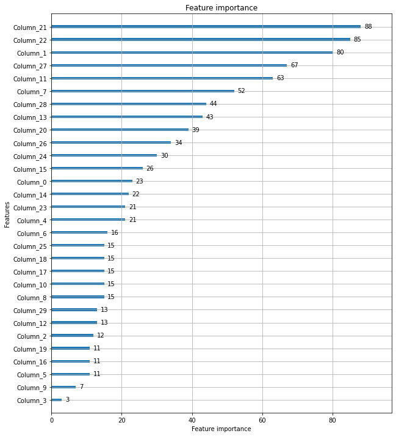
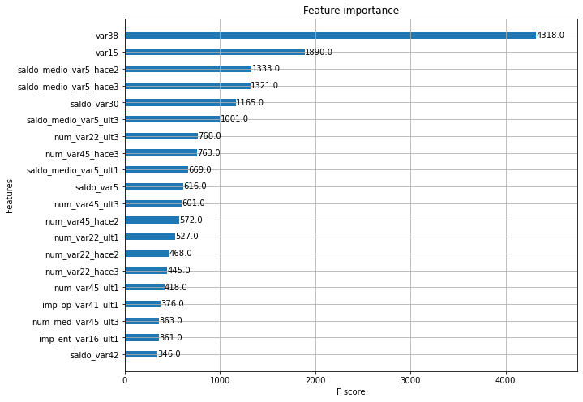

# LightGBM

### XGBoost와의 차이점

* 더 빠른 학습과 예측 수행 시간
* 더 작은 메모리 사용량
* 카테고리형 피처의 자동 변환과 최적 분할(원-핫 인코딩 등을 수행하지 않고도 카테고리형 피처를 최적으로 변환, 노드 분할 수행)

파이썬 패키지명 : lightgbm

* 특징 : 일반 GBM 계열의 트리 분할 방법과 다르게 리프 중심 트리 분할 사용
 
         -> 트리의 균형을 맞추지 않고, 최대 손실 값(max delta loss)을 가지는 리프 노드를 지속적으로 분할
         -> 트리의 깊이가 깊어지고 비대칭적인 규칙 트리 생성
         -> 학습을 반복할수록 결국은 균형 트리 분할 방식보다 예측 오류 손실을 최소화 할 수 있음

* * *

### LightGBM 하이퍼 파라미터

> 주요 파라미터
> * num_iterations[default=100] : 반복 수행하려는 트리의 개수 지정. 클수록 예측 성능 높아지나 너무 크게 지정하면 과적합의 가능성 있음. 사이킷런 호환 클래스에서는 n_estimators로 이름 변경.
> * learning_rate[default=0.1] : 0~1, 부스팅 스텝을 반복적으로 수행할 때 업데이트되는 학습률 값.작을수록 예측 성능 높아지나 학습 시간 길어지고 과적합의 가능성 높아짐.
> * max_depth[default=-1] : 설명 생략
> * min_data_in_leaf[default=20] : 결정 트리의 min_samples_leaf와 같은 파라미터. 사이킷런 래퍼 클래스에서는 min_child_samples로 이름 변경
> * num_leaves[default=31] : 하나의 트리가 가질 수 있는 최대 리프 개수
> * boosting[default=gbdt] : 부스팅의 트리를 생성하는 알고리즘(gbdt: 일반적인 그래디언트 부스팅 결정 트리, rf: 랜덤 포레스트)
> * bagging_fraction[default=1.0] : 트리가 커져 과적합되는것을 제어하기 위해 뎅터를 샘플링하는 비율을 지정.사이킷런 레퍼 클래스에서는 subsample로 이름 변경
> * feature_fraction[default=1.0] : 개별 트리를 학습할 때마다 무작위로 선택하는 피처의 비율. 과적합을 막기 위해 사용. 사이킷런 래퍼 클래스에서는 colsample_bytree로 이름 변경
> * lambda_l2[default=0.0] : L2 regulation 제어를 위한 값. 피처 개수가 많을 경우 적용을 검토, 클수록 과적합 감소. 사이킷런 래퍼 클래스에서는 reg_lambda로 이름 변경
> * lambda_l1[default=0.0] : L1 regulation 제어를 위한 값. 과적합 제어. 사이킷런 래퍼 클래스에서는 reg_alpha로 이름 변경
> Learning task 파라미터
> * objective : 최솟값을 가져야 할 손실함수 정의.회귀/다중 클래스 분류/이진 분류인지에 따라 objective인 손실한수가 정의됨

* * * 

### 하이퍼 파라미터 튜닝 방안

num_leaves의 개수를 중심으로 min_child_samples(min_data_in_leaf), max_depth를 함께 조정하면서 모델의 복잡도 줄이는 것이 기본 튜닝 방안.
* num_leaves 개수를 높이면 정확도가 높아지지만, 트리의 깊이가 깊어지고 모델의 복잡도가 커져 과적합 영향도가 커짐
* min_data_in_leaf는 과적합 개선을 위해 중요한 파라미터, 보통 큰 값으로 설정하면 트리가 깊어지는 것을 방지
* max_depth는 명시적으로 깊이의 크기 제한. num_leaves, min_data_in_leaf와 결합해 과적합 개선

부스팅 계열에서 가장 기본적인 튜닝 방안(learning_rate를 작게 하면서 n_estimators를 크게 하는 것)을 적용하는 것도 좋으나 n_estimators를 너무 크게 하는 것은 과적합으로 성능 저하를 초래할 수 있으므로 유념해야 함

* * *

### LightGBM 적용 - 위스콘신 유방암 예측


```python
#LightGBM의 파이썬 패키지인 lightgbm에서 LGBMClassifier 임포트
from lightgbm import LGBMClassifier

import pandas as pd
import numpy as np
from sklearn.datasets import load_breast_cancer
from sklearn.model_selection import train_test_split

dataset = load_breast_cancer()
ftr = dataset.data
target = dataset.target

# 전체 데이터 중 80%는 학습용 데이터, 20%는 테스트용 데이터 추출
X_train, X_test, y_train, y_test=train_test_split(ftr, target, test_size=0.2, random_state=156)

# 앞서 XGBoost와 동일하게 n_estimators는 400으로 설정
lgbm_wrapper = LGBMClassifier(n_estimators=400)

# LightGBM도 XGBoost와 동일하게 조기 중단 수행 가능
evals = [(X_test, y_test)]
lgbm_wrapper.fit(X_train, y_train, early_stopping_rounds=100, eval_metric="logloss", eval_set=evals, verbose=True)
preds = lgbm_wrapper.predict(X_test)
pred_proba = lgbm_wrapper.predict_proba(X_test)[:,1]
```

    [1]	valid_0's binary_logloss: 0.565079
    [2]	valid_0's binary_logloss: 0.507451
    [3]	valid_0's binary_logloss: 0.458489
    [4]	valid_0's binary_logloss: 0.417481
    [5]	valid_0's binary_logloss: 0.385507
    [6]	valid_0's binary_logloss: 0.355773
    [7]	valid_0's binary_logloss: 0.329587
    [8]	valid_0's binary_logloss: 0.308478
    [9]	valid_0's binary_logloss: 0.285395
    [10]	valid_0's binary_logloss: 0.267055
    [11]	valid_0's binary_logloss: 0.252013
    [12]	valid_0's binary_logloss: 0.237018
    [13]	valid_0's binary_logloss: 0.224756
    [14]	valid_0's binary_logloss: 0.213383
    [15]	valid_0's binary_logloss: 0.203058
    [16]	valid_0's binary_logloss: 0.194015
    [17]	valid_0's binary_logloss: 0.186412
    [18]	valid_0's binary_logloss: 0.179108
    [19]	valid_0's binary_logloss: 0.174004
    [20]	valid_0's binary_logloss: 0.167155
    [21]	valid_0's binary_logloss: 0.162494
    [22]	valid_0's binary_logloss: 0.156886
    [23]	valid_0's binary_logloss: 0.152855
    [24]	valid_0's binary_logloss: 0.151113
    [25]	valid_0's binary_logloss: 0.148395
    [26]	valid_0's binary_logloss: 0.145869
    [27]	valid_0's binary_logloss: 0.143036
    [28]	valid_0's binary_logloss: 0.14033
    [29]	valid_0's binary_logloss: 0.139609
    [30]	valid_0's binary_logloss: 0.136109
    [31]	valid_0's binary_logloss: 0.134867
    [32]	valid_0's binary_logloss: 0.134729
    [33]	valid_0's binary_logloss: 0.1311
    [34]	valid_0's binary_logloss: 0.131143
    [35]	valid_0's binary_logloss: 0.129435
    [36]	valid_0's binary_logloss: 0.128474
    [37]	valid_0's binary_logloss: 0.126683
    [38]	valid_0's binary_logloss: 0.126112
    [39]	valid_0's binary_logloss: 0.122831
    [40]	valid_0's binary_logloss: 0.123162
    [41]	valid_0's binary_logloss: 0.125592
    [42]	valid_0's binary_logloss: 0.128293
    [43]	valid_0's binary_logloss: 0.128123
    [44]	valid_0's binary_logloss: 0.12789
    [45]	valid_0's binary_logloss: 0.122818
    [46]	valid_0's binary_logloss: 0.12496
    [47]	valid_0's binary_logloss: 0.125578
    [48]	valid_0's binary_logloss: 0.127381
    [49]	valid_0's binary_logloss: 0.128349
    [50]	valid_0's binary_logloss: 0.127004
    [51]	valid_0's binary_logloss: 0.130288
    [52]	valid_0's binary_logloss: 0.131362
    [53]	valid_0's binary_logloss: 0.133363
    [54]	valid_0's binary_logloss: 0.1332
    [55]	valid_0's binary_logloss: 0.134543
    [56]	valid_0's binary_logloss: 0.130803
    [57]	valid_0's binary_logloss: 0.130306
    [58]	valid_0's binary_logloss: 0.132514
    [59]	valid_0's binary_logloss: 0.133278
    [60]	valid_0's binary_logloss: 0.134804
    [61]	valid_0's binary_logloss: 0.136888
    [62]	valid_0's binary_logloss: 0.138745
    [63]	valid_0's binary_logloss: 0.140497
    [64]	valid_0's binary_logloss: 0.141368
    [65]	valid_0's binary_logloss: 0.140764
    [66]	valid_0's binary_logloss: 0.14348
    [67]	valid_0's binary_logloss: 0.143418
    [68]	valid_0's binary_logloss: 0.143682
    [69]	valid_0's binary_logloss: 0.145076
    [70]	valid_0's binary_logloss: 0.14686
    [71]	valid_0's binary_logloss: 0.148051
    [72]	valid_0's binary_logloss: 0.147664
    [73]	valid_0's binary_logloss: 0.149478
    [74]	valid_0's binary_logloss: 0.14708
    [75]	valid_0's binary_logloss: 0.14545
    [76]	valid_0's binary_logloss: 0.148767
    [77]	valid_0's binary_logloss: 0.149959
    [78]	valid_0's binary_logloss: 0.146083
    [79]	valid_0's binary_logloss: 0.14638
    [80]	valid_0's binary_logloss: 0.148461
    [81]	valid_0's binary_logloss: 0.15091
    [82]	valid_0's binary_logloss: 0.153011
    [83]	valid_0's binary_logloss: 0.154807
    [84]	valid_0's binary_logloss: 0.156501
    [85]	valid_0's binary_logloss: 0.158586
    [86]	valid_0's binary_logloss: 0.159819
    [87]	valid_0's binary_logloss: 0.161745
    [88]	valid_0's binary_logloss: 0.162829
    [89]	valid_0's binary_logloss: 0.159142
    [90]	valid_0's binary_logloss: 0.156765
    [91]	valid_0's binary_logloss: 0.158625
    [92]	valid_0's binary_logloss: 0.156832
    [93]	valid_0's binary_logloss: 0.154616
    [94]	valid_0's binary_logloss: 0.154263
    [95]	valid_0's binary_logloss: 0.157156
    [96]	valid_0's binary_logloss: 0.158617
    [97]	valid_0's binary_logloss: 0.157495
    [98]	valid_0's binary_logloss: 0.159413
    [99]	valid_0's binary_logloss: 0.15847
    [100]	valid_0's binary_logloss: 0.160746
    [101]	valid_0's binary_logloss: 0.16217
    [102]	valid_0's binary_logloss: 0.165293
    [103]	valid_0's binary_logloss: 0.164749
    [104]	valid_0's binary_logloss: 0.167097
    [105]	valid_0's binary_logloss: 0.167697
    [106]	valid_0's binary_logloss: 0.169462
    [107]	valid_0's binary_logloss: 0.169947
    [108]	valid_0's binary_logloss: 0.171
    [109]	valid_0's binary_logloss: 0.16907
    [110]	valid_0's binary_logloss: 0.169521
    [111]	valid_0's binary_logloss: 0.167719
    [112]	valid_0's binary_logloss: 0.166648
    [113]	valid_0's binary_logloss: 0.169053
    [114]	valid_0's binary_logloss: 0.169613
    [115]	valid_0's binary_logloss: 0.170059
    [116]	valid_0's binary_logloss: 0.1723
    [117]	valid_0's binary_logloss: 0.174733
    [118]	valid_0's binary_logloss: 0.173526
    [119]	valid_0's binary_logloss: 0.1751
    [120]	valid_0's binary_logloss: 0.178254
    [121]	valid_0's binary_logloss: 0.182968
    [122]	valid_0's binary_logloss: 0.179017
    [123]	valid_0's binary_logloss: 0.178326
    [124]	valid_0's binary_logloss: 0.177149
    [125]	valid_0's binary_logloss: 0.179171
    [126]	valid_0's binary_logloss: 0.180948
    [127]	valid_0's binary_logloss: 0.183861
    [128]	valid_0's binary_logloss: 0.187579
    [129]	valid_0's binary_logloss: 0.188122
    [130]	valid_0's binary_logloss: 0.1857
    [131]	valid_0's binary_logloss: 0.187442
    [132]	valid_0's binary_logloss: 0.188578
    [133]	valid_0's binary_logloss: 0.189729
    [134]	valid_0's binary_logloss: 0.187313
    [135]	valid_0's binary_logloss: 0.189279
    [136]	valid_0's binary_logloss: 0.191068
    [137]	valid_0's binary_logloss: 0.192414
    [138]	valid_0's binary_logloss: 0.191255
    [139]	valid_0's binary_logloss: 0.193453
    [140]	valid_0's binary_logloss: 0.196969
    [141]	valid_0's binary_logloss: 0.196378
    [142]	valid_0's binary_logloss: 0.196367
    [143]	valid_0's binary_logloss: 0.19869
    [144]	valid_0's binary_logloss: 0.200352
    [145]	valid_0's binary_logloss: 0.19712
    

    C:\Users\gram\anaconda3\lib\site-packages\lightgbm\sklearn.py:726: UserWarning: 'early_stopping_rounds' argument is deprecated and will be removed in a future release of LightGBM. Pass 'early_stopping()' callback via 'callbacks' argument instead.
      _log_warning("'early_stopping_rounds' argument is deprecated and will be removed in a future release of LightGBM. "
    C:\Users\gram\anaconda3\lib\site-packages\lightgbm\sklearn.py:736: UserWarning: 'verbose' argument is deprecated and will be removed in a future release of LightGBM. Pass 'log_evaluation()' callback via 'callbacks' argument instead.
      _log_warning("'verbose' argument is deprecated and will be removed in a future release of LightGBM. "
    


```python
from sklearn.metrics import confusion_matrix, accuracy_score
from sklearn.metrics import precision_score, recall_score
from sklearn.metrics import f1_score, roc_auc_score

def get_clf_eval(y_test , pred):
    confusion = confusion_matrix( y_test, pred)
    accuracy = accuracy_score(y_test , pred)
    precision = precision_score(y_test , pred)
    recall = recall_score(y_test , pred)
    f1 = f1_score(y_test,pred)
    roc_auc = roc_auc_score(y_test, pred)
    print('오차 행렬')
    print(confusion)
    print('정확도: {0:.4f}, 정밀도: {1:.4f}, 재현율: {2:.4f},\
    F1: {3:.4f}, AUC:{4:.4f}'.format(accuracy, precision, recall, f1, roc_auc))
```


```python
get_clf_eval(y_test, preds)
```

    오차 행렬
    [[33  4]
     [ 1 76]]
    정확도: 0.9561, 정밀도: 0.9500, 재현율: 0.9870,    F1: 0.9682, AUC:0.9395
    


```python
# plot_importance()를 이용해 피처 중요도 시각화
from lightgbm import plot_importance
import matplotlib.pyplot as plt
%matplotlib inline

fig, ax = plt.subplots(figsize=(10, 12))
plot_importance(lgbm_wrapper, ax=ax)
```


    <AxesSubplot:title={'center':'Feature importance'}, xlabel='Feature importance', ylabel='Features'>


    

    


* * *

## 분류 실습 - 캐글 산탄데르 고객 만족 예측

370개의 피처로 주어진 데이터 세트 기반에서 고객 만족 여부를 예측, 클래스 레이블 명:TARGET, 1이면 불만을 가진 고객, 0이면 만족한 고객

대부분이 만족이고 불만족인 데이터는 일부 -> 정확도 수치보다는 ROC-AUC(ROC 곡선 영역)으로 평가하는 것이 적합


```python
import numpy as np
import pandas as pd
import matplotlib.pyplot as plt
import matplotlib

cust_df = pd.read_csv("./train_santander.csv", encoding='latin-1')
print('dataset shape:', cust_df.shape)
cust_df.head(3)
```

    dataset shape: (76020, 371)
    


<div>
<style scoped>
    .dataframe tbody tr th:only-of-type {
        vertical-align: middle;
    }

    .dataframe tbody tr th {
        vertical-align: top;
    }

    .dataframe thead th {
        text-align: right;
    }
</style>
<table border="1" class="dataframe">
  <thead>
    <tr style="text-align: right;">
      <th></th>
      <th>ID</th>
      <th>var3</th>
      <th>var15</th>
      <th>imp_ent_var16_ult1</th>
      <th>imp_op_var39_comer_ult1</th>
      <th>imp_op_var39_comer_ult3</th>
      <th>imp_op_var40_comer_ult1</th>
      <th>imp_op_var40_comer_ult3</th>
      <th>imp_op_var40_efect_ult1</th>
      <th>imp_op_var40_efect_ult3</th>
      <th>...</th>
      <th>saldo_medio_var33_hace2</th>
      <th>saldo_medio_var33_hace3</th>
      <th>saldo_medio_var33_ult1</th>
      <th>saldo_medio_var33_ult3</th>
      <th>saldo_medio_var44_hace2</th>
      <th>saldo_medio_var44_hace3</th>
      <th>saldo_medio_var44_ult1</th>
      <th>saldo_medio_var44_ult3</th>
      <th>var38</th>
      <th>TARGET</th>
    </tr>
  </thead>
  <tbody>
    <tr>
      <th>0</th>
      <td>1</td>
      <td>2</td>
      <td>23</td>
      <td>0.0</td>
      <td>0.0</td>
      <td>0.0</td>
      <td>0.0</td>
      <td>0.0</td>
      <td>0.0</td>
      <td>0.0</td>
      <td>...</td>
      <td>0.0</td>
      <td>0.0</td>
      <td>0.0</td>
      <td>0.0</td>
      <td>0.0</td>
      <td>0.0</td>
      <td>0.0</td>
      <td>0.0</td>
      <td>39205.17</td>
      <td>0</td>
    </tr>
    <tr>
      <th>1</th>
      <td>3</td>
      <td>2</td>
      <td>34</td>
      <td>0.0</td>
      <td>0.0</td>
      <td>0.0</td>
      <td>0.0</td>
      <td>0.0</td>
      <td>0.0</td>
      <td>0.0</td>
      <td>...</td>
      <td>0.0</td>
      <td>0.0</td>
      <td>0.0</td>
      <td>0.0</td>
      <td>0.0</td>
      <td>0.0</td>
      <td>0.0</td>
      <td>0.0</td>
      <td>49278.03</td>
      <td>0</td>
    </tr>
    <tr>
      <th>2</th>
      <td>4</td>
      <td>2</td>
      <td>23</td>
      <td>0.0</td>
      <td>0.0</td>
      <td>0.0</td>
      <td>0.0</td>
      <td>0.0</td>
      <td>0.0</td>
      <td>0.0</td>
      <td>...</td>
      <td>0.0</td>
      <td>0.0</td>
      <td>0.0</td>
      <td>0.0</td>
      <td>0.0</td>
      <td>0.0</td>
      <td>0.0</td>
      <td>0.0</td>
      <td>67333.77</td>
      <td>0</td>
    </tr>
  </tbody>
</table>
<p>3 rows × 371 columns</p>
</div>


```python
cust_df.info()
```

    <class 'pandas.core.frame.DataFrame'>
    RangeIndex: 76020 entries, 0 to 76019
    Columns: 371 entries, ID to TARGET
    dtypes: float64(111), int64(260)
    memory usage: 215.2 MB
    


```python
# 전체 데이터에서 만족과 불만족의 비율
print(cust_df['TARGET'].value_counts())
unsatisfied_cnt = cust_df[cust_df['TARGET']==1].TARGET.count()
total_cnt = cust_df.TARGET.count()
print('unsatisfied 비율은 {0:.2f}'.format((unsatisfied_cnt/total_cnt)))
```

    0    73012
    1     3008
    Name: TARGET, dtype: int64
    unsatisfied 비율은 0.04
    


```python
# 각 피처의 값 분포 확인
cust_df.describe()
```


<div>
<style scoped>
    .dataframe tbody tr th:only-of-type {
        vertical-align: middle;
    }

    .dataframe tbody tr th {
        vertical-align: top;
    }

    .dataframe thead th {
        text-align: right;
    }
</style>
<table border="1" class="dataframe">
  <thead>
    <tr style="text-align: right;">
      <th></th>
      <th>ID</th>
      <th>var3</th>
      <th>var15</th>
      <th>imp_ent_var16_ult1</th>
      <th>imp_op_var39_comer_ult1</th>
      <th>imp_op_var39_comer_ult3</th>
      <th>imp_op_var40_comer_ult1</th>
      <th>imp_op_var40_comer_ult3</th>
      <th>imp_op_var40_efect_ult1</th>
      <th>imp_op_var40_efect_ult3</th>
      <th>...</th>
      <th>saldo_medio_var33_hace2</th>
      <th>saldo_medio_var33_hace3</th>
      <th>saldo_medio_var33_ult1</th>
      <th>saldo_medio_var33_ult3</th>
      <th>saldo_medio_var44_hace2</th>
      <th>saldo_medio_var44_hace3</th>
      <th>saldo_medio_var44_ult1</th>
      <th>saldo_medio_var44_ult3</th>
      <th>var38</th>
      <th>TARGET</th>
    </tr>
  </thead>
  <tbody>
    <tr>
      <th>count</th>
      <td>76020.000000</td>
      <td>76020.000000</td>
      <td>76020.000000</td>
      <td>76020.000000</td>
      <td>76020.000000</td>
      <td>76020.000000</td>
      <td>76020.000000</td>
      <td>76020.000000</td>
      <td>76020.000000</td>
      <td>76020.000000</td>
      <td>...</td>
      <td>76020.000000</td>
      <td>76020.000000</td>
      <td>76020.000000</td>
      <td>76020.000000</td>
      <td>76020.000000</td>
      <td>76020.000000</td>
      <td>76020.000000</td>
      <td>76020.000000</td>
      <td>7.602000e+04</td>
      <td>76020.000000</td>
    </tr>
    <tr>
      <th>mean</th>
      <td>75964.050723</td>
      <td>-1523.199277</td>
      <td>33.212865</td>
      <td>86.208265</td>
      <td>72.363067</td>
      <td>119.529632</td>
      <td>3.559130</td>
      <td>6.472698</td>
      <td>0.412946</td>
      <td>0.567352</td>
      <td>...</td>
      <td>7.935824</td>
      <td>1.365146</td>
      <td>12.215580</td>
      <td>8.784074</td>
      <td>31.505324</td>
      <td>1.858575</td>
      <td>76.026165</td>
      <td>56.614351</td>
      <td>1.172358e+05</td>
      <td>0.039569</td>
    </tr>
    <tr>
      <th>std</th>
      <td>43781.947379</td>
      <td>39033.462364</td>
      <td>12.956486</td>
      <td>1614.757313</td>
      <td>339.315831</td>
      <td>546.266294</td>
      <td>93.155749</td>
      <td>153.737066</td>
      <td>30.604864</td>
      <td>36.513513</td>
      <td>...</td>
      <td>455.887218</td>
      <td>113.959637</td>
      <td>783.207399</td>
      <td>538.439211</td>
      <td>2013.125393</td>
      <td>147.786584</td>
      <td>4040.337842</td>
      <td>2852.579397</td>
      <td>1.826646e+05</td>
      <td>0.194945</td>
    </tr>
    <tr>
      <th>min</th>
      <td>1.000000</td>
      <td>-999999.000000</td>
      <td>5.000000</td>
      <td>0.000000</td>
      <td>0.000000</td>
      <td>0.000000</td>
      <td>0.000000</td>
      <td>0.000000</td>
      <td>0.000000</td>
      <td>0.000000</td>
      <td>...</td>
      <td>0.000000</td>
      <td>0.000000</td>
      <td>0.000000</td>
      <td>0.000000</td>
      <td>0.000000</td>
      <td>0.000000</td>
      <td>0.000000</td>
      <td>0.000000</td>
      <td>5.163750e+03</td>
      <td>0.000000</td>
    </tr>
    <tr>
      <th>25%</th>
      <td>38104.750000</td>
      <td>2.000000</td>
      <td>23.000000</td>
      <td>0.000000</td>
      <td>0.000000</td>
      <td>0.000000</td>
      <td>0.000000</td>
      <td>0.000000</td>
      <td>0.000000</td>
      <td>0.000000</td>
      <td>...</td>
      <td>0.000000</td>
      <td>0.000000</td>
      <td>0.000000</td>
      <td>0.000000</td>
      <td>0.000000</td>
      <td>0.000000</td>
      <td>0.000000</td>
      <td>0.000000</td>
      <td>6.787061e+04</td>
      <td>0.000000</td>
    </tr>
    <tr>
      <th>50%</th>
      <td>76043.000000</td>
      <td>2.000000</td>
      <td>28.000000</td>
      <td>0.000000</td>
      <td>0.000000</td>
      <td>0.000000</td>
      <td>0.000000</td>
      <td>0.000000</td>
      <td>0.000000</td>
      <td>0.000000</td>
      <td>...</td>
      <td>0.000000</td>
      <td>0.000000</td>
      <td>0.000000</td>
      <td>0.000000</td>
      <td>0.000000</td>
      <td>0.000000</td>
      <td>0.000000</td>
      <td>0.000000</td>
      <td>1.064092e+05</td>
      <td>0.000000</td>
    </tr>
    <tr>
      <th>75%</th>
      <td>113748.750000</td>
      <td>2.000000</td>
      <td>40.000000</td>
      <td>0.000000</td>
      <td>0.000000</td>
      <td>0.000000</td>
      <td>0.000000</td>
      <td>0.000000</td>
      <td>0.000000</td>
      <td>0.000000</td>
      <td>...</td>
      <td>0.000000</td>
      <td>0.000000</td>
      <td>0.000000</td>
      <td>0.000000</td>
      <td>0.000000</td>
      <td>0.000000</td>
      <td>0.000000</td>
      <td>0.000000</td>
      <td>1.187563e+05</td>
      <td>0.000000</td>
    </tr>
    <tr>
      <th>max</th>
      <td>151838.000000</td>
      <td>238.000000</td>
      <td>105.000000</td>
      <td>210000.000000</td>
      <td>12888.030000</td>
      <td>21024.810000</td>
      <td>8237.820000</td>
      <td>11073.570000</td>
      <td>6600.000000</td>
      <td>6600.000000</td>
      <td>...</td>
      <td>50003.880000</td>
      <td>20385.720000</td>
      <td>138831.630000</td>
      <td>91778.730000</td>
      <td>438329.220000</td>
      <td>24650.010000</td>
      <td>681462.900000</td>
      <td>397884.300000</td>
      <td>2.203474e+07</td>
      <td>1.000000</td>
    </tr>
  </tbody>
</table>
<p>8 rows × 371 columns</p>
</div>


> 위의 결과 해석
> * 결측값을 -999999로 함, -999999값이 116개 있음
> * 편차가 심하므로 가장 값이 많은 2로 변경


```python
cust_df['var3'].replace(-999999, 2, inplace=True)
cust_df.drop('ID', axis=1, inplace=True)

# 피처 세트와 레이블 세트 분리. 레이블 칼럼은 데이터프레임의 맨 마지막에 위치해 칼럼 위치 -1로 분리
X_features = cust_df.iloc[:, :-1]
y_labels = cust_df.iloc[:, -1]
print('피처 데이터 shape:{0}'.format(X_features.shape))
```

    피처 데이터 shape:(76020, 369)
    


```python

```


```python
# 원본 데이터셋에서 학습 데이터셋과 테스트 데이터셋 분리
# 비대칭한 데이터셋이므로 클래스인 Target 값 분포가 둘 모두 비슷하게 추출되었는지 확인
from sklearn.model_selection import train_test_split

X_train, X_test, y_train, y_test = train_test_split(X_features, y_labels, test_size=0.2, random_state=0)

train_cnt = y_train.count()
test_cnt = y_test.count()
print('학습 세트 Shape:{0}, 테스트 세트 Shape:{1}'.format(X_train.shape, X_test.shape))

print(' 학습 세트 레이블 값 분포 비율')
print(y_train.value_counts()/train_cnt)
print('\n 테스트 세트 레이블 값 분포 비율')
print(y_test.value_counts()/test_cnt)
```

    학습 세트 Shape:(60816, 369), 테스트 세트 Shape:(15204, 369)
     학습 세트 레이블 값 분포 비율
    0    0.960964
    1    0.039036
    Name: TARGET, dtype: float64
    
     테스트 세트 레이블 값 분포 비율
    0    0.9583
    1    0.0417
    Name: TARGET, dtype: float64
    

### XGBoost 모델 학습과 하이퍼 파라미터 튜닝

XGBoost 학습 모델 생성하고 예측 결과 ROC AUC로 평가

사이킷런 래퍼 XGBClassifier 기반 학습 수행

n_estimators는 500, early_stopping_rounds는 100

성능 평가 기준이 ROC AUC 이므로 eval_metric은 auc로 함(logloss로 해도 큰 차이 x)

평가 데이터셋은 앞에서 분리한 테스트 데이터셋 이용(테스트 데이터셋을 평가 데이터셋으로 사용하면 과적합의 가능성을 증가시킬 수 있음을 주지하고 넘어감)

eval_set = [(X_train, y_train), (X_test, y_test)]로 설정


```python
from xgboost import XGBClassifier
from sklearn.metrics import roc_auc_score

# n_estimators는 500, random state는 예제 수행 시마다 동일한 예측 결과를 위해 설정
xgb_clf = XGBClassifier(n_estimators=500, random_state=156)

# 성능 평가 지표를 auc로, 조기 중단 파라미터는 100으로 설정하고 학습 수행
xgb_clf.fit(X_train, y_train, early_stopping_rounds=100, eval_metric="auc", eval_set=[(X_train, y_train), (X_test, y_test)])

xgb_roc_score = roc_auc_score(y_test, xgb_clf.predict_proba(X_test)[:, 1], average='macro')
print('ROC AUC: {0:.4f}'.format(xgb_roc_score))
```

    C:\Users\gram\anaconda3\lib\site-packages\xgboost\compat.py:36: FutureWarning: pandas.Int64Index is deprecated and will be removed from pandas in a future version. Use pandas.Index with the appropriate dtype instead.
      from pandas import MultiIndex, Int64Index
    C:\Users\gram\anaconda3\lib\site-packages\xgboost\sklearn.py:1224: UserWarning: The use of label encoder in XGBClassifier is deprecated and will be removed in a future release. To remove this warning, do the following: 1) Pass option use_label_encoder=False when constructing XGBClassifier object; and 2) Encode your labels (y) as integers starting with 0, i.e. 0, 1, 2, ..., [num_class - 1].
      warnings.warn(label_encoder_deprecation_msg, UserWarning)
    C:\Users\gram\anaconda3\lib\site-packages\xgboost\data.py:250: FutureWarning: pandas.Int64Index is deprecated and will be removed from pandas in a future version. Use pandas.Index with the appropriate dtype instead.
      elif isinstance(data.columns, (pd.Int64Index, pd.RangeIndex)):
    

    [0]	validation_0-auc:0.82005	validation_1-auc:0.81157
    [1]	validation_0-auc:0.83400	validation_1-auc:0.82452
    [2]	validation_0-auc:0.83870	validation_1-auc:0.82746
    [3]	validation_0-auc:0.84419	validation_1-auc:0.82922
    [4]	validation_0-auc:0.84783	validation_1-auc:0.83298
    [5]	validation_0-auc:0.85125	validation_1-auc:0.83500
    [6]	validation_0-auc:0.85501	validation_1-auc:0.83653
    [7]	validation_0-auc:0.85831	validation_1-auc:0.83782
    [8]	validation_0-auc:0.86143	validation_1-auc:0.83802
    [9]	validation_0-auc:0.86452	validation_1-auc:0.83914
    [10]	validation_0-auc:0.86717	validation_1-auc:0.83954
    [11]	validation_0-auc:0.87013	validation_1-auc:0.83983
    [12]	validation_0-auc:0.87369	validation_1-auc:0.84033
    [13]	validation_0-auc:0.87620	validation_1-auc:0.84054
    [14]	validation_0-auc:0.87799	validation_1-auc:0.84135
    [15]	validation_0-auc:0.88072	validation_1-auc:0.84117
    [16]	validation_0-auc:0.88238	validation_1-auc:0.84101
    [17]	validation_0-auc:0.88354	validation_1-auc:0.84071
    [18]	validation_0-auc:0.88458	validation_1-auc:0.84052
    [19]	validation_0-auc:0.88592	validation_1-auc:0.84023
    [20]	validation_0-auc:0.88790	validation_1-auc:0.84012
    [21]	validation_0-auc:0.88846	validation_1-auc:0.84022
    [22]	validation_0-auc:0.88980	validation_1-auc:0.84007
    [23]	validation_0-auc:0.89019	validation_1-auc:0.84009
    [24]	validation_0-auc:0.89195	validation_1-auc:0.83974
    [25]	validation_0-auc:0.89255	validation_1-auc:0.84015
    [26]	validation_0-auc:0.89332	validation_1-auc:0.84101
    [27]	validation_0-auc:0.89389	validation_1-auc:0.84088
    [28]	validation_0-auc:0.89420	validation_1-auc:0.84074
    [29]	validation_0-auc:0.89665	validation_1-auc:0.83999
    [30]	validation_0-auc:0.89741	validation_1-auc:0.83959
    [31]	validation_0-auc:0.89916	validation_1-auc:0.83952
    [32]	validation_0-auc:0.90106	validation_1-auc:0.83901
    [33]	validation_0-auc:0.90253	validation_1-auc:0.83885
    [34]	validation_0-auc:0.90278	validation_1-auc:0.83887
    [35]	validation_0-auc:0.90293	validation_1-auc:0.83864
    [36]	validation_0-auc:0.90463	validation_1-auc:0.83834
    [37]	validation_0-auc:0.90500	validation_1-auc:0.83810
    [38]	validation_0-auc:0.90519	validation_1-auc:0.83810
    [39]	validation_0-auc:0.90533	validation_1-auc:0.83813
    [40]	validation_0-auc:0.90575	validation_1-auc:0.83776
    [41]	validation_0-auc:0.90691	validation_1-auc:0.83720
    [42]	validation_0-auc:0.90716	validation_1-auc:0.83684
    [43]	validation_0-auc:0.90737	validation_1-auc:0.83672
    [44]	validation_0-auc:0.90759	validation_1-auc:0.83674
    [45]	validation_0-auc:0.90769	validation_1-auc:0.83693
    [46]	validation_0-auc:0.90779	validation_1-auc:0.83686
    [47]	validation_0-auc:0.90793	validation_1-auc:0.83678
    [48]	validation_0-auc:0.90831	validation_1-auc:0.83694
    [49]	validation_0-auc:0.90871	validation_1-auc:0.83676
    [50]	validation_0-auc:0.90892	validation_1-auc:0.83655
    [51]	validation_0-auc:0.91070	validation_1-auc:0.83669
    [52]	validation_0-auc:0.91240	validation_1-auc:0.83641
    [53]	validation_0-auc:0.91354	validation_1-auc:0.83690
    [54]	validation_0-auc:0.91389	validation_1-auc:0.83693
    [55]	validation_0-auc:0.91408	validation_1-auc:0.83681
    [56]	validation_0-auc:0.91548	validation_1-auc:0.83680
    [57]	validation_0-auc:0.91560	validation_1-auc:0.83667
    [58]	validation_0-auc:0.91631	validation_1-auc:0.83664
    [59]	validation_0-auc:0.91729	validation_1-auc:0.83591
    [60]	validation_0-auc:0.91765	validation_1-auc:0.83576
    [61]	validation_0-auc:0.91788	validation_1-auc:0.83534
    [62]	validation_0-auc:0.91876	validation_1-auc:0.83513
    [63]	validation_0-auc:0.91896	validation_1-auc:0.83510
    [64]	validation_0-auc:0.91900	validation_1-auc:0.83508
    [65]	validation_0-auc:0.91911	validation_1-auc:0.83518
    [66]	validation_0-auc:0.91975	validation_1-auc:0.83510
    [67]	validation_0-auc:0.91986	validation_1-auc:0.83523
    [68]	validation_0-auc:0.92012	validation_1-auc:0.83457
    [69]	validation_0-auc:0.92019	validation_1-auc:0.83460
    [70]	validation_0-auc:0.92029	validation_1-auc:0.83446
    [71]	validation_0-auc:0.92041	validation_1-auc:0.83462
    [72]	validation_0-auc:0.92093	validation_1-auc:0.83394
    [73]	validation_0-auc:0.92099	validation_1-auc:0.83410
    [74]	validation_0-auc:0.92140	validation_1-auc:0.83394
    [75]	validation_0-auc:0.92148	validation_1-auc:0.83368
    [76]	validation_0-auc:0.92330	validation_1-auc:0.83413
    [77]	validation_0-auc:0.92424	validation_1-auc:0.83359
    [78]	validation_0-auc:0.92512	validation_1-auc:0.83353
    [79]	validation_0-auc:0.92549	validation_1-auc:0.83293
    [80]	validation_0-auc:0.92586	validation_1-auc:0.83253
    [81]	validation_0-auc:0.92686	validation_1-auc:0.83187
    [82]	validation_0-auc:0.92714	validation_1-auc:0.83230
    [83]	validation_0-auc:0.92810	validation_1-auc:0.83216
    [84]	validation_0-auc:0.92832	validation_1-auc:0.83206
    [85]	validation_0-auc:0.92878	validation_1-auc:0.83196
    [86]	validation_0-auc:0.92883	validation_1-auc:0.83200
    [87]	validation_0-auc:0.92890	validation_1-auc:0.83208
    [88]	validation_0-auc:0.92928	validation_1-auc:0.83174
    [89]	validation_0-auc:0.92950	validation_1-auc:0.83160
    [90]	validation_0-auc:0.92958	validation_1-auc:0.83155
    [91]	validation_0-auc:0.92969	validation_1-auc:0.83165
    [92]	validation_0-auc:0.92974	validation_1-auc:0.83172
    [93]	validation_0-auc:0.93042	validation_1-auc:0.83160
    [94]	validation_0-auc:0.93043	validation_1-auc:0.83150
    [95]	validation_0-auc:0.93048	validation_1-auc:0.83132
    [96]	validation_0-auc:0.93094	validation_1-auc:0.83090
    [97]	validation_0-auc:0.93102	validation_1-auc:0.83091
    [98]	validation_0-auc:0.93179	validation_1-auc:0.83066
    [99]	validation_0-auc:0.93255	validation_1-auc:0.83058
    [100]	validation_0-auc:0.93296	validation_1-auc:0.83029
    [101]	validation_0-auc:0.93370	validation_1-auc:0.82955
    [102]	validation_0-auc:0.93369	validation_1-auc:0.82962
    [103]	validation_0-auc:0.93448	validation_1-auc:0.82893
    [104]	validation_0-auc:0.93460	validation_1-auc:0.82837
    [105]	validation_0-auc:0.93494	validation_1-auc:0.82815
    [106]	validation_0-auc:0.93594	validation_1-auc:0.82744
    [107]	validation_0-auc:0.93598	validation_1-auc:0.82728
    [108]	validation_0-auc:0.93625	validation_1-auc:0.82651
    [109]	validation_0-auc:0.93632	validation_1-auc:0.82650
    [110]	validation_0-auc:0.93673	validation_1-auc:0.82621
    [111]	validation_0-auc:0.93678	validation_1-auc:0.82620
    [112]	validation_0-auc:0.93726	validation_1-auc:0.82591
    [113]	validation_0-auc:0.93797	validation_1-auc:0.82498
    ROC AUC: 0.8413
    

하이퍼 파라미터 튜닝 수행

칼럼 개수가 많아 과적합의 가능성을 가정하고 max_depth, min_child_weight, colsample_bytree만 일차 튜닝

* 학습 시간이 많이 필요한 모델의 하이퍼 파라미터 튜닝 요령

     : 2\~3개 정도의 파라미터를 결합해 최적 파라미터를 찾아낸 후 이 파라미터를 기반으로 다시 1\~2개 파라미터를 결합해 튜닝 수행

수행 시간이 많이 걸리므로 n_estimators는 100으로 줄이고 early_stopping_rounds도 30으로 줄여서 테스트한 후 튜닝이 완료되면 다시 증가

GridSearchCV 적용 후 촤적 파라미터가 어떤 것인지, GridSearchCV에서 재학습된 Estimator에서 ROC_AUC수치가 어떻게 향상됐는지 확인


```python
from sklearn.model_selection import GridSearchCV

# 하이퍼 파라미터 테스트의 수행 속도를 향상시키기 위해 n_estimators를 100으로 감소
xgb_clf = XGBClassifier(n_estimators=100)

params = {'max_depth':[5, 7], 'min_child_weight':[1, 3], 'colsample_bytree':[0.5, 0.75]}

# cv는 3으로 지정
gridCV = GridSearchCV(xgb_clf, param_grid=params, cv=3)
gridCV.fit(X_train, y_train, early_stopping_rounds=30, eval_metric="auc", eval_set=[(X_train, y_train), (X_test, y_test)])

print('GridSearchCV 최적 파라미터:', gridCV.best_params_)

xgb_roc_score = roc_auc_score(y_test, gridCV.predict_proba(X_test)[:, 1], average='macro')
print('ROC AUC: {0:.4f}'.format(xgb_roc_score))
```

    C:\Users\gram\anaconda3\lib\site-packages\xgboost\sklearn.py:1224: UserWarning: The use of label encoder in XGBClassifier is deprecated and will be removed in a future release. To remove this warning, do the following: 1) Pass option use_label_encoder=False when constructing XGBClassifier object; and 2) Encode your labels (y) as integers starting with 0, i.e. 0, 1, 2, ..., [num_class - 1].
      warnings.warn(label_encoder_deprecation_msg, UserWarning)
    C:\Users\gram\anaconda3\lib\site-packages\xgboost\data.py:250: FutureWarning: pandas.Int64Index is deprecated and will be removed from pandas in a future version. Use pandas.Index with the appropriate dtype instead.
      elif isinstance(data.columns, (pd.Int64Index, pd.RangeIndex)):
    

    [0]	validation_0-auc:0.79161	validation_1-auc:0.79321
    [1]	validation_0-auc:0.81865	validation_1-auc:0.81375
    [2]	validation_0-auc:0.82586	validation_1-auc:0.81846
    [3]	validation_0-auc:0.82789	validation_1-auc:0.82226
    [4]	validation_0-auc:0.83249	validation_1-auc:0.82677
    [5]	validation_0-auc:0.83477	validation_1-auc:0.83225
    [6]	validation_0-auc:0.83340	validation_1-auc:0.82654
    [7]	validation_0-auc:0.84223	validation_1-auc:0.83486
    [8]	validation_0-auc:0.84586	validation_1-auc:0.83682
    [9]	validation_0-auc:0.84557	validation_1-auc:0.83472
    [10]	validation_0-auc:0.84423	validation_1-auc:0.83181
    [11]	validation_0-auc:0.84428	validation_1-auc:0.82920
    [12]	validation_0-auc:0.85176	validation_1-auc:0.83433
    [13]	validation_0-auc:0.85540	validation_1-auc:0.83565
    [14]	validation_0-auc:0.85718	validation_1-auc:0.83696
    [15]	validation_0-auc:0.85851	validation_1-auc:0.83561
    [16]	validation_0-auc:0.85964	validation_1-auc:0.83578
    [17]	validation_0-auc:0.86091	validation_1-auc:0.83570
    [18]	validation_0-auc:0.86188	validation_1-auc:0.83595
    [19]	validation_0-auc:0.86249	validation_1-auc:0.83552
    [20]	validation_0-auc:0.86298	validation_1-auc:0.83452
    [21]	validation_0-auc:0.86375	validation_1-auc:0.83437
    [22]	validation_0-auc:0.86440	validation_1-auc:0.83516
    [23]	validation_0-auc:0.86554	validation_1-auc:0.83470
    [24]	validation_0-auc:0.86601	validation_1-auc:0.83492
    [25]	validation_0-auc:0.86700	validation_1-auc:0.83510
    [26]	validation_0-auc:0.86770	validation_1-auc:0.83412
    [27]	validation_0-auc:0.86852	validation_1-auc:0.83394
    [28]	validation_0-auc:0.86898	validation_1-auc:0.83441
    [29]	validation_0-auc:0.86914	validation_1-auc:0.83440
    [30]	validation_0-auc:0.86953	validation_1-auc:0.83380
    [31]	validation_0-auc:0.87051	validation_1-auc:0.83346
    [32]	validation_0-auc:0.87085	validation_1-auc:0.83334
    [33]	validation_0-auc:0.87112	validation_1-auc:0.83313
    [34]	validation_0-auc:0.87161	validation_1-auc:0.83383
    [35]	validation_0-auc:0.87173	validation_1-auc:0.83376
    [36]	validation_0-auc:0.87260	validation_1-auc:0.83340
    [37]	validation_0-auc:0.87310	validation_1-auc:0.83344
    [38]	validation_0-auc:0.87322	validation_1-auc:0.83343
    [39]	validation_0-auc:0.87339	validation_1-auc:0.83370
    [40]	validation_0-auc:0.87351	validation_1-auc:0.83373
    [41]	validation_0-auc:0.87411	validation_1-auc:0.83358
    [42]	validation_0-auc:0.87433	validation_1-auc:0.83325
    [43]	validation_0-auc:0.87432	validation_1-auc:0.83319
    

    C:\Users\gram\anaconda3\lib\site-packages\xgboost\sklearn.py:1224: UserWarning: The use of label encoder in XGBClassifier is deprecated and will be removed in a future release. To remove this warning, do the following: 1) Pass option use_label_encoder=False when constructing XGBClassifier object; and 2) Encode your labels (y) as integers starting with 0, i.e. 0, 1, 2, ..., [num_class - 1].
      warnings.warn(label_encoder_deprecation_msg, UserWarning)
    C:\Users\gram\anaconda3\lib\site-packages\xgboost\data.py:250: FutureWarning: pandas.Int64Index is deprecated and will be removed from pandas in a future version. Use pandas.Index with the appropriate dtype instead.
      elif isinstance(data.columns, (pd.Int64Index, pd.RangeIndex)):
    

    [0]	validation_0-auc:0.80013	validation_1-auc:0.79685
    [1]	validation_0-auc:0.82084	validation_1-auc:0.81574
    [2]	validation_0-auc:0.82744	validation_1-auc:0.82189
    [3]	validation_0-auc:0.83029	validation_1-auc:0.82317
    [4]	validation_0-auc:0.83578	validation_1-auc:0.82564
    [5]	validation_0-auc:0.83777	validation_1-auc:0.83385
    [6]	validation_0-auc:0.83742	validation_1-auc:0.83162
    [7]	validation_0-auc:0.84373	validation_1-auc:0.83436
    [8]	validation_0-auc:0.84836	validation_1-auc:0.83664
    [9]	validation_0-auc:0.84790	validation_1-auc:0.83583
    [10]	validation_0-auc:0.84717	validation_1-auc:0.83268
    [11]	validation_0-auc:0.84654	validation_1-auc:0.83066
    [12]	validation_0-auc:0.85377	validation_1-auc:0.83579
    [13]	validation_0-auc:0.85800	validation_1-auc:0.83859
    [14]	validation_0-auc:0.85962	validation_1-auc:0.83984
    [15]	validation_0-auc:0.86143	validation_1-auc:0.84003
    [16]	validation_0-auc:0.86269	validation_1-auc:0.84049
    [17]	validation_0-auc:0.86399	validation_1-auc:0.84009
    [18]	validation_0-auc:0.86474	validation_1-auc:0.84034
    [19]	validation_0-auc:0.86662	validation_1-auc:0.84138
    [20]	validation_0-auc:0.86730	validation_1-auc:0.84100
    [21]	validation_0-auc:0.86821	validation_1-auc:0.84058
    [22]	validation_0-auc:0.86942	validation_1-auc:0.84128
    [23]	validation_0-auc:0.86992	validation_1-auc:0.84122
    [24]	validation_0-auc:0.87035	validation_1-auc:0.84116
    [25]	validation_0-auc:0.87091	validation_1-auc:0.84045
    [26]	validation_0-auc:0.87139	validation_1-auc:0.83974
    [27]	validation_0-auc:0.87296	validation_1-auc:0.83926
    [28]	validation_0-auc:0.87307	validation_1-auc:0.83943
    [29]	validation_0-auc:0.87330	validation_1-auc:0.84017
    [30]	validation_0-auc:0.87443	validation_1-auc:0.83949
    [31]	validation_0-auc:0.87467	validation_1-auc:0.83936
    [32]	validation_0-auc:0.87513	validation_1-auc:0.83943
    [33]	validation_0-auc:0.87519	validation_1-auc:0.83951
    [34]	validation_0-auc:0.87542	validation_1-auc:0.83953
    [35]	validation_0-auc:0.87552	validation_1-auc:0.83946
    [36]	validation_0-auc:0.87582	validation_1-auc:0.83936
    [37]	validation_0-auc:0.87604	validation_1-auc:0.83919
    [38]	validation_0-auc:0.87622	validation_1-auc:0.83874
    [39]	validation_0-auc:0.87670	validation_1-auc:0.83844
    [40]	validation_0-auc:0.87678	validation_1-auc:0.83859
    [41]	validation_0-auc:0.87711	validation_1-auc:0.83830
    [42]	validation_0-auc:0.87738	validation_1-auc:0.83823
    [43]	validation_0-auc:0.87752	validation_1-auc:0.83796
    [44]	validation_0-auc:0.87777	validation_1-auc:0.83765
    [45]	validation_0-auc:0.87785	validation_1-auc:0.83786
    [46]	validation_0-auc:0.87802	validation_1-auc:0.83761
    [47]	validation_0-auc:0.87840	validation_1-auc:0.83698
    [48]	validation_0-auc:0.87868	validation_1-auc:0.83699
    [49]	validation_0-auc:0.87882	validation_1-auc:0.83708
    

    C:\Users\gram\anaconda3\lib\site-packages\xgboost\sklearn.py:1224: UserWarning: The use of label encoder in XGBClassifier is deprecated and will be removed in a future release. To remove this warning, do the following: 1) Pass option use_label_encoder=False when constructing XGBClassifier object; and 2) Encode your labels (y) as integers starting with 0, i.e. 0, 1, 2, ..., [num_class - 1].
      warnings.warn(label_encoder_deprecation_msg, UserWarning)
    C:\Users\gram\anaconda3\lib\site-packages\xgboost\data.py:250: FutureWarning: pandas.Int64Index is deprecated and will be removed from pandas in a future version. Use pandas.Index with the appropriate dtype instead.
      elif isinstance(data.columns, (pd.Int64Index, pd.RangeIndex)):
    

    [0]	validation_0-auc:0.80039	validation_1-auc:0.80013
    [1]	validation_0-auc:0.82111	validation_1-auc:0.82026
    [2]	validation_0-auc:0.82749	validation_1-auc:0.82627
    [3]	validation_0-auc:0.83124	validation_1-auc:0.82830
    [4]	validation_0-auc:0.83475	validation_1-auc:0.82881
    [5]	validation_0-auc:0.83676	validation_1-auc:0.83385
    [6]	validation_0-auc:0.83648	validation_1-auc:0.83085
    [7]	validation_0-auc:0.84336	validation_1-auc:0.83472
    [8]	validation_0-auc:0.84624	validation_1-auc:0.83404
    [9]	validation_0-auc:0.84541	validation_1-auc:0.83287
    [10]	validation_0-auc:0.84554	validation_1-auc:0.83039
    [11]	validation_0-auc:0.84525	validation_1-auc:0.82995
    [12]	validation_0-auc:0.85144	validation_1-auc:0.83489
    [13]	validation_0-auc:0.85525	validation_1-auc:0.83803
    [14]	validation_0-auc:0.85745	validation_1-auc:0.84145
    [15]	validation_0-auc:0.85817	validation_1-auc:0.84082
    [16]	validation_0-auc:0.86006	validation_1-auc:0.84076
    [17]	validation_0-auc:0.86127	validation_1-auc:0.84139
    [18]	validation_0-auc:0.86194	validation_1-auc:0.84041
    [19]	validation_0-auc:0.86337	validation_1-auc:0.84100
    [20]	validation_0-auc:0.86386	validation_1-auc:0.84145
    [21]	validation_0-auc:0.86550	validation_1-auc:0.84030
    [22]	validation_0-auc:0.86690	validation_1-auc:0.84072
    [23]	validation_0-auc:0.86765	validation_1-auc:0.84077
    [24]	validation_0-auc:0.86827	validation_1-auc:0.84136
    [25]	validation_0-auc:0.86939	validation_1-auc:0.84120
    [26]	validation_0-auc:0.87045	validation_1-auc:0.84098
    [27]	validation_0-auc:0.87062	validation_1-auc:0.84148
    [28]	validation_0-auc:0.87072	validation_1-auc:0.84120
    [29]	validation_0-auc:0.87113	validation_1-auc:0.84147
    [30]	validation_0-auc:0.87115	validation_1-auc:0.84181
    [31]	validation_0-auc:0.87145	validation_1-auc:0.84172
    [32]	validation_0-auc:0.87226	validation_1-auc:0.84100
    [33]	validation_0-auc:0.87242	validation_1-auc:0.84149
    [34]	validation_0-auc:0.87255	validation_1-auc:0.84120
    [35]	validation_0-auc:0.87297	validation_1-auc:0.84095
    [36]	validation_0-auc:0.87348	validation_1-auc:0.84051
    [37]	validation_0-auc:0.87395	validation_1-auc:0.84084
    [38]	validation_0-auc:0.87433	validation_1-auc:0.84055
    [39]	validation_0-auc:0.87448	validation_1-auc:0.84048
    [40]	validation_0-auc:0.87465	validation_1-auc:0.84042
    [41]	validation_0-auc:0.87486	validation_1-auc:0.84034
    [42]	validation_0-auc:0.87518	validation_1-auc:0.84021
    [43]	validation_0-auc:0.87525	validation_1-auc:0.84022
    [44]	validation_0-auc:0.87595	validation_1-auc:0.83967
    [45]	validation_0-auc:0.87629	validation_1-auc:0.84004
    [46]	validation_0-auc:0.87704	validation_1-auc:0.83966
    [47]	validation_0-auc:0.87746	validation_1-auc:0.83963
    [48]	validation_0-auc:0.87774	validation_1-auc:0.83931
    [49]	validation_0-auc:0.87784	validation_1-auc:0.83925
    [50]	validation_0-auc:0.87826	validation_1-auc:0.83935
    [51]	validation_0-auc:0.87861	validation_1-auc:0.83920
    [52]	validation_0-auc:0.87950	validation_1-auc:0.83895
    [53]	validation_0-auc:0.88024	validation_1-auc:0.83876
    [54]	validation_0-auc:0.88117	validation_1-auc:0.83840
    [55]	validation_0-auc:0.88126	validation_1-auc:0.83834
    [56]	validation_0-auc:0.88145	validation_1-auc:0.83873
    [57]	validation_0-auc:0.88157	validation_1-auc:0.83860
    [58]	validation_0-auc:0.88178	validation_1-auc:0.83810
    [59]	validation_0-auc:0.88186	validation_1-auc:0.83774
    

    C:\Users\gram\anaconda3\lib\site-packages\xgboost\sklearn.py:1224: UserWarning: The use of label encoder in XGBClassifier is deprecated and will be removed in a future release. To remove this warning, do the following: 1) Pass option use_label_encoder=False when constructing XGBClassifier object; and 2) Encode your labels (y) as integers starting with 0, i.e. 0, 1, 2, ..., [num_class - 1].
      warnings.warn(label_encoder_deprecation_msg, UserWarning)
    C:\Users\gram\anaconda3\lib\site-packages\xgboost\data.py:250: FutureWarning: pandas.Int64Index is deprecated and will be removed from pandas in a future version. Use pandas.Index with the appropriate dtype instead.
      elif isinstance(data.columns, (pd.Int64Index, pd.RangeIndex)):
    

    [0]	validation_0-auc:0.79210	validation_1-auc:0.79292
    [1]	validation_0-auc:0.81759	validation_1-auc:0.81404
    [2]	validation_0-auc:0.82567	validation_1-auc:0.81864
    [3]	validation_0-auc:0.82819	validation_1-auc:0.82244
    [4]	validation_0-auc:0.83233	validation_1-auc:0.82618
    [5]	validation_0-auc:0.83480	validation_1-auc:0.83163
    [6]	validation_0-auc:0.83342	validation_1-auc:0.82840
    [7]	validation_0-auc:0.84265	validation_1-auc:0.83512
    [8]	validation_0-auc:0.84614	validation_1-auc:0.83742
    [9]	validation_0-auc:0.84573	validation_1-auc:0.83475
    [10]	validation_0-auc:0.84426	validation_1-auc:0.83066
    [11]	validation_0-auc:0.84358	validation_1-auc:0.82937
    [12]	validation_0-auc:0.85089	validation_1-auc:0.83491
    [13]	validation_0-auc:0.85457	validation_1-auc:0.83785
    [14]	validation_0-auc:0.85645	validation_1-auc:0.83894
    [15]	validation_0-auc:0.85744	validation_1-auc:0.83784
    [16]	validation_0-auc:0.85870	validation_1-auc:0.83899
    [17]	validation_0-auc:0.86002	validation_1-auc:0.83854
    [18]	validation_0-auc:0.86091	validation_1-auc:0.83860
    [19]	validation_0-auc:0.86154	validation_1-auc:0.83818
    [20]	validation_0-auc:0.86189	validation_1-auc:0.83772
    [21]	validation_0-auc:0.86295	validation_1-auc:0.83703
    [22]	validation_0-auc:0.86334	validation_1-auc:0.83721
    [23]	validation_0-auc:0.86402	validation_1-auc:0.83581
    [24]	validation_0-auc:0.86456	validation_1-auc:0.83557
    [25]	validation_0-auc:0.86494	validation_1-auc:0.83534
    [26]	validation_0-auc:0.86516	validation_1-auc:0.83481
    [27]	validation_0-auc:0.86660	validation_1-auc:0.83557
    [28]	validation_0-auc:0.86784	validation_1-auc:0.83546
    [29]	validation_0-auc:0.86793	validation_1-auc:0.83545
    [30]	validation_0-auc:0.86840	validation_1-auc:0.83496
    [31]	validation_0-auc:0.86867	validation_1-auc:0.83481
    [32]	validation_0-auc:0.86884	validation_1-auc:0.83472
    [33]	validation_0-auc:0.86900	validation_1-auc:0.83482
    [34]	validation_0-auc:0.86907	validation_1-auc:0.83423
    [35]	validation_0-auc:0.86981	validation_1-auc:0.83350
    [36]	validation_0-auc:0.86996	validation_1-auc:0.83334
    [37]	validation_0-auc:0.87004	validation_1-auc:0.83365
    [38]	validation_0-auc:0.87022	validation_1-auc:0.83384
    [39]	validation_0-auc:0.87078	validation_1-auc:0.83373
    [40]	validation_0-auc:0.87094	validation_1-auc:0.83373
    [41]	validation_0-auc:0.87109	validation_1-auc:0.83359
    [42]	validation_0-auc:0.87173	validation_1-auc:0.83365
    [43]	validation_0-auc:0.87264	validation_1-auc:0.83386
    [44]	validation_0-auc:0.87336	validation_1-auc:0.83319
    [45]	validation_0-auc:0.87361	validation_1-auc:0.83318
    

    C:\Users\gram\anaconda3\lib\site-packages\xgboost\sklearn.py:1224: UserWarning: The use of label encoder in XGBClassifier is deprecated and will be removed in a future release. To remove this warning, do the following: 1) Pass option use_label_encoder=False when constructing XGBClassifier object; and 2) Encode your labels (y) as integers starting with 0, i.e. 0, 1, 2, ..., [num_class - 1].
      warnings.warn(label_encoder_deprecation_msg, UserWarning)
    C:\Users\gram\anaconda3\lib\site-packages\xgboost\data.py:250: FutureWarning: pandas.Int64Index is deprecated and will be removed from pandas in a future version. Use pandas.Index with the appropriate dtype instead.
      elif isinstance(data.columns, (pd.Int64Index, pd.RangeIndex)):
    

    [0]	validation_0-auc:0.79931	validation_1-auc:0.79594
    [1]	validation_0-auc:0.81987	validation_1-auc:0.81503
    [2]	validation_0-auc:0.82734	validation_1-auc:0.82126
    [3]	validation_0-auc:0.83110	validation_1-auc:0.82302
    [4]	validation_0-auc:0.83608	validation_1-auc:0.82494
    [5]	validation_0-auc:0.83914	validation_1-auc:0.83100
    [6]	validation_0-auc:0.83828	validation_1-auc:0.82999
    [7]	validation_0-auc:0.84425	validation_1-auc:0.83439
    [8]	validation_0-auc:0.84749	validation_1-auc:0.83609
    [9]	validation_0-auc:0.84727	validation_1-auc:0.83597
    [10]	validation_0-auc:0.84703	validation_1-auc:0.83250
    [11]	validation_0-auc:0.84664	validation_1-auc:0.83237
    [12]	validation_0-auc:0.85343	validation_1-auc:0.83713
    [13]	validation_0-auc:0.85671	validation_1-auc:0.83887
    [14]	validation_0-auc:0.85824	validation_1-auc:0.83919
    [15]	validation_0-auc:0.85962	validation_1-auc:0.83905
    [16]	validation_0-auc:0.86089	validation_1-auc:0.84031
    [17]	validation_0-auc:0.86216	validation_1-auc:0.84051
    [18]	validation_0-auc:0.86264	validation_1-auc:0.84051
    [19]	validation_0-auc:0.86341	validation_1-auc:0.84030
    [20]	validation_0-auc:0.86379	validation_1-auc:0.83988
    [21]	validation_0-auc:0.86413	validation_1-auc:0.84020
    [22]	validation_0-auc:0.86513	validation_1-auc:0.84033
    [23]	validation_0-auc:0.86584	validation_1-auc:0.84016
    [24]	validation_0-auc:0.86638	validation_1-auc:0.84016
    [25]	validation_0-auc:0.86691	validation_1-auc:0.83991
    [26]	validation_0-auc:0.86798	validation_1-auc:0.83979
    [27]	validation_0-auc:0.86869	validation_1-auc:0.83952
    [28]	validation_0-auc:0.86881	validation_1-auc:0.83942
    [29]	validation_0-auc:0.86908	validation_1-auc:0.83912
    [30]	validation_0-auc:0.86934	validation_1-auc:0.83907
    [31]	validation_0-auc:0.86942	validation_1-auc:0.83896
    [32]	validation_0-auc:0.87000	validation_1-auc:0.83860
    [33]	validation_0-auc:0.87016	validation_1-auc:0.83878
    [34]	validation_0-auc:0.87050	validation_1-auc:0.83830
    [35]	validation_0-auc:0.87069	validation_1-auc:0.83825
    [36]	validation_0-auc:0.87118	validation_1-auc:0.83880
    [37]	validation_0-auc:0.87126	validation_1-auc:0.83883
    [38]	validation_0-auc:0.87138	validation_1-auc:0.83882
    [39]	validation_0-auc:0.87243	validation_1-auc:0.83833
    [40]	validation_0-auc:0.87267	validation_1-auc:0.83813
    [41]	validation_0-auc:0.87282	validation_1-auc:0.83811
    [42]	validation_0-auc:0.87356	validation_1-auc:0.83806
    [43]	validation_0-auc:0.87372	validation_1-auc:0.83815
    [44]	validation_0-auc:0.87384	validation_1-auc:0.83807
    [45]	validation_0-auc:0.87395	validation_1-auc:0.83813
    [46]	validation_0-auc:0.87450	validation_1-auc:0.83757
    [47]	validation_0-auc:0.87476	validation_1-auc:0.83762
    

    C:\Users\gram\anaconda3\lib\site-packages\xgboost\sklearn.py:1224: UserWarning: The use of label encoder in XGBClassifier is deprecated and will be removed in a future release. To remove this warning, do the following: 1) Pass option use_label_encoder=False when constructing XGBClassifier object; and 2) Encode your labels (y) as integers starting with 0, i.e. 0, 1, 2, ..., [num_class - 1].
      warnings.warn(label_encoder_deprecation_msg, UserWarning)
    C:\Users\gram\anaconda3\lib\site-packages\xgboost\data.py:250: FutureWarning: pandas.Int64Index is deprecated and will be removed from pandas in a future version. Use pandas.Index with the appropriate dtype instead.
      elif isinstance(data.columns, (pd.Int64Index, pd.RangeIndex)):
    

    [0]	validation_0-auc:0.80248	validation_1-auc:0.80001
    [1]	validation_0-auc:0.82249	validation_1-auc:0.81765
    [2]	validation_0-auc:0.82833	validation_1-auc:0.82524
    [3]	validation_0-auc:0.83371	validation_1-auc:0.82814
    [4]	validation_0-auc:0.83653	validation_1-auc:0.82856
    [5]	validation_0-auc:0.83838	validation_1-auc:0.83345
    [6]	validation_0-auc:0.83823	validation_1-auc:0.83165
    [7]	validation_0-auc:0.84386	validation_1-auc:0.83505
    [8]	validation_0-auc:0.84688	validation_1-auc:0.83507
    [9]	validation_0-auc:0.84634	validation_1-auc:0.83483
    [10]	validation_0-auc:0.84564	validation_1-auc:0.83324
    [11]	validation_0-auc:0.84501	validation_1-auc:0.83283
    [12]	validation_0-auc:0.85011	validation_1-auc:0.83693
    [13]	validation_0-auc:0.85299	validation_1-auc:0.83995
    [14]	validation_0-auc:0.85523	validation_1-auc:0.84250
    [15]	validation_0-auc:0.85608	validation_1-auc:0.84183
    [16]	validation_0-auc:0.85748	validation_1-auc:0.84319
    [17]	validation_0-auc:0.85895	validation_1-auc:0.84363
    [18]	validation_0-auc:0.85944	validation_1-auc:0.84311
    [19]	validation_0-auc:0.86102	validation_1-auc:0.84368
    [20]	validation_0-auc:0.86122	validation_1-auc:0.84367
    [21]	validation_0-auc:0.86196	validation_1-auc:0.84403
    [22]	validation_0-auc:0.86291	validation_1-auc:0.84498
    [23]	validation_0-auc:0.86385	validation_1-auc:0.84460
    [24]	validation_0-auc:0.86452	validation_1-auc:0.84460
    [25]	validation_0-auc:0.86534	validation_1-auc:0.84480
    [26]	validation_0-auc:0.86584	validation_1-auc:0.84441
    [27]	validation_0-auc:0.86653	validation_1-auc:0.84401
    [28]	validation_0-auc:0.86697	validation_1-auc:0.84422
    [29]	validation_0-auc:0.86770	validation_1-auc:0.84385
    [30]	validation_0-auc:0.86777	validation_1-auc:0.84407
    [31]	validation_0-auc:0.86803	validation_1-auc:0.84395
    [32]	validation_0-auc:0.86826	validation_1-auc:0.84381
    [33]	validation_0-auc:0.86862	validation_1-auc:0.84417
    [34]	validation_0-auc:0.86902	validation_1-auc:0.84385
    [35]	validation_0-auc:0.86959	validation_1-auc:0.84369
    [36]	validation_0-auc:0.87020	validation_1-auc:0.84297
    [37]	validation_0-auc:0.87047	validation_1-auc:0.84278
    [38]	validation_0-auc:0.87175	validation_1-auc:0.84286
    [39]	validation_0-auc:0.87269	validation_1-auc:0.84224
    [40]	validation_0-auc:0.87289	validation_1-auc:0.84197
    [41]	validation_0-auc:0.87294	validation_1-auc:0.84175
    [42]	validation_0-auc:0.87418	validation_1-auc:0.84148
    [43]	validation_0-auc:0.87431	validation_1-auc:0.84121
    [44]	validation_0-auc:0.87441	validation_1-auc:0.84127
    [45]	validation_0-auc:0.87458	validation_1-auc:0.84103
    [46]	validation_0-auc:0.87475	validation_1-auc:0.84119
    [47]	validation_0-auc:0.87529	validation_1-auc:0.84128
    [48]	validation_0-auc:0.87554	validation_1-auc:0.84050
    [49]	validation_0-auc:0.87572	validation_1-auc:0.84039
    [50]	validation_0-auc:0.87575	validation_1-auc:0.84062
    [51]	validation_0-auc:0.87605	validation_1-auc:0.84105
    

    C:\Users\gram\anaconda3\lib\site-packages\xgboost\sklearn.py:1224: UserWarning: The use of label encoder in XGBClassifier is deprecated and will be removed in a future release. To remove this warning, do the following: 1) Pass option use_label_encoder=False when constructing XGBClassifier object; and 2) Encode your labels (y) as integers starting with 0, i.e. 0, 1, 2, ..., [num_class - 1].
      warnings.warn(label_encoder_deprecation_msg, UserWarning)
    C:\Users\gram\anaconda3\lib\site-packages\xgboost\data.py:250: FutureWarning: pandas.Int64Index is deprecated and will be removed from pandas in a future version. Use pandas.Index with the appropriate dtype instead.
      elif isinstance(data.columns, (pd.Int64Index, pd.RangeIndex)):
    

    [0]	validation_0-auc:0.80843	validation_1-auc:0.80885
    [1]	validation_0-auc:0.82920	validation_1-auc:0.82211
    [2]	validation_0-auc:0.83320	validation_1-auc:0.82400
    [3]	validation_0-auc:0.83625	validation_1-auc:0.82577
    [4]	validation_0-auc:0.84188	validation_1-auc:0.82897
    [5]	validation_0-auc:0.84455	validation_1-auc:0.83377
    [6]	validation_0-auc:0.84503	validation_1-auc:0.82916
    [7]	validation_0-auc:0.85319	validation_1-auc:0.83364
    [8]	validation_0-auc:0.85976	validation_1-auc:0.83390
    [9]	validation_0-auc:0.85952	validation_1-auc:0.82834
    [10]	validation_0-auc:0.85919	validation_1-auc:0.82378
    [11]	validation_0-auc:0.85956	validation_1-auc:0.82400
    [12]	validation_0-auc:0.86574	validation_1-auc:0.82888
    [13]	validation_0-auc:0.87027	validation_1-auc:0.83251
    [14]	validation_0-auc:0.87240	validation_1-auc:0.83311
    [15]	validation_0-auc:0.87365	validation_1-auc:0.83080
    [16]	validation_0-auc:0.87567	validation_1-auc:0.83134
    [17]	validation_0-auc:0.87777	validation_1-auc:0.83255
    [18]	validation_0-auc:0.87904	validation_1-auc:0.83149
    [19]	validation_0-auc:0.88037	validation_1-auc:0.83083
    [20]	validation_0-auc:0.88104	validation_1-auc:0.82964
    [21]	validation_0-auc:0.88159	validation_1-auc:0.82802
    [22]	validation_0-auc:0.88227	validation_1-auc:0.82806
    [23]	validation_0-auc:0.88255	validation_1-auc:0.82806
    [24]	validation_0-auc:0.88328	validation_1-auc:0.82840
    [25]	validation_0-auc:0.88353	validation_1-auc:0.82851
    [26]	validation_0-auc:0.88384	validation_1-auc:0.82899
    [27]	validation_0-auc:0.88509	validation_1-auc:0.82988
    [28]	validation_0-auc:0.88544	validation_1-auc:0.82886
    [29]	validation_0-auc:0.88569	validation_1-auc:0.82922
    [30]	validation_0-auc:0.88588	validation_1-auc:0.82962
    [31]	validation_0-auc:0.88682	validation_1-auc:0.82951
    [32]	validation_0-auc:0.88752	validation_1-auc:0.82858
    [33]	validation_0-auc:0.88762	validation_1-auc:0.82843
    [34]	validation_0-auc:0.88792	validation_1-auc:0.82804
    [35]	validation_0-auc:0.88865	validation_1-auc:0.82692
    [36]	validation_0-auc:0.88868	validation_1-auc:0.82609
    [37]	validation_0-auc:0.88901	validation_1-auc:0.82607
    [38]	validation_0-auc:0.88904	validation_1-auc:0.82598
    

    C:\Users\gram\anaconda3\lib\site-packages\xgboost\sklearn.py:1224: UserWarning: The use of label encoder in XGBClassifier is deprecated and will be removed in a future release. To remove this warning, do the following: 1) Pass option use_label_encoder=False when constructing XGBClassifier object; and 2) Encode your labels (y) as integers starting with 0, i.e. 0, 1, 2, ..., [num_class - 1].
      warnings.warn(label_encoder_deprecation_msg, UserWarning)
    C:\Users\gram\anaconda3\lib\site-packages\xgboost\data.py:250: FutureWarning: pandas.Int64Index is deprecated and will be removed from pandas in a future version. Use pandas.Index with the appropriate dtype instead.
      elif isinstance(data.columns, (pd.Int64Index, pd.RangeIndex)):
    

    [0]	validation_0-auc:0.81304	validation_1-auc:0.81746
    [1]	validation_0-auc:0.82882	validation_1-auc:0.82026
    [2]	validation_0-auc:0.83609	validation_1-auc:0.82474
    [3]	validation_0-auc:0.84041	validation_1-auc:0.82824
    [4]	validation_0-auc:0.84760	validation_1-auc:0.83130
    [5]	validation_0-auc:0.84938	validation_1-auc:0.83590
    [6]	validation_0-auc:0.85116	validation_1-auc:0.83167
    [7]	validation_0-auc:0.85828	validation_1-auc:0.83471
    [8]	validation_0-auc:0.86371	validation_1-auc:0.83640
    [9]	validation_0-auc:0.86365	validation_1-auc:0.83549
    [10]	validation_0-auc:0.86395	validation_1-auc:0.83127
    [11]	validation_0-auc:0.86437	validation_1-auc:0.82983
    [12]	validation_0-auc:0.87068	validation_1-auc:0.83421
    [13]	validation_0-auc:0.87545	validation_1-auc:0.83773
    [14]	validation_0-auc:0.87779	validation_1-auc:0.83843
    [15]	validation_0-auc:0.87893	validation_1-auc:0.83628
    [16]	validation_0-auc:0.88035	validation_1-auc:0.83878
    [17]	validation_0-auc:0.88227	validation_1-auc:0.83749
    [18]	validation_0-auc:0.88364	validation_1-auc:0.83710
    [19]	validation_0-auc:0.88528	validation_1-auc:0.83727
    [20]	validation_0-auc:0.88606	validation_1-auc:0.83670
    [21]	validation_0-auc:0.88672	validation_1-auc:0.83629
    [22]	validation_0-auc:0.88793	validation_1-auc:0.83586
    [23]	validation_0-auc:0.88875	validation_1-auc:0.83562
    [24]	validation_0-auc:0.88913	validation_1-auc:0.83589
    [25]	validation_0-auc:0.88932	validation_1-auc:0.83575
    [26]	validation_0-auc:0.89053	validation_1-auc:0.83424
    [27]	validation_0-auc:0.89116	validation_1-auc:0.83427
    [28]	validation_0-auc:0.89172	validation_1-auc:0.83384
    [29]	validation_0-auc:0.89244	validation_1-auc:0.83318
    [30]	validation_0-auc:0.89260	validation_1-auc:0.83224
    [31]	validation_0-auc:0.89294	validation_1-auc:0.83214
    [32]	validation_0-auc:0.89361	validation_1-auc:0.83111
    [33]	validation_0-auc:0.89396	validation_1-auc:0.83114
    [34]	validation_0-auc:0.89481	validation_1-auc:0.83121
    [35]	validation_0-auc:0.89548	validation_1-auc:0.83133
    [36]	validation_0-auc:0.89589	validation_1-auc:0.83039
    [37]	validation_0-auc:0.89614	validation_1-auc:0.83024
    [38]	validation_0-auc:0.89743	validation_1-auc:0.82952
    [39]	validation_0-auc:0.89749	validation_1-auc:0.82950
    [40]	validation_0-auc:0.89754	validation_1-auc:0.82932
    [41]	validation_0-auc:0.89813	validation_1-auc:0.82838
    [42]	validation_0-auc:0.89831	validation_1-auc:0.82849
    [43]	validation_0-auc:0.89841	validation_1-auc:0.82827
    [44]	validation_0-auc:0.89908	validation_1-auc:0.82824
    [45]	validation_0-auc:0.89919	validation_1-auc:0.82788
    [46]	validation_0-auc:0.89921	validation_1-auc:0.82764
    

    C:\Users\gram\anaconda3\lib\site-packages\xgboost\sklearn.py:1224: UserWarning: The use of label encoder in XGBClassifier is deprecated and will be removed in a future release. To remove this warning, do the following: 1) Pass option use_label_encoder=False when constructing XGBClassifier object; and 2) Encode your labels (y) as integers starting with 0, i.e. 0, 1, 2, ..., [num_class - 1].
      warnings.warn(label_encoder_deprecation_msg, UserWarning)
    C:\Users\gram\anaconda3\lib\site-packages\xgboost\data.py:250: FutureWarning: pandas.Int64Index is deprecated and will be removed from pandas in a future version. Use pandas.Index with the appropriate dtype instead.
      elif isinstance(data.columns, (pd.Int64Index, pd.RangeIndex)):
    

    [0]	validation_0-auc:0.81393	validation_1-auc:0.81377
    [1]	validation_0-auc:0.82962	validation_1-auc:0.82668
    [2]	validation_0-auc:0.83724	validation_1-auc:0.83017
    [3]	validation_0-auc:0.84075	validation_1-auc:0.83079
    [4]	validation_0-auc:0.84691	validation_1-auc:0.83337
    [5]	validation_0-auc:0.84896	validation_1-auc:0.83502
    [6]	validation_0-auc:0.84980	validation_1-auc:0.82858
    [7]	validation_0-auc:0.85918	validation_1-auc:0.83358
    [8]	validation_0-auc:0.86284	validation_1-auc:0.83470
    [9]	validation_0-auc:0.86365	validation_1-auc:0.83427
    [10]	validation_0-auc:0.86243	validation_1-auc:0.83264
    [11]	validation_0-auc:0.86248	validation_1-auc:0.83255
    [12]	validation_0-auc:0.86969	validation_1-auc:0.83531
    [13]	validation_0-auc:0.87452	validation_1-auc:0.83774
    [14]	validation_0-auc:0.87630	validation_1-auc:0.83936
    [15]	validation_0-auc:0.87826	validation_1-auc:0.83676
    [16]	validation_0-auc:0.87988	validation_1-auc:0.83852
    [17]	validation_0-auc:0.88289	validation_1-auc:0.83811
    [18]	validation_0-auc:0.88333	validation_1-auc:0.83735
    [19]	validation_0-auc:0.88506	validation_1-auc:0.83720
    [20]	validation_0-auc:0.88528	validation_1-auc:0.83718
    [21]	validation_0-auc:0.88547	validation_1-auc:0.83646
    [22]	validation_0-auc:0.88632	validation_1-auc:0.83706
    [23]	validation_0-auc:0.88770	validation_1-auc:0.83714
    [24]	validation_0-auc:0.88867	validation_1-auc:0.83742
    [25]	validation_0-auc:0.88905	validation_1-auc:0.83753
    [26]	validation_0-auc:0.89065	validation_1-auc:0.83634
    [27]	validation_0-auc:0.89158	validation_1-auc:0.83565
    [28]	validation_0-auc:0.89214	validation_1-auc:0.83460
    [29]	validation_0-auc:0.89345	validation_1-auc:0.83413
    [30]	validation_0-auc:0.89377	validation_1-auc:0.83373
    [31]	validation_0-auc:0.89392	validation_1-auc:0.83396
    [32]	validation_0-auc:0.89410	validation_1-auc:0.83435
    [33]	validation_0-auc:0.89416	validation_1-auc:0.83412
    [34]	validation_0-auc:0.89437	validation_1-auc:0.83386
    [35]	validation_0-auc:0.89513	validation_1-auc:0.83338
    [36]	validation_0-auc:0.89553	validation_1-auc:0.83232
    [37]	validation_0-auc:0.89589	validation_1-auc:0.83223
    [38]	validation_0-auc:0.89609	validation_1-auc:0.83222
    [39]	validation_0-auc:0.89636	validation_1-auc:0.83187
    [40]	validation_0-auc:0.89652	validation_1-auc:0.83146
    [41]	validation_0-auc:0.89655	validation_1-auc:0.83131
    [42]	validation_0-auc:0.89789	validation_1-auc:0.83068
    [43]	validation_0-auc:0.89792	validation_1-auc:0.83069
    

    C:\Users\gram\anaconda3\lib\site-packages\xgboost\sklearn.py:1224: UserWarning: The use of label encoder in XGBClassifier is deprecated and will be removed in a future release. To remove this warning, do the following: 1) Pass option use_label_encoder=False when constructing XGBClassifier object; and 2) Encode your labels (y) as integers starting with 0, i.e. 0, 1, 2, ..., [num_class - 1].
      warnings.warn(label_encoder_deprecation_msg, UserWarning)
    C:\Users\gram\anaconda3\lib\site-packages\xgboost\data.py:250: FutureWarning: pandas.Int64Index is deprecated and will be removed from pandas in a future version. Use pandas.Index with the appropriate dtype instead.
      elif isinstance(data.columns, (pd.Int64Index, pd.RangeIndex)):
    

    [0]	validation_0-auc:0.80901	validation_1-auc:0.80653
    [1]	validation_0-auc:0.82713	validation_1-auc:0.82150
    [2]	validation_0-auc:0.83227	validation_1-auc:0.82513
    [3]	validation_0-auc:0.83319	validation_1-auc:0.82525
    [4]	validation_0-auc:0.83786	validation_1-auc:0.82805
    [5]	validation_0-auc:0.84104	validation_1-auc:0.82979
    [6]	validation_0-auc:0.84432	validation_1-auc:0.82639
    [7]	validation_0-auc:0.85301	validation_1-auc:0.83411
    [8]	validation_0-auc:0.85882	validation_1-auc:0.83754
    [9]	validation_0-auc:0.85838	validation_1-auc:0.83437
    [10]	validation_0-auc:0.85606	validation_1-auc:0.83252
    [11]	validation_0-auc:0.85677	validation_1-auc:0.83031
    [12]	validation_0-auc:0.86256	validation_1-auc:0.83311
    [13]	validation_0-auc:0.86712	validation_1-auc:0.83500
    [14]	validation_0-auc:0.86926	validation_1-auc:0.83593
    [15]	validation_0-auc:0.87031	validation_1-auc:0.83404
    [16]	validation_0-auc:0.87119	validation_1-auc:0.83472
    [17]	validation_0-auc:0.87276	validation_1-auc:0.83454
    [18]	validation_0-auc:0.87365	validation_1-auc:0.83418
    [19]	validation_0-auc:0.87495	validation_1-auc:0.83324
    [20]	validation_0-auc:0.87498	validation_1-auc:0.83267
    [21]	validation_0-auc:0.87527	validation_1-auc:0.83259
    [22]	validation_0-auc:0.87572	validation_1-auc:0.83274
    [23]	validation_0-auc:0.87659	validation_1-auc:0.83362
    [24]	validation_0-auc:0.87704	validation_1-auc:0.83315
    [25]	validation_0-auc:0.87743	validation_1-auc:0.83338
    [26]	validation_0-auc:0.87762	validation_1-auc:0.83358
    [27]	validation_0-auc:0.87818	validation_1-auc:0.83337
    [28]	validation_0-auc:0.87822	validation_1-auc:0.83346
    [29]	validation_0-auc:0.87890	validation_1-auc:0.83331
    [30]	validation_0-auc:0.87903	validation_1-auc:0.83315
    [31]	validation_0-auc:0.87993	validation_1-auc:0.83277
    [32]	validation_0-auc:0.88063	validation_1-auc:0.83284
    [33]	validation_0-auc:0.88096	validation_1-auc:0.83339
    [34]	validation_0-auc:0.88210	validation_1-auc:0.83309
    [35]	validation_0-auc:0.88207	validation_1-auc:0.83317
    [36]	validation_0-auc:0.88224	validation_1-auc:0.83314
    [37]	validation_0-auc:0.88240	validation_1-auc:0.83292
    

    C:\Users\gram\anaconda3\lib\site-packages\xgboost\sklearn.py:1224: UserWarning: The use of label encoder in XGBClassifier is deprecated and will be removed in a future release. To remove this warning, do the following: 1) Pass option use_label_encoder=False when constructing XGBClassifier object; and 2) Encode your labels (y) as integers starting with 0, i.e. 0, 1, 2, ..., [num_class - 1].
      warnings.warn(label_encoder_deprecation_msg, UserWarning)
    C:\Users\gram\anaconda3\lib\site-packages\xgboost\data.py:250: FutureWarning: pandas.Int64Index is deprecated and will be removed from pandas in a future version. Use pandas.Index with the appropriate dtype instead.
      elif isinstance(data.columns, (pd.Int64Index, pd.RangeIndex)):
    

    [0]	validation_0-auc:0.81176	validation_1-auc:0.80947
    [1]	validation_0-auc:0.82651	validation_1-auc:0.82286
    [2]	validation_0-auc:0.83551	validation_1-auc:0.82712
    [3]	validation_0-auc:0.83820	validation_1-auc:0.82810
    [4]	validation_0-auc:0.84733	validation_1-auc:0.82952
    [5]	validation_0-auc:0.84903	validation_1-auc:0.83409
    [6]	validation_0-auc:0.84836	validation_1-auc:0.83191
    [7]	validation_0-auc:0.85387	validation_1-auc:0.83486
    [8]	validation_0-auc:0.85876	validation_1-auc:0.83709
    [9]	validation_0-auc:0.85840	validation_1-auc:0.83730
    [10]	validation_0-auc:0.85787	validation_1-auc:0.83417
    [11]	validation_0-auc:0.85814	validation_1-auc:0.83328
    [12]	validation_0-auc:0.86431	validation_1-auc:0.83684
    [13]	validation_0-auc:0.86878	validation_1-auc:0.83901
    [14]	validation_0-auc:0.87119	validation_1-auc:0.83987
    [15]	validation_0-auc:0.87268	validation_1-auc:0.83789
    [16]	validation_0-auc:0.87455	validation_1-auc:0.83903
    [17]	validation_0-auc:0.87645	validation_1-auc:0.83873
    [18]	validation_0-auc:0.87724	validation_1-auc:0.83908
    [19]	validation_0-auc:0.87799	validation_1-auc:0.83966
    [20]	validation_0-auc:0.87882	validation_1-auc:0.83958
    [21]	validation_0-auc:0.87902	validation_1-auc:0.83960
    [22]	validation_0-auc:0.87951	validation_1-auc:0.83985
    [23]	validation_0-auc:0.88042	validation_1-auc:0.83903
    [24]	validation_0-auc:0.88118	validation_1-auc:0.83938
    [25]	validation_0-auc:0.88183	validation_1-auc:0.83941
    [26]	validation_0-auc:0.88279	validation_1-auc:0.83943
    [27]	validation_0-auc:0.88430	validation_1-auc:0.83947
    [28]	validation_0-auc:0.88447	validation_1-auc:0.83972
    [29]	validation_0-auc:0.88487	validation_1-auc:0.83903
    [30]	validation_0-auc:0.88567	validation_1-auc:0.83956
    [31]	validation_0-auc:0.88560	validation_1-auc:0.83942
    [32]	validation_0-auc:0.88572	validation_1-auc:0.83903
    [33]	validation_0-auc:0.88598	validation_1-auc:0.83902
    [34]	validation_0-auc:0.88633	validation_1-auc:0.83882
    [35]	validation_0-auc:0.88642	validation_1-auc:0.83890
    [36]	validation_0-auc:0.88707	validation_1-auc:0.83877
    [37]	validation_0-auc:0.88742	validation_1-auc:0.83862
    [38]	validation_0-auc:0.88755	validation_1-auc:0.83835
    [39]	validation_0-auc:0.88788	validation_1-auc:0.83760
    [40]	validation_0-auc:0.88777	validation_1-auc:0.83781
    [41]	validation_0-auc:0.88796	validation_1-auc:0.83789
    [42]	validation_0-auc:0.88804	validation_1-auc:0.83796
    [43]	validation_0-auc:0.88868	validation_1-auc:0.83769
    

    C:\Users\gram\anaconda3\lib\site-packages\xgboost\sklearn.py:1224: UserWarning: The use of label encoder in XGBClassifier is deprecated and will be removed in a future release. To remove this warning, do the following: 1) Pass option use_label_encoder=False when constructing XGBClassifier object; and 2) Encode your labels (y) as integers starting with 0, i.e. 0, 1, 2, ..., [num_class - 1].
      warnings.warn(label_encoder_deprecation_msg, UserWarning)
    C:\Users\gram\anaconda3\lib\site-packages\xgboost\data.py:250: FutureWarning: pandas.Int64Index is deprecated and will be removed from pandas in a future version. Use pandas.Index with the appropriate dtype instead.
      elif isinstance(data.columns, (pd.Int64Index, pd.RangeIndex)):
    

    [0]	validation_0-auc:0.81519	validation_1-auc:0.81115
    [1]	validation_0-auc:0.83201	validation_1-auc:0.82366
    [2]	validation_0-auc:0.83718	validation_1-auc:0.83029
    [3]	validation_0-auc:0.84145	validation_1-auc:0.83163
    [4]	validation_0-auc:0.84628	validation_1-auc:0.83410
    [5]	validation_0-auc:0.84792	validation_1-auc:0.83694
    [6]	validation_0-auc:0.84780	validation_1-auc:0.83116
    [7]	validation_0-auc:0.85599	validation_1-auc:0.83759
    [8]	validation_0-auc:0.85905	validation_1-auc:0.83700
    [9]	validation_0-auc:0.85860	validation_1-auc:0.83638
    [10]	validation_0-auc:0.85875	validation_1-auc:0.83594
    [11]	validation_0-auc:0.85921	validation_1-auc:0.83691
    [12]	validation_0-auc:0.86560	validation_1-auc:0.84075
    [13]	validation_0-auc:0.86941	validation_1-auc:0.84350
    [14]	validation_0-auc:0.87102	validation_1-auc:0.84520
    [15]	validation_0-auc:0.87174	validation_1-auc:0.84423
    [16]	validation_0-auc:0.87350	validation_1-auc:0.84460
    [17]	validation_0-auc:0.87528	validation_1-auc:0.84395
    [18]	validation_0-auc:0.87593	validation_1-auc:0.84331
    [19]	validation_0-auc:0.87733	validation_1-auc:0.84275
    [20]	validation_0-auc:0.87769	validation_1-auc:0.84252
    [21]	validation_0-auc:0.87822	validation_1-auc:0.84160
    [22]	validation_0-auc:0.87989	validation_1-auc:0.84207
    [23]	validation_0-auc:0.88086	validation_1-auc:0.84223
    [24]	validation_0-auc:0.88139	validation_1-auc:0.84238
    [25]	validation_0-auc:0.88186	validation_1-auc:0.84258
    [26]	validation_0-auc:0.88258	validation_1-auc:0.84240
    [27]	validation_0-auc:0.88359	validation_1-auc:0.84183
    [28]	validation_0-auc:0.88402	validation_1-auc:0.84147
    [29]	validation_0-auc:0.88415	validation_1-auc:0.84140
    [30]	validation_0-auc:0.88455	validation_1-auc:0.84080
    [31]	validation_0-auc:0.88538	validation_1-auc:0.84070
    [32]	validation_0-auc:0.88563	validation_1-auc:0.84055
    [33]	validation_0-auc:0.88610	validation_1-auc:0.84024
    [34]	validation_0-auc:0.88631	validation_1-auc:0.83977
    [35]	validation_0-auc:0.88637	validation_1-auc:0.83959
    [36]	validation_0-auc:0.88644	validation_1-auc:0.83935
    [37]	validation_0-auc:0.88728	validation_1-auc:0.83898
    [38]	validation_0-auc:0.88802	validation_1-auc:0.83814
    [39]	validation_0-auc:0.88815	validation_1-auc:0.83806
    [40]	validation_0-auc:0.88815	validation_1-auc:0.83811
    [41]	validation_0-auc:0.88838	validation_1-auc:0.83807
    [42]	validation_0-auc:0.88883	validation_1-auc:0.83753
    [43]	validation_0-auc:0.88902	validation_1-auc:0.83781
    

    C:\Users\gram\anaconda3\lib\site-packages\xgboost\sklearn.py:1224: UserWarning: The use of label encoder in XGBClassifier is deprecated and will be removed in a future release. To remove this warning, do the following: 1) Pass option use_label_encoder=False when constructing XGBClassifier object; and 2) Encode your labels (y) as integers starting with 0, i.e. 0, 1, 2, ..., [num_class - 1].
      warnings.warn(label_encoder_deprecation_msg, UserWarning)
    C:\Users\gram\anaconda3\lib\site-packages\xgboost\data.py:250: FutureWarning: pandas.Int64Index is deprecated and will be removed from pandas in a future version. Use pandas.Index with the appropriate dtype instead.
      elif isinstance(data.columns, (pd.Int64Index, pd.RangeIndex)):
    

    [0]	validation_0-auc:0.81007	validation_1-auc:0.80693
    [1]	validation_0-auc:0.82137	validation_1-auc:0.81877
    [2]	validation_0-auc:0.82976	validation_1-auc:0.82498
    [3]	validation_0-auc:0.83120	validation_1-auc:0.82212
    [4]	validation_0-auc:0.83382	validation_1-auc:0.82481
    [5]	validation_0-auc:0.83696	validation_1-auc:0.82672
    [6]	validation_0-auc:0.83976	validation_1-auc:0.83016
    [7]	validation_0-auc:0.84177	validation_1-auc:0.83330
    [8]	validation_0-auc:0.84585	validation_1-auc:0.83282
    [9]	validation_0-auc:0.84984	validation_1-auc:0.83519
    [10]	validation_0-auc:0.85146	validation_1-auc:0.83530
    [11]	validation_0-auc:0.85113	validation_1-auc:0.83380
    [12]	validation_0-auc:0.85502	validation_1-auc:0.83622
    [13]	validation_0-auc:0.85797	validation_1-auc:0.83644
    [14]	validation_0-auc:0.85990	validation_1-auc:0.83686
    [15]	validation_0-auc:0.86114	validation_1-auc:0.83639
    [16]	validation_0-auc:0.86158	validation_1-auc:0.83602
    [17]	validation_0-auc:0.86285	validation_1-auc:0.83501
    [18]	validation_0-auc:0.86405	validation_1-auc:0.83454
    [19]	validation_0-auc:0.86498	validation_1-auc:0.83497
    [20]	validation_0-auc:0.86595	validation_1-auc:0.83417
    [21]	validation_0-auc:0.86757	validation_1-auc:0.83454
    [22]	validation_0-auc:0.86810	validation_1-auc:0.83466
    [23]	validation_0-auc:0.86830	validation_1-auc:0.83461
    [24]	validation_0-auc:0.86859	validation_1-auc:0.83422
    [25]	validation_0-auc:0.86941	validation_1-auc:0.83371
    [26]	validation_0-auc:0.86986	validation_1-auc:0.83392
    [27]	validation_0-auc:0.87053	validation_1-auc:0.83330
    [28]	validation_0-auc:0.87105	validation_1-auc:0.83367
    [29]	validation_0-auc:0.87111	validation_1-auc:0.83371
    [30]	validation_0-auc:0.87152	validation_1-auc:0.83435
    [31]	validation_0-auc:0.87181	validation_1-auc:0.83437
    [32]	validation_0-auc:0.87286	validation_1-auc:0.83459
    [33]	validation_0-auc:0.87304	validation_1-auc:0.83470
    [34]	validation_0-auc:0.87347	validation_1-auc:0.83407
    [35]	validation_0-auc:0.87393	validation_1-auc:0.83319
    [36]	validation_0-auc:0.87464	validation_1-auc:0.83300
    [37]	validation_0-auc:0.87469	validation_1-auc:0.83311
    [38]	validation_0-auc:0.87502	validation_1-auc:0.83281
    [39]	validation_0-auc:0.87594	validation_1-auc:0.83273
    [40]	validation_0-auc:0.87620	validation_1-auc:0.83299
    [41]	validation_0-auc:0.87747	validation_1-auc:0.83274
    [42]	validation_0-auc:0.87754	validation_1-auc:0.83254
    [43]	validation_0-auc:0.87846	validation_1-auc:0.83286
    [44]	validation_0-auc:0.87847	validation_1-auc:0.83268
    

    C:\Users\gram\anaconda3\lib\site-packages\xgboost\sklearn.py:1224: UserWarning: The use of label encoder in XGBClassifier is deprecated and will be removed in a future release. To remove this warning, do the following: 1) Pass option use_label_encoder=False when constructing XGBClassifier object; and 2) Encode your labels (y) as integers starting with 0, i.e. 0, 1, 2, ..., [num_class - 1].
      warnings.warn(label_encoder_deprecation_msg, UserWarning)
    C:\Users\gram\anaconda3\lib\site-packages\xgboost\data.py:250: FutureWarning: pandas.Int64Index is deprecated and will be removed from pandas in a future version. Use pandas.Index with the appropriate dtype instead.
      elif isinstance(data.columns, (pd.Int64Index, pd.RangeIndex)):
    

    [0]	validation_0-auc:0.80863	validation_1-auc:0.80010
    [1]	validation_0-auc:0.82349	validation_1-auc:0.81717
    [2]	validation_0-auc:0.82654	validation_1-auc:0.81737
    [3]	validation_0-auc:0.82988	validation_1-auc:0.82281
    [4]	validation_0-auc:0.83570	validation_1-auc:0.82554
    [5]	validation_0-auc:0.83917	validation_1-auc:0.82930
    [6]	validation_0-auc:0.84492	validation_1-auc:0.83396
    [7]	validation_0-auc:0.84657	validation_1-auc:0.83569
    [8]	validation_0-auc:0.84837	validation_1-auc:0.83476
    [9]	validation_0-auc:0.85010	validation_1-auc:0.83841
    [10]	validation_0-auc:0.85017	validation_1-auc:0.83887
    [11]	validation_0-auc:0.85091	validation_1-auc:0.83723
    [12]	validation_0-auc:0.85584	validation_1-auc:0.83976
    [13]	validation_0-auc:0.85900	validation_1-auc:0.84063
    [14]	validation_0-auc:0.86059	validation_1-auc:0.84054
    [15]	validation_0-auc:0.86167	validation_1-auc:0.84086
    [16]	validation_0-auc:0.86303	validation_1-auc:0.84085
    [17]	validation_0-auc:0.86383	validation_1-auc:0.83947
    [18]	validation_0-auc:0.86462	validation_1-auc:0.83971
    [19]	validation_0-auc:0.86559	validation_1-auc:0.84059
    [20]	validation_0-auc:0.86650	validation_1-auc:0.83981
    [21]	validation_0-auc:0.86762	validation_1-auc:0.84030
    [22]	validation_0-auc:0.86865	validation_1-auc:0.84050
    [23]	validation_0-auc:0.86916	validation_1-auc:0.83978
    [24]	validation_0-auc:0.86953	validation_1-auc:0.84033
    [25]	validation_0-auc:0.86992	validation_1-auc:0.84000
    [26]	validation_0-auc:0.87005	validation_1-auc:0.83998
    [27]	validation_0-auc:0.87115	validation_1-auc:0.83964
    [28]	validation_0-auc:0.87205	validation_1-auc:0.83972
    [29]	validation_0-auc:0.87328	validation_1-auc:0.83984
    [30]	validation_0-auc:0.87360	validation_1-auc:0.83929
    [31]	validation_0-auc:0.87367	validation_1-auc:0.83938
    [32]	validation_0-auc:0.87441	validation_1-auc:0.83918
    [33]	validation_0-auc:0.87490	validation_1-auc:0.83990
    [34]	validation_0-auc:0.87594	validation_1-auc:0.84011
    [35]	validation_0-auc:0.87618	validation_1-auc:0.83988
    [36]	validation_0-auc:0.87648	validation_1-auc:0.83991
    [37]	validation_0-auc:0.87657	validation_1-auc:0.83991
    [38]	validation_0-auc:0.87676	validation_1-auc:0.83987
    [39]	validation_0-auc:0.87696	validation_1-auc:0.83973
    [40]	validation_0-auc:0.87705	validation_1-auc:0.83990
    [41]	validation_0-auc:0.87724	validation_1-auc:0.83941
    [42]	validation_0-auc:0.87781	validation_1-auc:0.83934
    [43]	validation_0-auc:0.87810	validation_1-auc:0.83924
    [44]	validation_0-auc:0.87848	validation_1-auc:0.83882
    [45]	validation_0-auc:0.87863	validation_1-auc:0.83888
    

    C:\Users\gram\anaconda3\lib\site-packages\xgboost\sklearn.py:1224: UserWarning: The use of label encoder in XGBClassifier is deprecated and will be removed in a future release. To remove this warning, do the following: 1) Pass option use_label_encoder=False when constructing XGBClassifier object; and 2) Encode your labels (y) as integers starting with 0, i.e. 0, 1, 2, ..., [num_class - 1].
      warnings.warn(label_encoder_deprecation_msg, UserWarning)
    C:\Users\gram\anaconda3\lib\site-packages\xgboost\data.py:250: FutureWarning: pandas.Int64Index is deprecated and will be removed from pandas in a future version. Use pandas.Index with the appropriate dtype instead.
      elif isinstance(data.columns, (pd.Int64Index, pd.RangeIndex)):
    

    [0]	validation_0-auc:0.82005	validation_1-auc:0.81815
    [1]	validation_0-auc:0.82547	validation_1-auc:0.82159
    [2]	validation_0-auc:0.83019	validation_1-auc:0.82631
    [3]	validation_0-auc:0.83230	validation_1-auc:0.82660
    [4]	validation_0-auc:0.83488	validation_1-auc:0.82988
    [5]	validation_0-auc:0.83888	validation_1-auc:0.83262
    [6]	validation_0-auc:0.84242	validation_1-auc:0.83408
    [7]	validation_0-auc:0.84581	validation_1-auc:0.83560
    [8]	validation_0-auc:0.84775	validation_1-auc:0.83617
    [9]	validation_0-auc:0.84989	validation_1-auc:0.83746
    [10]	validation_0-auc:0.85052	validation_1-auc:0.83816
    [11]	validation_0-auc:0.84982	validation_1-auc:0.83603
    [12]	validation_0-auc:0.85408	validation_1-auc:0.83825
    [13]	validation_0-auc:0.85547	validation_1-auc:0.83955
    [14]	validation_0-auc:0.85818	validation_1-auc:0.84292
    [15]	validation_0-auc:0.85990	validation_1-auc:0.84361
    [16]	validation_0-auc:0.86142	validation_1-auc:0.84287
    [17]	validation_0-auc:0.86247	validation_1-auc:0.84280
    [18]	validation_0-auc:0.86276	validation_1-auc:0.84297
    [19]	validation_0-auc:0.86368	validation_1-auc:0.84290
    [20]	validation_0-auc:0.86488	validation_1-auc:0.84279
    [21]	validation_0-auc:0.86540	validation_1-auc:0.84307
    [22]	validation_0-auc:0.86631	validation_1-auc:0.84285
    [23]	validation_0-auc:0.86687	validation_1-auc:0.84289
    [24]	validation_0-auc:0.86777	validation_1-auc:0.84289
    [25]	validation_0-auc:0.86830	validation_1-auc:0.84279
    [26]	validation_0-auc:0.86862	validation_1-auc:0.84237
    [27]	validation_0-auc:0.87011	validation_1-auc:0.84232
    [28]	validation_0-auc:0.87063	validation_1-auc:0.84224
    [29]	validation_0-auc:0.87063	validation_1-auc:0.84199
    [30]	validation_0-auc:0.87108	validation_1-auc:0.84246
    [31]	validation_0-auc:0.87190	validation_1-auc:0.84252
    [32]	validation_0-auc:0.87275	validation_1-auc:0.84147
    [33]	validation_0-auc:0.87302	validation_1-auc:0.84149
    [34]	validation_0-auc:0.87350	validation_1-auc:0.84118
    [35]	validation_0-auc:0.87371	validation_1-auc:0.84115
    [36]	validation_0-auc:0.87407	validation_1-auc:0.84113
    [37]	validation_0-auc:0.87475	validation_1-auc:0.84038
    [38]	validation_0-auc:0.87529	validation_1-auc:0.84009
    [39]	validation_0-auc:0.87540	validation_1-auc:0.83988
    [40]	validation_0-auc:0.87555	validation_1-auc:0.83984
    [41]	validation_0-auc:0.87579	validation_1-auc:0.83991
    [42]	validation_0-auc:0.87630	validation_1-auc:0.83942
    [43]	validation_0-auc:0.87664	validation_1-auc:0.83926
    [44]	validation_0-auc:0.87713	validation_1-auc:0.83916
    [45]	validation_0-auc:0.87763	validation_1-auc:0.83868
    

    C:\Users\gram\anaconda3\lib\site-packages\xgboost\sklearn.py:1224: UserWarning: The use of label encoder in XGBClassifier is deprecated and will be removed in a future release. To remove this warning, do the following: 1) Pass option use_label_encoder=False when constructing XGBClassifier object; and 2) Encode your labels (y) as integers starting with 0, i.e. 0, 1, 2, ..., [num_class - 1].
      warnings.warn(label_encoder_deprecation_msg, UserWarning)
    C:\Users\gram\anaconda3\lib\site-packages\xgboost\data.py:250: FutureWarning: pandas.Int64Index is deprecated and will be removed from pandas in a future version. Use pandas.Index with the appropriate dtype instead.
      elif isinstance(data.columns, (pd.Int64Index, pd.RangeIndex)):
    

    [0]	validation_0-auc:0.81105	validation_1-auc:0.80637
    [1]	validation_0-auc:0.82008	validation_1-auc:0.81881
    [2]	validation_0-auc:0.82922	validation_1-auc:0.82532
    [3]	validation_0-auc:0.83159	validation_1-auc:0.82594
    [4]	validation_0-auc:0.83378	validation_1-auc:0.82618
    [5]	validation_0-auc:0.83671	validation_1-auc:0.82887
    [6]	validation_0-auc:0.84111	validation_1-auc:0.83302
    [7]	validation_0-auc:0.84227	validation_1-auc:0.83380
    [8]	validation_0-auc:0.84422	validation_1-auc:0.83346
    [9]	validation_0-auc:0.84742	validation_1-auc:0.83581
    [10]	validation_0-auc:0.84984	validation_1-auc:0.83563
    [11]	validation_0-auc:0.84933	validation_1-auc:0.83344
    [12]	validation_0-auc:0.85285	validation_1-auc:0.83653
    [13]	validation_0-auc:0.85494	validation_1-auc:0.83796
    [14]	validation_0-auc:0.85653	validation_1-auc:0.83880
    [15]	validation_0-auc:0.85803	validation_1-auc:0.83841
    [16]	validation_0-auc:0.85922	validation_1-auc:0.83773
    [17]	validation_0-auc:0.85983	validation_1-auc:0.83709
    [18]	validation_0-auc:0.86162	validation_1-auc:0.83622
    [19]	validation_0-auc:0.86232	validation_1-auc:0.83513
    [20]	validation_0-auc:0.86287	validation_1-auc:0.83518
    [21]	validation_0-auc:0.86374	validation_1-auc:0.83543
    [22]	validation_0-auc:0.86416	validation_1-auc:0.83540
    [23]	validation_0-auc:0.86459	validation_1-auc:0.83510
    [24]	validation_0-auc:0.86482	validation_1-auc:0.83477
    [25]	validation_0-auc:0.86526	validation_1-auc:0.83484
    [26]	validation_0-auc:0.86545	validation_1-auc:0.83473
    [27]	validation_0-auc:0.86568	validation_1-auc:0.83481
    [28]	validation_0-auc:0.86578	validation_1-auc:0.83485
    [29]	validation_0-auc:0.86654	validation_1-auc:0.83501
    [30]	validation_0-auc:0.86666	validation_1-auc:0.83465
    [31]	validation_0-auc:0.86790	validation_1-auc:0.83486
    [32]	validation_0-auc:0.86802	validation_1-auc:0.83488
    [33]	validation_0-auc:0.86809	validation_1-auc:0.83473
    [34]	validation_0-auc:0.86821	validation_1-auc:0.83483
    [35]	validation_0-auc:0.86828	validation_1-auc:0.83508
    [36]	validation_0-auc:0.86861	validation_1-auc:0.83435
    [37]	validation_0-auc:0.86866	validation_1-auc:0.83425
    [38]	validation_0-auc:0.86892	validation_1-auc:0.83451
    [39]	validation_0-auc:0.86913	validation_1-auc:0.83425
    [40]	validation_0-auc:0.86939	validation_1-auc:0.83430
    [41]	validation_0-auc:0.86940	validation_1-auc:0.83443
    [42]	validation_0-auc:0.86949	validation_1-auc:0.83436
    [43]	validation_0-auc:0.87013	validation_1-auc:0.83441
    

    C:\Users\gram\anaconda3\lib\site-packages\xgboost\sklearn.py:1224: UserWarning: The use of label encoder in XGBClassifier is deprecated and will be removed in a future release. To remove this warning, do the following: 1) Pass option use_label_encoder=False when constructing XGBClassifier object; and 2) Encode your labels (y) as integers starting with 0, i.e. 0, 1, 2, ..., [num_class - 1].
      warnings.warn(label_encoder_deprecation_msg, UserWarning)
    C:\Users\gram\anaconda3\lib\site-packages\xgboost\data.py:250: FutureWarning: pandas.Int64Index is deprecated and will be removed from pandas in a future version. Use pandas.Index with the appropriate dtype instead.
      elif isinstance(data.columns, (pd.Int64Index, pd.RangeIndex)):
    

    [0]	validation_0-auc:0.81067	validation_1-auc:0.81109
    [1]	validation_0-auc:0.82045	validation_1-auc:0.81627
    [2]	validation_0-auc:0.82760	validation_1-auc:0.82116
    [3]	validation_0-auc:0.82925	validation_1-auc:0.81730
    [4]	validation_0-auc:0.83628	validation_1-auc:0.82554
    [5]	validation_0-auc:0.83889	validation_1-auc:0.82992
    [6]	validation_0-auc:0.84258	validation_1-auc:0.83304
    [7]	validation_0-auc:0.84515	validation_1-auc:0.83327
    [8]	validation_0-auc:0.84797	validation_1-auc:0.83479
    [9]	validation_0-auc:0.84982	validation_1-auc:0.83737
    [10]	validation_0-auc:0.84996	validation_1-auc:0.83746
    [11]	validation_0-auc:0.84929	validation_1-auc:0.83715
    [12]	validation_0-auc:0.85506	validation_1-auc:0.83957
    [13]	validation_0-auc:0.85817	validation_1-auc:0.84131
    [14]	validation_0-auc:0.85945	validation_1-auc:0.84041
    [15]	validation_0-auc:0.86040	validation_1-auc:0.83984
    [16]	validation_0-auc:0.86127	validation_1-auc:0.83954
    [17]	validation_0-auc:0.86170	validation_1-auc:0.83947
    [18]	validation_0-auc:0.86276	validation_1-auc:0.83945
    [19]	validation_0-auc:0.86327	validation_1-auc:0.84019
    [20]	validation_0-auc:0.86381	validation_1-auc:0.84075
    [21]	validation_0-auc:0.86454	validation_1-auc:0.84078
    [22]	validation_0-auc:0.86530	validation_1-auc:0.84164
    [23]	validation_0-auc:0.86598	validation_1-auc:0.84128
    [24]	validation_0-auc:0.86656	validation_1-auc:0.84078
    [25]	validation_0-auc:0.86721	validation_1-auc:0.84069
    [26]	validation_0-auc:0.86745	validation_1-auc:0.84066
    [27]	validation_0-auc:0.86808	validation_1-auc:0.84017
    [28]	validation_0-auc:0.86914	validation_1-auc:0.84027
    [29]	validation_0-auc:0.86951	validation_1-auc:0.84014
    [30]	validation_0-auc:0.86972	validation_1-auc:0.84016
    [31]	validation_0-auc:0.86996	validation_1-auc:0.83992
    [32]	validation_0-auc:0.87072	validation_1-auc:0.84001
    [33]	validation_0-auc:0.87090	validation_1-auc:0.83997
    [34]	validation_0-auc:0.87111	validation_1-auc:0.83969
    [35]	validation_0-auc:0.87145	validation_1-auc:0.83964
    [36]	validation_0-auc:0.87215	validation_1-auc:0.84006
    [37]	validation_0-auc:0.87242	validation_1-auc:0.83987
    [38]	validation_0-auc:0.87262	validation_1-auc:0.83995
    [39]	validation_0-auc:0.87270	validation_1-auc:0.84021
    [40]	validation_0-auc:0.87275	validation_1-auc:0.84066
    [41]	validation_0-auc:0.87323	validation_1-auc:0.84095
    [42]	validation_0-auc:0.87372	validation_1-auc:0.84074
    [43]	validation_0-auc:0.87433	validation_1-auc:0.84057
    [44]	validation_0-auc:0.87440	validation_1-auc:0.84028
    [45]	validation_0-auc:0.87511	validation_1-auc:0.84011
    [46]	validation_0-auc:0.87553	validation_1-auc:0.83972
    [47]	validation_0-auc:0.87606	validation_1-auc:0.83880
    [48]	validation_0-auc:0.87630	validation_1-auc:0.83876
    [49]	validation_0-auc:0.87629	validation_1-auc:0.83900
    [50]	validation_0-auc:0.87637	validation_1-auc:0.83902
    [51]	validation_0-auc:0.87649	validation_1-auc:0.83930
    

    C:\Users\gram\anaconda3\lib\site-packages\xgboost\sklearn.py:1224: UserWarning: The use of label encoder in XGBClassifier is deprecated and will be removed in a future release. To remove this warning, do the following: 1) Pass option use_label_encoder=False when constructing XGBClassifier object; and 2) Encode your labels (y) as integers starting with 0, i.e. 0, 1, 2, ..., [num_class - 1].
      warnings.warn(label_encoder_deprecation_msg, UserWarning)
    C:\Users\gram\anaconda3\lib\site-packages\xgboost\data.py:250: FutureWarning: pandas.Int64Index is deprecated and will be removed from pandas in a future version. Use pandas.Index with the appropriate dtype instead.
      elif isinstance(data.columns, (pd.Int64Index, pd.RangeIndex)):
    

    [0]	validation_0-auc:0.81835	validation_1-auc:0.81691
    [1]	validation_0-auc:0.82862	validation_1-auc:0.82346
    [2]	validation_0-auc:0.83280	validation_1-auc:0.82893
    [3]	validation_0-auc:0.83563	validation_1-auc:0.82931
    [4]	validation_0-auc:0.83780	validation_1-auc:0.83200
    [5]	validation_0-auc:0.83975	validation_1-auc:0.83280
    [6]	validation_0-auc:0.84205	validation_1-auc:0.83374
    [7]	validation_0-auc:0.84453	validation_1-auc:0.83256
    [8]	validation_0-auc:0.84638	validation_1-auc:0.83384
    [9]	validation_0-auc:0.84986	validation_1-auc:0.83670
    [10]	validation_0-auc:0.85058	validation_1-auc:0.83825
    [11]	validation_0-auc:0.84986	validation_1-auc:0.83646
    [12]	validation_0-auc:0.85321	validation_1-auc:0.83744
    [13]	validation_0-auc:0.85478	validation_1-auc:0.83942
    [14]	validation_0-auc:0.85613	validation_1-auc:0.84091
    [15]	validation_0-auc:0.85709	validation_1-auc:0.84170
    [16]	validation_0-auc:0.85891	validation_1-auc:0.84239
    [17]	validation_0-auc:0.86023	validation_1-auc:0.84215
    [18]	validation_0-auc:0.86146	validation_1-auc:0.84247
    [19]	validation_0-auc:0.86202	validation_1-auc:0.84237
    [20]	validation_0-auc:0.86268	validation_1-auc:0.84152
    [21]	validation_0-auc:0.86342	validation_1-auc:0.84132
    [22]	validation_0-auc:0.86492	validation_1-auc:0.84044
    [23]	validation_0-auc:0.86602	validation_1-auc:0.84073
    [24]	validation_0-auc:0.86688	validation_1-auc:0.84082
    [25]	validation_0-auc:0.86779	validation_1-auc:0.84074
    [26]	validation_0-auc:0.86849	validation_1-auc:0.84076
    [27]	validation_0-auc:0.86910	validation_1-auc:0.84096
    [28]	validation_0-auc:0.86931	validation_1-auc:0.84113
    [29]	validation_0-auc:0.86974	validation_1-auc:0.84187
    [30]	validation_0-auc:0.87070	validation_1-auc:0.84167
    [31]	validation_0-auc:0.87108	validation_1-auc:0.84174
    [32]	validation_0-auc:0.87123	validation_1-auc:0.84166
    [33]	validation_0-auc:0.87153	validation_1-auc:0.84142
    [34]	validation_0-auc:0.87214	validation_1-auc:0.84153
    [35]	validation_0-auc:0.87289	validation_1-auc:0.84147
    [36]	validation_0-auc:0.87329	validation_1-auc:0.84136
    [37]	validation_0-auc:0.87345	validation_1-auc:0.84116
    [38]	validation_0-auc:0.87355	validation_1-auc:0.84114
    [39]	validation_0-auc:0.87411	validation_1-auc:0.84087
    [40]	validation_0-auc:0.87419	validation_1-auc:0.84088
    [41]	validation_0-auc:0.87540	validation_1-auc:0.84065
    [42]	validation_0-auc:0.87576	validation_1-auc:0.84078
    [43]	validation_0-auc:0.87598	validation_1-auc:0.84097
    [44]	validation_0-auc:0.87646	validation_1-auc:0.84047
    [45]	validation_0-auc:0.87666	validation_1-auc:0.84048
    [46]	validation_0-auc:0.87670	validation_1-auc:0.84016
    [47]	validation_0-auc:0.87719	validation_1-auc:0.84000
    [48]	validation_0-auc:0.87796	validation_1-auc:0.83922
    

    C:\Users\gram\anaconda3\lib\site-packages\xgboost\sklearn.py:1224: UserWarning: The use of label encoder in XGBClassifier is deprecated and will be removed in a future release. To remove this warning, do the following: 1) Pass option use_label_encoder=False when constructing XGBClassifier object; and 2) Encode your labels (y) as integers starting with 0, i.e. 0, 1, 2, ..., [num_class - 1].
      warnings.warn(label_encoder_deprecation_msg, UserWarning)
    C:\Users\gram\anaconda3\lib\site-packages\xgboost\data.py:250: FutureWarning: pandas.Int64Index is deprecated and will be removed from pandas in a future version. Use pandas.Index with the appropriate dtype instead.
      elif isinstance(data.columns, (pd.Int64Index, pd.RangeIndex)):
    

    [0]	validation_0-auc:0.81685	validation_1-auc:0.81075
    [1]	validation_0-auc:0.82791	validation_1-auc:0.82283
    [2]	validation_0-auc:0.83537	validation_1-auc:0.82615
    [3]	validation_0-auc:0.83996	validation_1-auc:0.82712
    [4]	validation_0-auc:0.84558	validation_1-auc:0.82791
    [5]	validation_0-auc:0.84781	validation_1-auc:0.82977
    [6]	validation_0-auc:0.85151	validation_1-auc:0.83373
    [7]	validation_0-auc:0.85510	validation_1-auc:0.83444
    [8]	validation_0-auc:0.85998	validation_1-auc:0.83601
    [9]	validation_0-auc:0.86238	validation_1-auc:0.83804
    [10]	validation_0-auc:0.86435	validation_1-auc:0.83584
    [11]	validation_0-auc:0.86583	validation_1-auc:0.83093
    [12]	validation_0-auc:0.87079	validation_1-auc:0.83235
    [13]	validation_0-auc:0.87454	validation_1-auc:0.83253
    [14]	validation_0-auc:0.87642	validation_1-auc:0.83254
    [15]	validation_0-auc:0.87856	validation_1-auc:0.83218
    [16]	validation_0-auc:0.87973	validation_1-auc:0.83171
    [17]	validation_0-auc:0.88122	validation_1-auc:0.83115
    [18]	validation_0-auc:0.88256	validation_1-auc:0.83119
    [19]	validation_0-auc:0.88330	validation_1-auc:0.83139
    [20]	validation_0-auc:0.88408	validation_1-auc:0.83082
    [21]	validation_0-auc:0.88505	validation_1-auc:0.83044
    [22]	validation_0-auc:0.88631	validation_1-auc:0.83025
    [23]	validation_0-auc:0.88670	validation_1-auc:0.83047
    [24]	validation_0-auc:0.88740	validation_1-auc:0.82903
    [25]	validation_0-auc:0.88770	validation_1-auc:0.82895
    [26]	validation_0-auc:0.88793	validation_1-auc:0.82913
    [27]	validation_0-auc:0.88808	validation_1-auc:0.82881
    [28]	validation_0-auc:0.88830	validation_1-auc:0.82901
    [29]	validation_0-auc:0.88834	validation_1-auc:0.82910
    [30]	validation_0-auc:0.88894	validation_1-auc:0.82854
    [31]	validation_0-auc:0.88898	validation_1-auc:0.82859
    [32]	validation_0-auc:0.88914	validation_1-auc:0.82837
    [33]	validation_0-auc:0.88935	validation_1-auc:0.82847
    [34]	validation_0-auc:0.89037	validation_1-auc:0.82891
    [35]	validation_0-auc:0.89097	validation_1-auc:0.82869
    [36]	validation_0-auc:0.89158	validation_1-auc:0.82814
    [37]	validation_0-auc:0.89167	validation_1-auc:0.82822
    [38]	validation_0-auc:0.89184	validation_1-auc:0.82764
    

    C:\Users\gram\anaconda3\lib\site-packages\xgboost\sklearn.py:1224: UserWarning: The use of label encoder in XGBClassifier is deprecated and will be removed in a future release. To remove this warning, do the following: 1) Pass option use_label_encoder=False when constructing XGBClassifier object; and 2) Encode your labels (y) as integers starting with 0, i.e. 0, 1, 2, ..., [num_class - 1].
      warnings.warn(label_encoder_deprecation_msg, UserWarning)
    C:\Users\gram\anaconda3\lib\site-packages\xgboost\data.py:250: FutureWarning: pandas.Int64Index is deprecated and will be removed from pandas in a future version. Use pandas.Index with the appropriate dtype instead.
      elif isinstance(data.columns, (pd.Int64Index, pd.RangeIndex)):
    

    [0]	validation_0-auc:0.81432	validation_1-auc:0.80561
    [1]	validation_0-auc:0.82773	validation_1-auc:0.81858
    [2]	validation_0-auc:0.83521	validation_1-auc:0.82197
    [3]	validation_0-auc:0.84270	validation_1-auc:0.82752
    [4]	validation_0-auc:0.84818	validation_1-auc:0.83067
    [5]	validation_0-auc:0.85320	validation_1-auc:0.83293
    [6]	validation_0-auc:0.85966	validation_1-auc:0.83461
    [7]	validation_0-auc:0.86215	validation_1-auc:0.83669
    [8]	validation_0-auc:0.86492	validation_1-auc:0.83749
    [9]	validation_0-auc:0.86708	validation_1-auc:0.83803
    [10]	validation_0-auc:0.86784	validation_1-auc:0.83916
    [11]	validation_0-auc:0.86926	validation_1-auc:0.83507
    [12]	validation_0-auc:0.87505	validation_1-auc:0.83780
    [13]	validation_0-auc:0.87858	validation_1-auc:0.83724
    [14]	validation_0-auc:0.88059	validation_1-auc:0.83823
    [15]	validation_0-auc:0.88238	validation_1-auc:0.83917
    [16]	validation_0-auc:0.88360	validation_1-auc:0.83884
    [17]	validation_0-auc:0.88479	validation_1-auc:0.83815
    [18]	validation_0-auc:0.88592	validation_1-auc:0.83772
    [19]	validation_0-auc:0.88673	validation_1-auc:0.83853
    [20]	validation_0-auc:0.88717	validation_1-auc:0.83800
    [21]	validation_0-auc:0.88813	validation_1-auc:0.83800
    [22]	validation_0-auc:0.88868	validation_1-auc:0.83811
    [23]	validation_0-auc:0.88983	validation_1-auc:0.83780
    [24]	validation_0-auc:0.89034	validation_1-auc:0.83731
    [25]	validation_0-auc:0.89095	validation_1-auc:0.83717
    [26]	validation_0-auc:0.89144	validation_1-auc:0.83694
    [27]	validation_0-auc:0.89201	validation_1-auc:0.83660
    [28]	validation_0-auc:0.89275	validation_1-auc:0.83711
    [29]	validation_0-auc:0.89285	validation_1-auc:0.83771
    [30]	validation_0-auc:0.89306	validation_1-auc:0.83717
    [31]	validation_0-auc:0.89335	validation_1-auc:0.83704
    [32]	validation_0-auc:0.89410	validation_1-auc:0.83731
    [33]	validation_0-auc:0.89482	validation_1-auc:0.83674
    [34]	validation_0-auc:0.89587	validation_1-auc:0.83723
    [35]	validation_0-auc:0.89607	validation_1-auc:0.83724
    [36]	validation_0-auc:0.89652	validation_1-auc:0.83646
    [37]	validation_0-auc:0.89677	validation_1-auc:0.83664
    [38]	validation_0-auc:0.89692	validation_1-auc:0.83654
    [39]	validation_0-auc:0.89734	validation_1-auc:0.83618
    [40]	validation_0-auc:0.89849	validation_1-auc:0.83615
    [41]	validation_0-auc:0.89850	validation_1-auc:0.83613
    [42]	validation_0-auc:0.89860	validation_1-auc:0.83601
    [43]	validation_0-auc:0.89856	validation_1-auc:0.83532
    [44]	validation_0-auc:0.89867	validation_1-auc:0.83517
    

    C:\Users\gram\anaconda3\lib\site-packages\xgboost\sklearn.py:1224: UserWarning: The use of label encoder in XGBClassifier is deprecated and will be removed in a future release. To remove this warning, do the following: 1) Pass option use_label_encoder=False when constructing XGBClassifier object; and 2) Encode your labels (y) as integers starting with 0, i.e. 0, 1, 2, ..., [num_class - 1].
      warnings.warn(label_encoder_deprecation_msg, UserWarning)
    C:\Users\gram\anaconda3\lib\site-packages\xgboost\data.py:250: FutureWarning: pandas.Int64Index is deprecated and will be removed from pandas in a future version. Use pandas.Index with the appropriate dtype instead.
      elif isinstance(data.columns, (pd.Int64Index, pd.RangeIndex)):
    

    [0]	validation_0-auc:0.82507	validation_1-auc:0.81932
    [1]	validation_0-auc:0.83077	validation_1-auc:0.82081
    [2]	validation_0-auc:0.83704	validation_1-auc:0.82829
    [3]	validation_0-auc:0.84184	validation_1-auc:0.83011
    [4]	validation_0-auc:0.84747	validation_1-auc:0.83438
    [5]	validation_0-auc:0.85320	validation_1-auc:0.83489
    [6]	validation_0-auc:0.85706	validation_1-auc:0.83487
    [7]	validation_0-auc:0.86253	validation_1-auc:0.83489
    [8]	validation_0-auc:0.86436	validation_1-auc:0.83406
    [9]	validation_0-auc:0.86657	validation_1-auc:0.83491
    [10]	validation_0-auc:0.86829	validation_1-auc:0.83443
    [11]	validation_0-auc:0.86897	validation_1-auc:0.83444
    [12]	validation_0-auc:0.87503	validation_1-auc:0.83503
    [13]	validation_0-auc:0.87822	validation_1-auc:0.83527
    [14]	validation_0-auc:0.88100	validation_1-auc:0.83735
    [15]	validation_0-auc:0.88255	validation_1-auc:0.83832
    [16]	validation_0-auc:0.88487	validation_1-auc:0.83666
    [17]	validation_0-auc:0.88664	validation_1-auc:0.83625
    [18]	validation_0-auc:0.88697	validation_1-auc:0.83559
    [19]	validation_0-auc:0.88789	validation_1-auc:0.83546
    [20]	validation_0-auc:0.88883	validation_1-auc:0.83529
    [21]	validation_0-auc:0.89000	validation_1-auc:0.83494
    [22]	validation_0-auc:0.89167	validation_1-auc:0.83342
    [23]	validation_0-auc:0.89222	validation_1-auc:0.83397
    [24]	validation_0-auc:0.89264	validation_1-auc:0.83420
    [25]	validation_0-auc:0.89306	validation_1-auc:0.83461
    [26]	validation_0-auc:0.89394	validation_1-auc:0.83459
    [27]	validation_0-auc:0.89431	validation_1-auc:0.83497
    [28]	validation_0-auc:0.89482	validation_1-auc:0.83437
    [29]	validation_0-auc:0.89489	validation_1-auc:0.83446
    [30]	validation_0-auc:0.89555	validation_1-auc:0.83426
    [31]	validation_0-auc:0.89557	validation_1-auc:0.83405
    [32]	validation_0-auc:0.89650	validation_1-auc:0.83320
    [33]	validation_0-auc:0.89671	validation_1-auc:0.83358
    [34]	validation_0-auc:0.89753	validation_1-auc:0.83320
    [35]	validation_0-auc:0.89775	validation_1-auc:0.83337
    [36]	validation_0-auc:0.89807	validation_1-auc:0.83330
    [37]	validation_0-auc:0.89808	validation_1-auc:0.83297
    [38]	validation_0-auc:0.89837	validation_1-auc:0.83265
    [39]	validation_0-auc:0.89869	validation_1-auc:0.83239
    [40]	validation_0-auc:0.89875	validation_1-auc:0.83215
    [41]	validation_0-auc:0.89893	validation_1-auc:0.83207
    [42]	validation_0-auc:0.89900	validation_1-auc:0.83192
    [43]	validation_0-auc:0.89912	validation_1-auc:0.83183
    [44]	validation_0-auc:0.89922	validation_1-auc:0.83188
    

    C:\Users\gram\anaconda3\lib\site-packages\xgboost\sklearn.py:1224: UserWarning: The use of label encoder in XGBClassifier is deprecated and will be removed in a future release. To remove this warning, do the following: 1) Pass option use_label_encoder=False when constructing XGBClassifier object; and 2) Encode your labels (y) as integers starting with 0, i.e. 0, 1, 2, ..., [num_class - 1].
      warnings.warn(label_encoder_deprecation_msg, UserWarning)
    C:\Users\gram\anaconda3\lib\site-packages\xgboost\data.py:250: FutureWarning: pandas.Int64Index is deprecated and will be removed from pandas in a future version. Use pandas.Index with the appropriate dtype instead.
      elif isinstance(data.columns, (pd.Int64Index, pd.RangeIndex)):
    

    [0]	validation_0-auc:0.81664	validation_1-auc:0.81074
    [1]	validation_0-auc:0.83122	validation_1-auc:0.82620
    [2]	validation_0-auc:0.83368	validation_1-auc:0.82978
    [3]	validation_0-auc:0.83631	validation_1-auc:0.82844
    [4]	validation_0-auc:0.83978	validation_1-auc:0.82902
    [5]	validation_0-auc:0.84479	validation_1-auc:0.83150
    [6]	validation_0-auc:0.85038	validation_1-auc:0.83301
    [7]	validation_0-auc:0.85463	validation_1-auc:0.83347
    [8]	validation_0-auc:0.85806	validation_1-auc:0.83504
    [9]	validation_0-auc:0.86217	validation_1-auc:0.83665
    [10]	validation_0-auc:0.86465	validation_1-auc:0.83511
    [11]	validation_0-auc:0.86428	validation_1-auc:0.83467
    [12]	validation_0-auc:0.86830	validation_1-auc:0.83612
    [13]	validation_0-auc:0.87024	validation_1-auc:0.83695
    [14]	validation_0-auc:0.87207	validation_1-auc:0.83698
    [15]	validation_0-auc:0.87350	validation_1-auc:0.83506
    [16]	validation_0-auc:0.87493	validation_1-auc:0.83587
    [17]	validation_0-auc:0.87588	validation_1-auc:0.83520
    [18]	validation_0-auc:0.87639	validation_1-auc:0.83404
    [19]	validation_0-auc:0.87740	validation_1-auc:0.83451
    [20]	validation_0-auc:0.87784	validation_1-auc:0.83428
    [21]	validation_0-auc:0.87910	validation_1-auc:0.83329
    [22]	validation_0-auc:0.87948	validation_1-auc:0.83338
    [23]	validation_0-auc:0.88027	validation_1-auc:0.83328
    [24]	validation_0-auc:0.88040	validation_1-auc:0.83382
    [25]	validation_0-auc:0.88052	validation_1-auc:0.83414
    [26]	validation_0-auc:0.88137	validation_1-auc:0.83412
    [27]	validation_0-auc:0.88137	validation_1-auc:0.83369
    [28]	validation_0-auc:0.88153	validation_1-auc:0.83337
    [29]	validation_0-auc:0.88273	validation_1-auc:0.83232
    [30]	validation_0-auc:0.88365	validation_1-auc:0.83105
    [31]	validation_0-auc:0.88374	validation_1-auc:0.83010
    [32]	validation_0-auc:0.88405	validation_1-auc:0.82954
    [33]	validation_0-auc:0.88413	validation_1-auc:0.82942
    [34]	validation_0-auc:0.88504	validation_1-auc:0.82801
    [35]	validation_0-auc:0.88580	validation_1-auc:0.82829
    [36]	validation_0-auc:0.88594	validation_1-auc:0.82844
    [37]	validation_0-auc:0.88628	validation_1-auc:0.82817
    [38]	validation_0-auc:0.88648	validation_1-auc:0.82852
    [39]	validation_0-auc:0.88653	validation_1-auc:0.82824
    [40]	validation_0-auc:0.88664	validation_1-auc:0.82841
    [41]	validation_0-auc:0.88657	validation_1-auc:0.82791
    [42]	validation_0-auc:0.88777	validation_1-auc:0.82698
    [43]	validation_0-auc:0.88789	validation_1-auc:0.82706
    

    C:\Users\gram\anaconda3\lib\site-packages\xgboost\sklearn.py:1224: UserWarning: The use of label encoder in XGBClassifier is deprecated and will be removed in a future release. To remove this warning, do the following: 1) Pass option use_label_encoder=False when constructing XGBClassifier object; and 2) Encode your labels (y) as integers starting with 0, i.e. 0, 1, 2, ..., [num_class - 1].
      warnings.warn(label_encoder_deprecation_msg, UserWarning)
    C:\Users\gram\anaconda3\lib\site-packages\xgboost\data.py:250: FutureWarning: pandas.Int64Index is deprecated and will be removed from pandas in a future version. Use pandas.Index with the appropriate dtype instead.
      elif isinstance(data.columns, (pd.Int64Index, pd.RangeIndex)):
    

    [0]	validation_0-auc:0.81435	validation_1-auc:0.81417
    [1]	validation_0-auc:0.82683	validation_1-auc:0.81889
    [2]	validation_0-auc:0.83601	validation_1-auc:0.82604
    [3]	validation_0-auc:0.83952	validation_1-auc:0.82594
    [4]	validation_0-auc:0.84601	validation_1-auc:0.83185
    [5]	validation_0-auc:0.84953	validation_1-auc:0.83241
    [6]	validation_0-auc:0.85560	validation_1-auc:0.83679
    [7]	validation_0-auc:0.85940	validation_1-auc:0.83663
    [8]	validation_0-auc:0.86252	validation_1-auc:0.83756
    [9]	validation_0-auc:0.86461	validation_1-auc:0.84151
    [10]	validation_0-auc:0.86372	validation_1-auc:0.84082
    [11]	validation_0-auc:0.86523	validation_1-auc:0.83606
    [12]	validation_0-auc:0.86931	validation_1-auc:0.83940
    [13]	validation_0-auc:0.87362	validation_1-auc:0.84092
    [14]	validation_0-auc:0.87500	validation_1-auc:0.84059
    [15]	validation_0-auc:0.87674	validation_1-auc:0.83958
    [16]	validation_0-auc:0.87751	validation_1-auc:0.84089
    [17]	validation_0-auc:0.87818	validation_1-auc:0.84054
    [18]	validation_0-auc:0.87849	validation_1-auc:0.84054
    [19]	validation_0-auc:0.87920	validation_1-auc:0.84046
    [20]	validation_0-auc:0.87944	validation_1-auc:0.83994
    [21]	validation_0-auc:0.87994	validation_1-auc:0.84012
    [22]	validation_0-auc:0.88086	validation_1-auc:0.83975
    [23]	validation_0-auc:0.88168	validation_1-auc:0.83978
    [24]	validation_0-auc:0.88275	validation_1-auc:0.84052
    [25]	validation_0-auc:0.88325	validation_1-auc:0.84057
    [26]	validation_0-auc:0.88340	validation_1-auc:0.84027
    [27]	validation_0-auc:0.88372	validation_1-auc:0.83987
    [28]	validation_0-auc:0.88385	validation_1-auc:0.83993
    [29]	validation_0-auc:0.88444	validation_1-auc:0.84004
    [30]	validation_0-auc:0.88492	validation_1-auc:0.83902
    [31]	validation_0-auc:0.88509	validation_1-auc:0.83907
    [32]	validation_0-auc:0.88554	validation_1-auc:0.83876
    [33]	validation_0-auc:0.88628	validation_1-auc:0.83852
    [34]	validation_0-auc:0.88716	validation_1-auc:0.83824
    [35]	validation_0-auc:0.88745	validation_1-auc:0.83792
    [36]	validation_0-auc:0.88758	validation_1-auc:0.83799
    [37]	validation_0-auc:0.88852	validation_1-auc:0.83840
    [38]	validation_0-auc:0.88964	validation_1-auc:0.83815
    

    C:\Users\gram\anaconda3\lib\site-packages\xgboost\sklearn.py:1224: UserWarning: The use of label encoder in XGBClassifier is deprecated and will be removed in a future release. To remove this warning, do the following: 1) Pass option use_label_encoder=False when constructing XGBClassifier object; and 2) Encode your labels (y) as integers starting with 0, i.e. 0, 1, 2, ..., [num_class - 1].
      warnings.warn(label_encoder_deprecation_msg, UserWarning)
    C:\Users\gram\anaconda3\lib\site-packages\xgboost\data.py:250: FutureWarning: pandas.Int64Index is deprecated and will be removed from pandas in a future version. Use pandas.Index with the appropriate dtype instead.
      elif isinstance(data.columns, (pd.Int64Index, pd.RangeIndex)):
    

    [0]	validation_0-auc:0.82297	validation_1-auc:0.81707
    [1]	validation_0-auc:0.83141	validation_1-auc:0.82133
    [2]	validation_0-auc:0.83805	validation_1-auc:0.82785
    [3]	validation_0-auc:0.84271	validation_1-auc:0.82901
    [4]	validation_0-auc:0.84766	validation_1-auc:0.83398
    [5]	validation_0-auc:0.85126	validation_1-auc:0.83381
    [6]	validation_0-auc:0.85486	validation_1-auc:0.83360
    [7]	validation_0-auc:0.85943	validation_1-auc:0.83287
    [8]	validation_0-auc:0.86243	validation_1-auc:0.83187
    [9]	validation_0-auc:0.86500	validation_1-auc:0.83304
    [10]	validation_0-auc:0.86496	validation_1-auc:0.83318
    [11]	validation_0-auc:0.86466	validation_1-auc:0.83180
    [12]	validation_0-auc:0.87014	validation_1-auc:0.83453
    [13]	validation_0-auc:0.87320	validation_1-auc:0.83548
    [14]	validation_0-auc:0.87478	validation_1-auc:0.83833
    [15]	validation_0-auc:0.87618	validation_1-auc:0.83862
    [16]	validation_0-auc:0.87736	validation_1-auc:0.83927
    [17]	validation_0-auc:0.87884	validation_1-auc:0.83904
    [18]	validation_0-auc:0.88010	validation_1-auc:0.83809
    [19]	validation_0-auc:0.88082	validation_1-auc:0.83801
    [20]	validation_0-auc:0.88190	validation_1-auc:0.83779
    [21]	validation_0-auc:0.88253	validation_1-auc:0.83713
    [22]	validation_0-auc:0.88380	validation_1-auc:0.83671
    [23]	validation_0-auc:0.88440	validation_1-auc:0.83659
    [24]	validation_0-auc:0.88469	validation_1-auc:0.83674
    [25]	validation_0-auc:0.88542	validation_1-auc:0.83674
    [26]	validation_0-auc:0.88565	validation_1-auc:0.83659
    [27]	validation_0-auc:0.88628	validation_1-auc:0.83675
    [28]	validation_0-auc:0.88700	validation_1-auc:0.83691
    [29]	validation_0-auc:0.88741	validation_1-auc:0.83677
    [30]	validation_0-auc:0.88755	validation_1-auc:0.83681
    [31]	validation_0-auc:0.88767	validation_1-auc:0.83666
    [32]	validation_0-auc:0.88800	validation_1-auc:0.83611
    [33]	validation_0-auc:0.88926	validation_1-auc:0.83562
    [34]	validation_0-auc:0.89023	validation_1-auc:0.83498
    [35]	validation_0-auc:0.89040	validation_1-auc:0.83515
    [36]	validation_0-auc:0.89111	validation_1-auc:0.83420
    [37]	validation_0-auc:0.89124	validation_1-auc:0.83435
    [38]	validation_0-auc:0.89167	validation_1-auc:0.83405
    [39]	validation_0-auc:0.89257	validation_1-auc:0.83376
    [40]	validation_0-auc:0.89270	validation_1-auc:0.83387
    [41]	validation_0-auc:0.89277	validation_1-auc:0.83334
    [42]	validation_0-auc:0.89328	validation_1-auc:0.83343
    [43]	validation_0-auc:0.89320	validation_1-auc:0.83370
    [44]	validation_0-auc:0.89404	validation_1-auc:0.83323
    [45]	validation_0-auc:0.89458	validation_1-auc:0.83295
    [46]	validation_0-auc:0.89512	validation_1-auc:0.83239
    

    C:\Users\gram\anaconda3\lib\site-packages\xgboost\sklearn.py:1224: UserWarning: The use of label encoder in XGBClassifier is deprecated and will be removed in a future release. To remove this warning, do the following: 1) Pass option use_label_encoder=False when constructing XGBClassifier object; and 2) Encode your labels (y) as integers starting with 0, i.e. 0, 1, 2, ..., [num_class - 1].
      warnings.warn(label_encoder_deprecation_msg, UserWarning)
    C:\Users\gram\anaconda3\lib\site-packages\xgboost\data.py:250: FutureWarning: pandas.Int64Index is deprecated and will be removed from pandas in a future version. Use pandas.Index with the appropriate dtype instead.
      elif isinstance(data.columns, (pd.Int64Index, pd.RangeIndex)):
    

    [0]	validation_0-auc:0.80839	validation_1-auc:0.80987
    [1]	validation_0-auc:0.82568	validation_1-auc:0.82196
    [2]	validation_0-auc:0.83339	validation_1-auc:0.82958
    [3]	validation_0-auc:0.83698	validation_1-auc:0.83249
    [4]	validation_0-auc:0.84250	validation_1-auc:0.83515
    [5]	validation_0-auc:0.84330	validation_1-auc:0.83849
    [6]	validation_0-auc:0.84276	validation_1-auc:0.83417
    [7]	validation_0-auc:0.84840	validation_1-auc:0.83701
    [8]	validation_0-auc:0.85092	validation_1-auc:0.83860
    [9]	validation_0-auc:0.85093	validation_1-auc:0.83816
    [10]	validation_0-auc:0.84973	validation_1-auc:0.83676
    [11]	validation_0-auc:0.85002	validation_1-auc:0.83660
    [12]	validation_0-auc:0.85677	validation_1-auc:0.84120
    [13]	validation_0-auc:0.86055	validation_1-auc:0.84387
    [14]	validation_0-auc:0.86262	validation_1-auc:0.84445
    [15]	validation_0-auc:0.86474	validation_1-auc:0.84328
    [16]	validation_0-auc:0.86581	validation_1-auc:0.84307
    [17]	validation_0-auc:0.86725	validation_1-auc:0.84240
    [18]	validation_0-auc:0.86784	validation_1-auc:0.84237
    [19]	validation_0-auc:0.86878	validation_1-auc:0.84274
    [20]	validation_0-auc:0.86929	validation_1-auc:0.84272
    [21]	validation_0-auc:0.86986	validation_1-auc:0.84276
    [22]	validation_0-auc:0.87099	validation_1-auc:0.84274
    [23]	validation_0-auc:0.87182	validation_1-auc:0.84258
    [24]	validation_0-auc:0.87292	validation_1-auc:0.84256
    [25]	validation_0-auc:0.87388	validation_1-auc:0.84239
    [26]	validation_0-auc:0.87475	validation_1-auc:0.84231
    [27]	validation_0-auc:0.87543	validation_1-auc:0.84245
    [28]	validation_0-auc:0.87604	validation_1-auc:0.84225
    [29]	validation_0-auc:0.87617	validation_1-auc:0.84249
    [30]	validation_0-auc:0.87673	validation_1-auc:0.84269
    [31]	validation_0-auc:0.87712	validation_1-auc:0.84240
    [32]	validation_0-auc:0.87736	validation_1-auc:0.84280
    [33]	validation_0-auc:0.87779	validation_1-auc:0.84267
    [34]	validation_0-auc:0.87801	validation_1-auc:0.84254
    [35]	validation_0-auc:0.87864	validation_1-auc:0.84245
    [36]	validation_0-auc:0.87932	validation_1-auc:0.84217
    [37]	validation_0-auc:0.87963	validation_1-auc:0.84184
    [38]	validation_0-auc:0.87984	validation_1-auc:0.84149
    [39]	validation_0-auc:0.88080	validation_1-auc:0.84133
    [40]	validation_0-auc:0.88106	validation_1-auc:0.84151
    [41]	validation_0-auc:0.88129	validation_1-auc:0.84146
    [42]	validation_0-auc:0.88226	validation_1-auc:0.84156
    [43]	validation_0-auc:0.88255	validation_1-auc:0.84143
    GridSearchCV 최적 파라미터: {'colsample_bytree': 0.5, 'max_depth': 5, 'min_child_weight': 3}
    ROC AUC: 0.8445
    

이전의 ROC_AUC가 약 0.8413에서 colsample_bytree:0.5, max_depth:5, min_child_weight:3 적용 후에 0.8445로 조금 개선

앞에서 구한 최적화 파라미터를 기반으로 다른 하이퍼 파라미터를 변경 또는 추가해 다시 최적화 진행

위에서 GridSearchCV 로 구한 최적 하이퍼 파라미터로 설정한 뒤 n_estimators=1000으로 증가, learning_rate는 0.02로 감소, reg_alpha=0.03 추가


```python
# n_estimators는 1000으로 증가, learning_rate=0.02로 감소, reg_alpha=0.03으로 추가
xgb_clf = XGBClassifier(n_estimators=1000, random_state=156, learning_rate=0.02, max_depth=7, 
                        min_child_weight=1, colsample_bytree=0.75, reg_alpha=0.03)

# 성능 평가 지표를 auc로, 조기 중단 파라미터 값은 200으로 설정하고 학습 수행
xgb_clf.fit(X_train, y_train, early_stopping_rounds=200, eval_metric="auc", eval_set=[(X_train, y_train), (X_test, y_test)])

xgb_roc_score = roc_auc_score(y_test, xgb_clf.predict_proba(X_test)[:, 1], average='macro')
print('ROC AUC: {0:.4f}'.format(xgb_roc_score))
```

    C:\Users\gram\anaconda3\lib\site-packages\xgboost\sklearn.py:1224: UserWarning: The use of label encoder in XGBClassifier is deprecated and will be removed in a future release. To remove this warning, do the following: 1) Pass option use_label_encoder=False when constructing XGBClassifier object; and 2) Encode your labels (y) as integers starting with 0, i.e. 0, 1, 2, ..., [num_class - 1].
      warnings.warn(label_encoder_deprecation_msg, UserWarning)
    C:\Users\gram\anaconda3\lib\site-packages\xgboost\data.py:250: FutureWarning: pandas.Int64Index is deprecated and will be removed from pandas in a future version. Use pandas.Index with the appropriate dtype instead.
      elif isinstance(data.columns, (pd.Int64Index, pd.RangeIndex)):
    

    [0]	validation_0-auc:0.73501	validation_1-auc:0.74128
    [1]	validation_0-auc:0.82359	validation_1-auc:0.81776
    [2]	validation_0-auc:0.81094	validation_1-auc:0.80194
    [3]	validation_0-auc:0.81288	validation_1-auc:0.80637
    [4]	validation_0-auc:0.82564	validation_1-auc:0.81831
    [5]	validation_0-auc:0.83066	validation_1-auc:0.82196
    [6]	validation_0-auc:0.83608	validation_1-auc:0.82734
    [7]	validation_0-auc:0.83832	validation_1-auc:0.82902
    [8]	validation_0-auc:0.84104	validation_1-auc:0.83114
    [9]	validation_0-auc:0.84000	validation_1-auc:0.83020
    [10]	validation_0-auc:0.84155	validation_1-auc:0.83071
    [11]	validation_0-auc:0.84090	validation_1-auc:0.82996
    [12]	validation_0-auc:0.84176	validation_1-auc:0.83039
    [13]	validation_0-auc:0.83971	validation_1-auc:0.82909
    [14]	validation_0-auc:0.84151	validation_1-auc:0.83008
    [15]	validation_0-auc:0.84436	validation_1-auc:0.83231
    [16]	validation_0-auc:0.84481	validation_1-auc:0.83256
    [17]	validation_0-auc:0.84456	validation_1-auc:0.83193
    [18]	validation_0-auc:0.84566	validation_1-auc:0.83316
    [19]	validation_0-auc:0.84591	validation_1-auc:0.83356
    [20]	validation_0-auc:0.84547	validation_1-auc:0.83278
    [21]	validation_0-auc:0.84587	validation_1-auc:0.83270
    [22]	validation_0-auc:0.84666	validation_1-auc:0.83272
    [23]	validation_0-auc:0.84754	validation_1-auc:0.83308
    [24]	validation_0-auc:0.84683	validation_1-auc:0.83304
    [25]	validation_0-auc:0.84703	validation_1-auc:0.83326
    [26]	validation_0-auc:0.84784	validation_1-auc:0.83383
    [27]	validation_0-auc:0.84869	validation_1-auc:0.83442
    [28]	validation_0-auc:0.84934	validation_1-auc:0.83458
    [29]	validation_0-auc:0.84893	validation_1-auc:0.83415
    [30]	validation_0-auc:0.85008	validation_1-auc:0.83476
    [31]	validation_0-auc:0.85060	validation_1-auc:0.83541
    [32]	validation_0-auc:0.85118	validation_1-auc:0.83535
    [33]	validation_0-auc:0.85150	validation_1-auc:0.83532
    [34]	validation_0-auc:0.85161	validation_1-auc:0.83513
    [35]	validation_0-auc:0.85152	validation_1-auc:0.83523
    [36]	validation_0-auc:0.85173	validation_1-auc:0.83520
    [37]	validation_0-auc:0.85181	validation_1-auc:0.83488
    [38]	validation_0-auc:0.85227	validation_1-auc:0.83507
    [39]	validation_0-auc:0.85308	validation_1-auc:0.83607
    [40]	validation_0-auc:0.85318	validation_1-auc:0.83637
    [41]	validation_0-auc:0.85381	validation_1-auc:0.83733
    [42]	validation_0-auc:0.85440	validation_1-auc:0.83743
    [43]	validation_0-auc:0.85479	validation_1-auc:0.83765
    [44]	validation_0-auc:0.85536	validation_1-auc:0.83686
    [45]	validation_0-auc:0.85617	validation_1-auc:0.83767
    [46]	validation_0-auc:0.85642	validation_1-auc:0.83797
    [47]	validation_0-auc:0.85689	validation_1-auc:0.83813
    [48]	validation_0-auc:0.85723	validation_1-auc:0.83837
    [49]	validation_0-auc:0.85760	validation_1-auc:0.83876
    [50]	validation_0-auc:0.85787	validation_1-auc:0.83881
    [51]	validation_0-auc:0.85817	validation_1-auc:0.83884
    [52]	validation_0-auc:0.85851	validation_1-auc:0.83884
    [53]	validation_0-auc:0.85870	validation_1-auc:0.83910
    [54]	validation_0-auc:0.85916	validation_1-auc:0.83949
    [55]	validation_0-auc:0.85937	validation_1-auc:0.83950
    [56]	validation_0-auc:0.85969	validation_1-auc:0.83951
    [57]	validation_0-auc:0.86014	validation_1-auc:0.83950
    [58]	validation_0-auc:0.86029	validation_1-auc:0.83961
    [59]	validation_0-auc:0.86032	validation_1-auc:0.83956
    [60]	validation_0-auc:0.86059	validation_1-auc:0.83960
    [61]	validation_0-auc:0.86102	validation_1-auc:0.83957
    [62]	validation_0-auc:0.86103	validation_1-auc:0.83965
    [63]	validation_0-auc:0.86131	validation_1-auc:0.83972
    [64]	validation_0-auc:0.86132	validation_1-auc:0.83987
    [65]	validation_0-auc:0.86155	validation_1-auc:0.83992
    [66]	validation_0-auc:0.86179	validation_1-auc:0.83987
    [67]	validation_0-auc:0.86202	validation_1-auc:0.83988
    [68]	validation_0-auc:0.86224	validation_1-auc:0.83975
    [69]	validation_0-auc:0.86241	validation_1-auc:0.83964
    [70]	validation_0-auc:0.86262	validation_1-auc:0.83985
    [71]	validation_0-auc:0.86272	validation_1-auc:0.83978
    [72]	validation_0-auc:0.86291	validation_1-auc:0.83977
    [73]	validation_0-auc:0.86307	validation_1-auc:0.83973
    [74]	validation_0-auc:0.86339	validation_1-auc:0.83960
    [75]	validation_0-auc:0.86362	validation_1-auc:0.84003
    [76]	validation_0-auc:0.86388	validation_1-auc:0.84005
    [77]	validation_0-auc:0.86400	validation_1-auc:0.84020
    [78]	validation_0-auc:0.86439	validation_1-auc:0.83998
    [79]	validation_0-auc:0.86441	validation_1-auc:0.84027
    [80]	validation_0-auc:0.86456	validation_1-auc:0.84057
    [81]	validation_0-auc:0.86471	validation_1-auc:0.84065
    [82]	validation_0-auc:0.86518	validation_1-auc:0.84041
    [83]	validation_0-auc:0.86541	validation_1-auc:0.84025
    [84]	validation_0-auc:0.86591	validation_1-auc:0.84084
    [85]	validation_0-auc:0.86601	validation_1-auc:0.84088
    [86]	validation_0-auc:0.86624	validation_1-auc:0.84075
    [87]	validation_0-auc:0.86636	validation_1-auc:0.84069
    [88]	validation_0-auc:0.86662	validation_1-auc:0.84104
    [89]	validation_0-auc:0.86677	validation_1-auc:0.84101
    [90]	validation_0-auc:0.86709	validation_1-auc:0.84117
    [91]	validation_0-auc:0.86749	validation_1-auc:0.84148
    [92]	validation_0-auc:0.86784	validation_1-auc:0.84154
    [93]	validation_0-auc:0.86790	validation_1-auc:0.84153
    [94]	validation_0-auc:0.86803	validation_1-auc:0.84151
    [95]	validation_0-auc:0.86804	validation_1-auc:0.84154
    [96]	validation_0-auc:0.86820	validation_1-auc:0.84150
    [97]	validation_0-auc:0.86830	validation_1-auc:0.84161
    [98]	validation_0-auc:0.86846	validation_1-auc:0.84174
    [99]	validation_0-auc:0.86866	validation_1-auc:0.84154
    [100]	validation_0-auc:0.86894	validation_1-auc:0.84148
    [101]	validation_0-auc:0.86913	validation_1-auc:0.84143
    [102]	validation_0-auc:0.86929	validation_1-auc:0.84166
    [103]	validation_0-auc:0.86958	validation_1-auc:0.84140
    [104]	validation_0-auc:0.86988	validation_1-auc:0.84162
    [105]	validation_0-auc:0.87017	validation_1-auc:0.84192
    [106]	validation_0-auc:0.87034	validation_1-auc:0.84211
    [107]	validation_0-auc:0.87026	validation_1-auc:0.84247
    [108]	validation_0-auc:0.87073	validation_1-auc:0.84237
    [109]	validation_0-auc:0.87102	validation_1-auc:0.84249
    [110]	validation_0-auc:0.87118	validation_1-auc:0.84266
    [111]	validation_0-auc:0.87131	validation_1-auc:0.84283
    [112]	validation_0-auc:0.87160	validation_1-auc:0.84286
    [113]	validation_0-auc:0.87215	validation_1-auc:0.84279
    [114]	validation_0-auc:0.87238	validation_1-auc:0.84278
    [115]	validation_0-auc:0.87261	validation_1-auc:0.84272
    [116]	validation_0-auc:0.87284	validation_1-auc:0.84296
    [117]	validation_0-auc:0.87289	validation_1-auc:0.84303
    [118]	validation_0-auc:0.87327	validation_1-auc:0.84312
    [119]	validation_0-auc:0.87360	validation_1-auc:0.84301
    [120]	validation_0-auc:0.87382	validation_1-auc:0.84272
    [121]	validation_0-auc:0.87399	validation_1-auc:0.84282
    [122]	validation_0-auc:0.87418	validation_1-auc:0.84276
    [123]	validation_0-auc:0.87458	validation_1-auc:0.84264
    [124]	validation_0-auc:0.87487	validation_1-auc:0.84247
    [125]	validation_0-auc:0.87498	validation_1-auc:0.84244
    [126]	validation_0-auc:0.87511	validation_1-auc:0.84240
    [127]	validation_0-auc:0.87532	validation_1-auc:0.84226
    [128]	validation_0-auc:0.87554	validation_1-auc:0.84238
    [129]	validation_0-auc:0.87585	validation_1-auc:0.84238
    [130]	validation_0-auc:0.87601	validation_1-auc:0.84240
    [131]	validation_0-auc:0.87624	validation_1-auc:0.84243
    [132]	validation_0-auc:0.87636	validation_1-auc:0.84247
    [133]	validation_0-auc:0.87650	validation_1-auc:0.84252
    [134]	validation_0-auc:0.87659	validation_1-auc:0.84269
    [135]	validation_0-auc:0.87705	validation_1-auc:0.84267
    [136]	validation_0-auc:0.87732	validation_1-auc:0.84296
    [137]	validation_0-auc:0.87747	validation_1-auc:0.84291
    [138]	validation_0-auc:0.87759	validation_1-auc:0.84291
    [139]	validation_0-auc:0.87797	validation_1-auc:0.84290
    [140]	validation_0-auc:0.87813	validation_1-auc:0.84307
    [141]	validation_0-auc:0.87836	validation_1-auc:0.84313
    [142]	validation_0-auc:0.87858	validation_1-auc:0.84306
    [143]	validation_0-auc:0.87884	validation_1-auc:0.84307
    [144]	validation_0-auc:0.87916	validation_1-auc:0.84310
    [145]	validation_0-auc:0.87923	validation_1-auc:0.84319
    [146]	validation_0-auc:0.87947	validation_1-auc:0.84328
    [147]	validation_0-auc:0.87971	validation_1-auc:0.84318
    [148]	validation_0-auc:0.87989	validation_1-auc:0.84332
    [149]	validation_0-auc:0.88004	validation_1-auc:0.84340
    [150]	validation_0-auc:0.88031	validation_1-auc:0.84355
    [151]	validation_0-auc:0.88060	validation_1-auc:0.84368
    [152]	validation_0-auc:0.88084	validation_1-auc:0.84378
    [153]	validation_0-auc:0.88104	validation_1-auc:0.84380
    [154]	validation_0-auc:0.88125	validation_1-auc:0.84384
    [155]	validation_0-auc:0.88149	validation_1-auc:0.84387
    [156]	validation_0-auc:0.88158	validation_1-auc:0.84388
    [157]	validation_0-auc:0.88186	validation_1-auc:0.84398
    [158]	validation_0-auc:0.88210	validation_1-auc:0.84413
    [159]	validation_0-auc:0.88229	validation_1-auc:0.84415
    [160]	validation_0-auc:0.88256	validation_1-auc:0.84416
    [161]	validation_0-auc:0.88288	validation_1-auc:0.84411
    [162]	validation_0-auc:0.88301	validation_1-auc:0.84393
    [163]	validation_0-auc:0.88313	validation_1-auc:0.84387
    [164]	validation_0-auc:0.88341	validation_1-auc:0.84398
    [165]	validation_0-auc:0.88367	validation_1-auc:0.84393
    [166]	validation_0-auc:0.88396	validation_1-auc:0.84407
    [167]	validation_0-auc:0.88426	validation_1-auc:0.84407
    [168]	validation_0-auc:0.88448	validation_1-auc:0.84419
    [169]	validation_0-auc:0.88479	validation_1-auc:0.84412
    [170]	validation_0-auc:0.88514	validation_1-auc:0.84415
    [171]	validation_0-auc:0.88540	validation_1-auc:0.84419
    [172]	validation_0-auc:0.88556	validation_1-auc:0.84413
    [173]	validation_0-auc:0.88558	validation_1-auc:0.84418
    [174]	validation_0-auc:0.88576	validation_1-auc:0.84417
    [175]	validation_0-auc:0.88605	validation_1-auc:0.84422
    [176]	validation_0-auc:0.88628	validation_1-auc:0.84433
    [177]	validation_0-auc:0.88662	validation_1-auc:0.84435
    [178]	validation_0-auc:0.88677	validation_1-auc:0.84437
    [179]	validation_0-auc:0.88704	validation_1-auc:0.84439
    [180]	validation_0-auc:0.88724	validation_1-auc:0.84442
    [181]	validation_0-auc:0.88758	validation_1-auc:0.84440
    [182]	validation_0-auc:0.88780	validation_1-auc:0.84436
    [183]	validation_0-auc:0.88792	validation_1-auc:0.84449
    [184]	validation_0-auc:0.88808	validation_1-auc:0.84443
    [185]	validation_0-auc:0.88836	validation_1-auc:0.84443
    [186]	validation_0-auc:0.88854	validation_1-auc:0.84435
    [187]	validation_0-auc:0.88895	validation_1-auc:0.84440
    [188]	validation_0-auc:0.88919	validation_1-auc:0.84436
    [189]	validation_0-auc:0.88938	validation_1-auc:0.84435
    [190]	validation_0-auc:0.88949	validation_1-auc:0.84435
    [191]	validation_0-auc:0.88975	validation_1-auc:0.84441
    [192]	validation_0-auc:0.88993	validation_1-auc:0.84450
    [193]	validation_0-auc:0.89014	validation_1-auc:0.84457
    [194]	validation_0-auc:0.89031	validation_1-auc:0.84469
    [195]	validation_0-auc:0.89043	validation_1-auc:0.84476
    [196]	validation_0-auc:0.89072	validation_1-auc:0.84475
    [197]	validation_0-auc:0.89086	validation_1-auc:0.84472
    [198]	validation_0-auc:0.89129	validation_1-auc:0.84468
    [199]	validation_0-auc:0.89142	validation_1-auc:0.84478
    [200]	validation_0-auc:0.89158	validation_1-auc:0.84487
    [201]	validation_0-auc:0.89174	validation_1-auc:0.84476
    [202]	validation_0-auc:0.89193	validation_1-auc:0.84479
    [203]	validation_0-auc:0.89214	validation_1-auc:0.84485
    [204]	validation_0-auc:0.89226	validation_1-auc:0.84488
    [205]	validation_0-auc:0.89254	validation_1-auc:0.84506
    [206]	validation_0-auc:0.89272	validation_1-auc:0.84511
    [207]	validation_0-auc:0.89284	validation_1-auc:0.84506
    [208]	validation_0-auc:0.89310	validation_1-auc:0.84510
    [209]	validation_0-auc:0.89333	validation_1-auc:0.84508
    [210]	validation_0-auc:0.89348	validation_1-auc:0.84512
    [211]	validation_0-auc:0.89372	validation_1-auc:0.84522
    [212]	validation_0-auc:0.89402	validation_1-auc:0.84534
    [213]	validation_0-auc:0.89426	validation_1-auc:0.84533
    [214]	validation_0-auc:0.89441	validation_1-auc:0.84530
    [215]	validation_0-auc:0.89457	validation_1-auc:0.84532
    [216]	validation_0-auc:0.89480	validation_1-auc:0.84526
    [217]	validation_0-auc:0.89503	validation_1-auc:0.84512
    [218]	validation_0-auc:0.89518	validation_1-auc:0.84508
    [219]	validation_0-auc:0.89551	validation_1-auc:0.84517
    [220]	validation_0-auc:0.89562	validation_1-auc:0.84514
    [221]	validation_0-auc:0.89575	validation_1-auc:0.84508
    [222]	validation_0-auc:0.89599	validation_1-auc:0.84515
    [223]	validation_0-auc:0.89619	validation_1-auc:0.84527
    [224]	validation_0-auc:0.89636	validation_1-auc:0.84520
    [225]	validation_0-auc:0.89647	validation_1-auc:0.84520
    [226]	validation_0-auc:0.89668	validation_1-auc:0.84525
    [227]	validation_0-auc:0.89701	validation_1-auc:0.84526
    [228]	validation_0-auc:0.89716	validation_1-auc:0.84528
    [229]	validation_0-auc:0.89733	validation_1-auc:0.84517
    [230]	validation_0-auc:0.89753	validation_1-auc:0.84510
    [231]	validation_0-auc:0.89764	validation_1-auc:0.84509
    [232]	validation_0-auc:0.89788	validation_1-auc:0.84501
    [233]	validation_0-auc:0.89810	validation_1-auc:0.84499
    [234]	validation_0-auc:0.89825	validation_1-auc:0.84498
    [235]	validation_0-auc:0.89838	validation_1-auc:0.84495
    [236]	validation_0-auc:0.89847	validation_1-auc:0.84492
    [237]	validation_0-auc:0.89857	validation_1-auc:0.84495
    [238]	validation_0-auc:0.89865	validation_1-auc:0.84497
    [239]	validation_0-auc:0.89882	validation_1-auc:0.84493
    [240]	validation_0-auc:0.89900	validation_1-auc:0.84498
    [241]	validation_0-auc:0.89916	validation_1-auc:0.84493
    [242]	validation_0-auc:0.89920	validation_1-auc:0.84495
    [243]	validation_0-auc:0.89935	validation_1-auc:0.84494
    [244]	validation_0-auc:0.89937	validation_1-auc:0.84487
    [245]	validation_0-auc:0.89952	validation_1-auc:0.84488
    [246]	validation_0-auc:0.89972	validation_1-auc:0.84482
    [247]	validation_0-auc:0.89981	validation_1-auc:0.84473
    [248]	validation_0-auc:0.89996	validation_1-auc:0.84467
    [249]	validation_0-auc:0.90005	validation_1-auc:0.84459
    [250]	validation_0-auc:0.90011	validation_1-auc:0.84450
    [251]	validation_0-auc:0.90024	validation_1-auc:0.84451
    [252]	validation_0-auc:0.90040	validation_1-auc:0.84455
    [253]	validation_0-auc:0.90050	validation_1-auc:0.84450
    [254]	validation_0-auc:0.90052	validation_1-auc:0.84449
    [255]	validation_0-auc:0.90066	validation_1-auc:0.84445
    [256]	validation_0-auc:0.90080	validation_1-auc:0.84449
    [257]	validation_0-auc:0.90093	validation_1-auc:0.84448
    [258]	validation_0-auc:0.90116	validation_1-auc:0.84459
    [259]	validation_0-auc:0.90130	validation_1-auc:0.84452
    [260]	validation_0-auc:0.90139	validation_1-auc:0.84455
    [261]	validation_0-auc:0.90156	validation_1-auc:0.84448
    [262]	validation_0-auc:0.90173	validation_1-auc:0.84446
    [263]	validation_0-auc:0.90191	validation_1-auc:0.84444
    [264]	validation_0-auc:0.90203	validation_1-auc:0.84443
    [265]	validation_0-auc:0.90208	validation_1-auc:0.84444
    [266]	validation_0-auc:0.90217	validation_1-auc:0.84445
    [267]	validation_0-auc:0.90224	validation_1-auc:0.84438
    [268]	validation_0-auc:0.90232	validation_1-auc:0.84427
    [269]	validation_0-auc:0.90245	validation_1-auc:0.84435
    [270]	validation_0-auc:0.90257	validation_1-auc:0.84436
    [271]	validation_0-auc:0.90263	validation_1-auc:0.84429
    [272]	validation_0-auc:0.90277	validation_1-auc:0.84427
    [273]	validation_0-auc:0.90288	validation_1-auc:0.84426
    [274]	validation_0-auc:0.90295	validation_1-auc:0.84420
    [275]	validation_0-auc:0.90310	validation_1-auc:0.84417
    [276]	validation_0-auc:0.90321	validation_1-auc:0.84413
    [277]	validation_0-auc:0.90332	validation_1-auc:0.84419
    [278]	validation_0-auc:0.90344	validation_1-auc:0.84415
    [279]	validation_0-auc:0.90346	validation_1-auc:0.84414
    [280]	validation_0-auc:0.90362	validation_1-auc:0.84410
    [281]	validation_0-auc:0.90374	validation_1-auc:0.84406
    [282]	validation_0-auc:0.90380	validation_1-auc:0.84402
    [283]	validation_0-auc:0.90382	validation_1-auc:0.84398
    [284]	validation_0-auc:0.90399	validation_1-auc:0.84393
    [285]	validation_0-auc:0.90412	validation_1-auc:0.84391
    [286]	validation_0-auc:0.90419	validation_1-auc:0.84388
    [287]	validation_0-auc:0.90427	validation_1-auc:0.84390
    [288]	validation_0-auc:0.90439	validation_1-auc:0.84387
    [289]	validation_0-auc:0.90451	validation_1-auc:0.84381
    [290]	validation_0-auc:0.90463	validation_1-auc:0.84374
    [291]	validation_0-auc:0.90470	validation_1-auc:0.84366
    [292]	validation_0-auc:0.90476	validation_1-auc:0.84366
    [293]	validation_0-auc:0.90482	validation_1-auc:0.84365
    [294]	validation_0-auc:0.90490	validation_1-auc:0.84362
    [295]	validation_0-auc:0.90498	validation_1-auc:0.84359
    [296]	validation_0-auc:0.90501	validation_1-auc:0.84358
    [297]	validation_0-auc:0.90509	validation_1-auc:0.84353
    [298]	validation_0-auc:0.90521	validation_1-auc:0.84359
    [299]	validation_0-auc:0.90528	validation_1-auc:0.84360
    [300]	validation_0-auc:0.90535	validation_1-auc:0.84360
    [301]	validation_0-auc:0.90539	validation_1-auc:0.84356
    [302]	validation_0-auc:0.90546	validation_1-auc:0.84351
    [303]	validation_0-auc:0.90551	validation_1-auc:0.84354
    [304]	validation_0-auc:0.90556	validation_1-auc:0.84352
    [305]	validation_0-auc:0.90565	validation_1-auc:0.84349
    [306]	validation_0-auc:0.90583	validation_1-auc:0.84348
    [307]	validation_0-auc:0.90587	validation_1-auc:0.84351
    [308]	validation_0-auc:0.90594	validation_1-auc:0.84350
    [309]	validation_0-auc:0.90599	validation_1-auc:0.84340
    [310]	validation_0-auc:0.90607	validation_1-auc:0.84342
    [311]	validation_0-auc:0.90628	validation_1-auc:0.84340
    [312]	validation_0-auc:0.90634	validation_1-auc:0.84342
    [313]	validation_0-auc:0.90647	validation_1-auc:0.84338
    [314]	validation_0-auc:0.90661	validation_1-auc:0.84335
    [315]	validation_0-auc:0.90674	validation_1-auc:0.84327
    [316]	validation_0-auc:0.90684	validation_1-auc:0.84330
    [317]	validation_0-auc:0.90688	validation_1-auc:0.84332
    [318]	validation_0-auc:0.90700	validation_1-auc:0.84334
    [319]	validation_0-auc:0.90705	validation_1-auc:0.84334
    [320]	validation_0-auc:0.90713	validation_1-auc:0.84346
    [321]	validation_0-auc:0.90724	validation_1-auc:0.84345
    [322]	validation_0-auc:0.90728	validation_1-auc:0.84349
    [323]	validation_0-auc:0.90738	validation_1-auc:0.84347
    [324]	validation_0-auc:0.90740	validation_1-auc:0.84343
    [325]	validation_0-auc:0.90752	validation_1-auc:0.84350
    [326]	validation_0-auc:0.90773	validation_1-auc:0.84349
    [327]	validation_0-auc:0.90778	validation_1-auc:0.84346
    [328]	validation_0-auc:0.90782	validation_1-auc:0.84341
    [329]	validation_0-auc:0.90797	validation_1-auc:0.84336
    [330]	validation_0-auc:0.90799	validation_1-auc:0.84335
    [331]	validation_0-auc:0.90801	validation_1-auc:0.84332
    [332]	validation_0-auc:0.90812	validation_1-auc:0.84328
    [333]	validation_0-auc:0.90817	validation_1-auc:0.84328
    [334]	validation_0-auc:0.90820	validation_1-auc:0.84327
    [335]	validation_0-auc:0.90826	validation_1-auc:0.84327
    [336]	validation_0-auc:0.90829	validation_1-auc:0.84329
    [337]	validation_0-auc:0.90843	validation_1-auc:0.84325
    [338]	validation_0-auc:0.90849	validation_1-auc:0.84318
    [339]	validation_0-auc:0.90854	validation_1-auc:0.84320
    [340]	validation_0-auc:0.90872	validation_1-auc:0.84325
    [341]	validation_0-auc:0.90876	validation_1-auc:0.84324
    [342]	validation_0-auc:0.90883	validation_1-auc:0.84320
    [343]	validation_0-auc:0.90885	validation_1-auc:0.84321
    [344]	validation_0-auc:0.90896	validation_1-auc:0.84322
    [345]	validation_0-auc:0.90907	validation_1-auc:0.84318
    [346]	validation_0-auc:0.90909	validation_1-auc:0.84321
    [347]	validation_0-auc:0.90923	validation_1-auc:0.84325
    [348]	validation_0-auc:0.90925	validation_1-auc:0.84324
    [349]	validation_0-auc:0.90937	validation_1-auc:0.84319
    [350]	validation_0-auc:0.90941	validation_1-auc:0.84317
    [351]	validation_0-auc:0.90950	validation_1-auc:0.84315
    [352]	validation_0-auc:0.90966	validation_1-auc:0.84314
    [353]	validation_0-auc:0.90969	validation_1-auc:0.84313
    [354]	validation_0-auc:0.90976	validation_1-auc:0.84314
    [355]	validation_0-auc:0.90994	validation_1-auc:0.84316
    [356]	validation_0-auc:0.90997	validation_1-auc:0.84313
    [357]	validation_0-auc:0.91000	validation_1-auc:0.84311
    [358]	validation_0-auc:0.91010	validation_1-auc:0.84311
    [359]	validation_0-auc:0.91011	validation_1-auc:0.84308
    [360]	validation_0-auc:0.91012	validation_1-auc:0.84305
    [361]	validation_0-auc:0.91018	validation_1-auc:0.84301
    [362]	validation_0-auc:0.91028	validation_1-auc:0.84298
    [363]	validation_0-auc:0.91033	validation_1-auc:0.84299
    [364]	validation_0-auc:0.91044	validation_1-auc:0.84305
    [365]	validation_0-auc:0.91047	validation_1-auc:0.84304
    [366]	validation_0-auc:0.91051	validation_1-auc:0.84308
    [367]	validation_0-auc:0.91063	validation_1-auc:0.84305
    [368]	validation_0-auc:0.91071	validation_1-auc:0.84308
    [369]	validation_0-auc:0.91075	validation_1-auc:0.84307
    [370]	validation_0-auc:0.91080	validation_1-auc:0.84307
    [371]	validation_0-auc:0.91086	validation_1-auc:0.84305
    [372]	validation_0-auc:0.91095	validation_1-auc:0.84298
    [373]	validation_0-auc:0.91106	validation_1-auc:0.84302
    [374]	validation_0-auc:0.91108	validation_1-auc:0.84298
    [375]	validation_0-auc:0.91119	validation_1-auc:0.84301
    [376]	validation_0-auc:0.91127	validation_1-auc:0.84300
    [377]	validation_0-auc:0.91132	validation_1-auc:0.84300
    [378]	validation_0-auc:0.91133	validation_1-auc:0.84299
    [379]	validation_0-auc:0.91139	validation_1-auc:0.84294
    [380]	validation_0-auc:0.91145	validation_1-auc:0.84291
    [381]	validation_0-auc:0.91147	validation_1-auc:0.84293
    [382]	validation_0-auc:0.91149	validation_1-auc:0.84291
    [383]	validation_0-auc:0.91158	validation_1-auc:0.84289
    [384]	validation_0-auc:0.91166	validation_1-auc:0.84289
    [385]	validation_0-auc:0.91170	validation_1-auc:0.84285
    [386]	validation_0-auc:0.91174	validation_1-auc:0.84283
    [387]	validation_0-auc:0.91175	validation_1-auc:0.84282
    [388]	validation_0-auc:0.91176	validation_1-auc:0.84283
    [389]	validation_0-auc:0.91179	validation_1-auc:0.84283
    [390]	validation_0-auc:0.91182	validation_1-auc:0.84286
    [391]	validation_0-auc:0.91184	validation_1-auc:0.84283
    [392]	validation_0-auc:0.91185	validation_1-auc:0.84282
    [393]	validation_0-auc:0.91190	validation_1-auc:0.84282
    [394]	validation_0-auc:0.91195	validation_1-auc:0.84282
    [395]	validation_0-auc:0.91198	validation_1-auc:0.84280
    [396]	validation_0-auc:0.91200	validation_1-auc:0.84283
    [397]	validation_0-auc:0.91204	validation_1-auc:0.84281
    [398]	validation_0-auc:0.91205	validation_1-auc:0.84280
    [399]	validation_0-auc:0.91210	validation_1-auc:0.84278
    [400]	validation_0-auc:0.91227	validation_1-auc:0.84278
    [401]	validation_0-auc:0.91228	validation_1-auc:0.84280
    [402]	validation_0-auc:0.91235	validation_1-auc:0.84279
    [403]	validation_0-auc:0.91238	validation_1-auc:0.84276
    [404]	validation_0-auc:0.91242	validation_1-auc:0.84279
    [405]	validation_0-auc:0.91244	validation_1-auc:0.84281
    [406]	validation_0-auc:0.91244	validation_1-auc:0.84281
    [407]	validation_0-auc:0.91247	validation_1-auc:0.84281
    [408]	validation_0-auc:0.91250	validation_1-auc:0.84282
    [409]	validation_0-auc:0.91252	validation_1-auc:0.84281
    [410]	validation_0-auc:0.91256	validation_1-auc:0.84282
    [411]	validation_0-auc:0.91260	validation_1-auc:0.84278
    ROC AUC: 0.8453
    


```python
# 튜닝된 모델에서 각 피처의 중요도를 피처 중요도 그래프로 나타내기
from xgboost import plot_importance
import matplotlib.pyplot as plt
%matplotlib inline

fig, ax = plt.subplots(1, 1, figsize=(10, 8))
plot_importance(xgb_clf, ax=ax, max_num_features=20, height=0.4)
```


    <AxesSubplot:title={'center':'Feature importance'}, xlabel='F score', ylabel='Features'>


    

    


### LightGBM 모델 학습과 하이퍼 파라미터 튜닝

앝의 XGBoost 예제와 동일하게 n_estimators는 500으로 설정, early_stopping_rounds는 100, 평가 데이터 셋은 테스트 데이터셋, eval_metric은 auc로 설정


```python
from lightgbm import LGBMClassifier

lgbm_clf = LGBMClassifier(n_estimators=500)

evals = [(X_test, y_test)]
lgbm_clf.fit(X_train, y_train, early_stopping_rounds=100, eval_metric="auc", eval_set=evals, verbose=True)

lgbm_roc_score = roc_auc_score(y_test, lgbm_clf.predict_proba(X_test)[:, 1], average='macro')
print('ROC AUC:{0:.4f}'.format(lgbm_roc_score))
```

    C:\Users\gram\anaconda3\lib\site-packages\lightgbm\sklearn.py:726: UserWarning: 'early_stopping_rounds' argument is deprecated and will be removed in a future release of LightGBM. Pass 'early_stopping()' callback via 'callbacks' argument instead.
      _log_warning("'early_stopping_rounds' argument is deprecated and will be removed in a future release of LightGBM. "
    C:\Users\gram\anaconda3\lib\site-packages\lightgbm\sklearn.py:736: UserWarning: 'verbose' argument is deprecated and will be removed in a future release of LightGBM. Pass 'log_evaluation()' callback via 'callbacks' argument instead.
      _log_warning("'verbose' argument is deprecated and will be removed in a future release of LightGBM. "
    

    [1]	valid_0's auc: 0.817384	valid_0's binary_logloss: 0.165046
    [2]	valid_0's auc: 0.818903	valid_0's binary_logloss: 0.160006
    [3]	valid_0's auc: 0.827707	valid_0's binary_logloss: 0.156323
    [4]	valid_0's auc: 0.832155	valid_0's binary_logloss: 0.153463
    [5]	valid_0's auc: 0.834677	valid_0's binary_logloss: 0.151256
    [6]	valid_0's auc: 0.834093	valid_0's binary_logloss: 0.149427
    [7]	valid_0's auc: 0.837046	valid_0's binary_logloss: 0.147961
    [8]	valid_0's auc: 0.837838	valid_0's binary_logloss: 0.146591
    [9]	valid_0's auc: 0.839435	valid_0's binary_logloss: 0.145455
    [10]	valid_0's auc: 0.83973	valid_0's binary_logloss: 0.144486
    [11]	valid_0's auc: 0.839799	valid_0's binary_logloss: 0.143769
    [12]	valid_0's auc: 0.840034	valid_0's binary_logloss: 0.143146
    [13]	valid_0's auc: 0.840271	valid_0's binary_logloss: 0.142533
    [14]	valid_0's auc: 0.840342	valid_0's binary_logloss: 0.142036
    [15]	valid_0's auc: 0.840928	valid_0's binary_logloss: 0.14161
    [16]	valid_0's auc: 0.840337	valid_0's binary_logloss: 0.141307
    [17]	valid_0's auc: 0.839901	valid_0's binary_logloss: 0.141152
    [18]	valid_0's auc: 0.839742	valid_0's binary_logloss: 0.141018
    [19]	valid_0's auc: 0.839818	valid_0's binary_logloss: 0.14068
    [20]	valid_0's auc: 0.839307	valid_0's binary_logloss: 0.140562
    [21]	valid_0's auc: 0.839662	valid_0's binary_logloss: 0.140353
    [22]	valid_0's auc: 0.840411	valid_0's binary_logloss: 0.140144
    [23]	valid_0's auc: 0.840522	valid_0's binary_logloss: 0.139983
    [24]	valid_0's auc: 0.840208	valid_0's binary_logloss: 0.139943
    [25]	valid_0's auc: 0.839578	valid_0's binary_logloss: 0.139898
    [26]	valid_0's auc: 0.83975	valid_0's binary_logloss: 0.139814
    [27]	valid_0's auc: 0.83988	valid_0's binary_logloss: 0.139711
    [28]	valid_0's auc: 0.839704	valid_0's binary_logloss: 0.139681
    [29]	valid_0's auc: 0.839432	valid_0's binary_logloss: 0.139662
    [30]	valid_0's auc: 0.839196	valid_0's binary_logloss: 0.139641
    [31]	valid_0's auc: 0.838891	valid_0's binary_logloss: 0.139654
    [32]	valid_0's auc: 0.838943	valid_0's binary_logloss: 0.1396
    [33]	valid_0's auc: 0.838632	valid_0's binary_logloss: 0.139642
    [34]	valid_0's auc: 0.838314	valid_0's binary_logloss: 0.139687
    [35]	valid_0's auc: 0.83844	valid_0's binary_logloss: 0.139668
    [36]	valid_0's auc: 0.839074	valid_0's binary_logloss: 0.139562
    [37]	valid_0's auc: 0.838806	valid_0's binary_logloss: 0.139594
    [38]	valid_0's auc: 0.839041	valid_0's binary_logloss: 0.139574
    [39]	valid_0's auc: 0.839081	valid_0's binary_logloss: 0.139587
    [40]	valid_0's auc: 0.839276	valid_0's binary_logloss: 0.139504
    [41]	valid_0's auc: 0.83951	valid_0's binary_logloss: 0.139481
    [42]	valid_0's auc: 0.839544	valid_0's binary_logloss: 0.139487
    [43]	valid_0's auc: 0.839673	valid_0's binary_logloss: 0.139478
    [44]	valid_0's auc: 0.839677	valid_0's binary_logloss: 0.139453
    [45]	valid_0's auc: 0.839703	valid_0's binary_logloss: 0.139445
    [46]	valid_0's auc: 0.839601	valid_0's binary_logloss: 0.139468
    [47]	valid_0's auc: 0.839318	valid_0's binary_logloss: 0.139529
    [48]	valid_0's auc: 0.839462	valid_0's binary_logloss: 0.139486
    [49]	valid_0's auc: 0.839288	valid_0's binary_logloss: 0.139492
    [50]	valid_0's auc: 0.838987	valid_0's binary_logloss: 0.139572
    [51]	valid_0's auc: 0.838845	valid_0's binary_logloss: 0.139603
    [52]	valid_0's auc: 0.838655	valid_0's binary_logloss: 0.139623
    [53]	valid_0's auc: 0.838783	valid_0's binary_logloss: 0.139609
    [54]	valid_0's auc: 0.838695	valid_0's binary_logloss: 0.139638
    [55]	valid_0's auc: 0.838868	valid_0's binary_logloss: 0.139625
    [56]	valid_0's auc: 0.838653	valid_0's binary_logloss: 0.139645
    [57]	valid_0's auc: 0.83856	valid_0's binary_logloss: 0.139688
    [58]	valid_0's auc: 0.838475	valid_0's binary_logloss: 0.139694
    [59]	valid_0's auc: 0.8384	valid_0's binary_logloss: 0.139682
    [60]	valid_0's auc: 0.838319	valid_0's binary_logloss: 0.13969
    [61]	valid_0's auc: 0.838209	valid_0's binary_logloss: 0.13973
    [62]	valid_0's auc: 0.83806	valid_0's binary_logloss: 0.139765
    [63]	valid_0's auc: 0.838096	valid_0's binary_logloss: 0.139749
    [64]	valid_0's auc: 0.838163	valid_0's binary_logloss: 0.139746
    [65]	valid_0's auc: 0.838183	valid_0's binary_logloss: 0.139805
    [66]	valid_0's auc: 0.838215	valid_0's binary_logloss: 0.139815
    [67]	valid_0's auc: 0.838268	valid_0's binary_logloss: 0.139822
    [68]	valid_0's auc: 0.83836	valid_0's binary_logloss: 0.139816
    [69]	valid_0's auc: 0.838114	valid_0's binary_logloss: 0.139874
    [70]	valid_0's auc: 0.83832	valid_0's binary_logloss: 0.139816
    [71]	valid_0's auc: 0.838256	valid_0's binary_logloss: 0.139818
    [72]	valid_0's auc: 0.838231	valid_0's binary_logloss: 0.139845
    [73]	valid_0's auc: 0.838028	valid_0's binary_logloss: 0.139888
    [74]	valid_0's auc: 0.837912	valid_0's binary_logloss: 0.139905
    [75]	valid_0's auc: 0.83772	valid_0's binary_logloss: 0.13992
    [76]	valid_0's auc: 0.837606	valid_0's binary_logloss: 0.139899
    [77]	valid_0's auc: 0.837521	valid_0's binary_logloss: 0.139925
    [78]	valid_0's auc: 0.837462	valid_0's binary_logloss: 0.139957
    [79]	valid_0's auc: 0.837541	valid_0's binary_logloss: 0.139944
    [80]	valid_0's auc: 0.838013	valid_0's binary_logloss: 0.13983
    [81]	valid_0's auc: 0.83789	valid_0's binary_logloss: 0.139874
    [82]	valid_0's auc: 0.837671	valid_0's binary_logloss: 0.139975
    [83]	valid_0's auc: 0.837707	valid_0's binary_logloss: 0.139972
    [84]	valid_0's auc: 0.837631	valid_0's binary_logloss: 0.140011
    [85]	valid_0's auc: 0.837496	valid_0's binary_logloss: 0.140023
    [86]	valid_0's auc: 0.83757	valid_0's binary_logloss: 0.140021
    [87]	valid_0's auc: 0.837284	valid_0's binary_logloss: 0.140099
    [88]	valid_0's auc: 0.837228	valid_0's binary_logloss: 0.140115
    [89]	valid_0's auc: 0.836964	valid_0's binary_logloss: 0.140172
    [90]	valid_0's auc: 0.836752	valid_0's binary_logloss: 0.140225
    [91]	valid_0's auc: 0.836833	valid_0's binary_logloss: 0.140221
    [92]	valid_0's auc: 0.836648	valid_0's binary_logloss: 0.140277
    [93]	valid_0's auc: 0.836648	valid_0's binary_logloss: 0.140315
    [94]	valid_0's auc: 0.836677	valid_0's binary_logloss: 0.140321
    [95]	valid_0's auc: 0.836729	valid_0's binary_logloss: 0.140307
    [96]	valid_0's auc: 0.8368	valid_0's binary_logloss: 0.140313
    [97]	valid_0's auc: 0.836797	valid_0's binary_logloss: 0.140331
    [98]	valid_0's auc: 0.836675	valid_0's binary_logloss: 0.140361
    [99]	valid_0's auc: 0.83655	valid_0's binary_logloss: 0.14039
    [100]	valid_0's auc: 0.836518	valid_0's binary_logloss: 0.1404
    [101]	valid_0's auc: 0.836998	valid_0's binary_logloss: 0.140294
    [102]	valid_0's auc: 0.836778	valid_0's binary_logloss: 0.140366
    [103]	valid_0's auc: 0.83694	valid_0's binary_logloss: 0.140333
    [104]	valid_0's auc: 0.836749	valid_0's binary_logloss: 0.14039
    [105]	valid_0's auc: 0.836752	valid_0's binary_logloss: 0.140391
    [106]	valid_0's auc: 0.837197	valid_0's binary_logloss: 0.140305
    [107]	valid_0's auc: 0.837141	valid_0's binary_logloss: 0.140329
    [108]	valid_0's auc: 0.8371	valid_0's binary_logloss: 0.140344
    [109]	valid_0's auc: 0.837136	valid_0's binary_logloss: 0.14033
    [110]	valid_0's auc: 0.837102	valid_0's binary_logloss: 0.140388
    [111]	valid_0's auc: 0.836957	valid_0's binary_logloss: 0.140426
    [112]	valid_0's auc: 0.836779	valid_0's binary_logloss: 0.14051
    [113]	valid_0's auc: 0.836831	valid_0's binary_logloss: 0.140526
    [114]	valid_0's auc: 0.836783	valid_0's binary_logloss: 0.14055
    [115]	valid_0's auc: 0.836672	valid_0's binary_logloss: 0.140585
    ROC AUC:0.8409
    


```python
from sklearn.model_selection import GridSearchCV

# 하이퍼 파라미터 테스트의 수행 속도를 향상시키기 위해 n_estimators를 200으로 감소
lgbm_clf = LGBMClassifier(n_estimators=200)

params = {'num_leaves':[32, 64],
         'max_depth':[128, 160],
         'min_child_samples':[60, 100],
         'subsample':[0.8, 1]}

# cv는 3으로 지정
gridcv = GridSearchCV(lgbm_clf, param_grid=params, cv=3)
gridcv.fit(X_train, y_train, early_stopping_rounds=30, eval_metric="auc",
          eval_set=[(X_train, y_train), (X_test, y_test)])

print('GridSearchCV 최적 파라미터:', gridcv.best_params_)
lgbm_roc_score = roc_auc_score(y_test, gridcv.predict_proba(X_test)[:, 1], average='macro')
print('ROC AUC:{0:.4f}'.format(lgbm_roc_score))
```


    ---------------------------------------------------------------------------

    NameError                                 Traceback (most recent call last)

    Input In [1], in <cell line: 4>()
          1 from sklearn.model_selection import GridSearchCV
          3 # 하이퍼 파라미터 테스트의 수행 속도를 향상시키기 위해 n_estimators를 200으로 감소
    ----> 4 lgbm_clf = LGBMClassifier(n_estimators=200)
          6 params = {'num_leaves':[32, 64],
          7          'max_depth':[128, 160],
          8          'min_child_samples':[60, 100],
          9          'subsample':[0.8, 1]}
         11 # cv는 3으로 지정
    

    NameError: name 'LGBMClassifier' is not defined


```python
lgbm_clf = LGBMClassifier(n_estimators=1000, num_leaves=32, subsample=0.8, min_child_samples=100, max_depth=128)

evals = [(X_test, y_test)]
lgbm_clf.fit(X_train, y_train, early_stopping_rounds=100, eval_metric="auc", eval_set=evals, verbose=True)

lgbm_roc_score = roc_auc_score(y_test, lgbm_clf.predict_proba(X_test)[:, 1], average='macro')
print('ROC AUC:{0:.4f}'.format(lgbm_roc_score))
```
